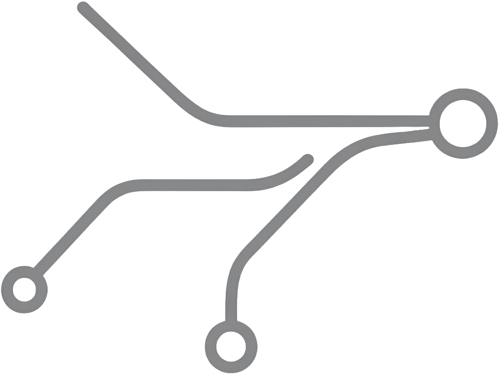

# 🚀 Senior Backend Developer Roadmap

<div align="center">
  
  
  <p><strong>A comprehensive, modern roadmap for senior backend developers</strong></p>
  
  [](https://alishahidi.github.io/roadmap/)
  [](https://docusaurus.io/)
  [](https://pages.github.com/)
</div>

---

## 📋 Overview

This roadmap is designed specifically for **senior backend developers** who want to master advanced concepts and modern architectural patterns. It covers everything from foundational principles to cutting-edge practices used in high-scale production systems.

### 🎯 Target Audience
- **Senior Backend Developers** looking to level up their skills
- **Architects** designing scalable systems
- **Tech Leads** mentoring development teams
- **Engineers** transitioning to senior roles

---

## 🗺️ Roadmap Structure

The roadmap is divided into **6 comprehensive sections**, each building upon the previous:

### 1. 🏗️ [Foundations of Backend Engineering](https://alishahidi.github.io/roadmap/docs/foundations)
**Build your technical foundation**
- **Networking**: TCP/IP, HTTP/HTTPS, DNS, TLS
- **Programming Paradigms**: OOP, Functional Programming, SOLID Principles
- **Concurrency & Threading**: Threading Models, Synchronization, Lock-Free Structures
- **Core Security**: Authentication, Authorization, Common Vulnerabilities

### 2. 🔌 [API Design & Development](https://alishahidi.github.io/roadmap/docs/api-design)
**Master modern API development**
- **RESTful APIs**: Resource Design, HTTP Verbs, Versioning
- **GraphQL**: Schema Design, N+1 Problem, Resolvers
- **API Security**: OAuth 2.0, JWT, Rate Limiting
- **Testing Strategies**: Unit, Integration, Contract, E2E Testing

### 3. 🏛️ [System Architecture & Design](https://alishahidi.github.io/roadmap/docs/system-architecture)
**Design scalable, maintainable systems**
- **Architectural Patterns**: Monolithic, Microservices, Event-Driven
- **Domain-Driven Design**: Strategic & Tactical DDD, Bounded Contexts
- **Advanced Patterns**: CQRS, Event Sourcing, SAGA, Clean Architecture
- **Design Patterns**: GoF Patterns, Enterprise Patterns

### 4. 💾 [Data & Persistence](https://alishahidi.github.io/roadmap/docs/data-and-persistence)
**Master data management and storage**
- **Database Technologies**: SQL, NoSQL, CAP Theorem
- **Performance Optimization**: Indexing, Query Optimization, Connection Pooling
- **Caching Strategies**: Cache-Aside, Write-Through, Write-Back
- **Messaging**: Message Brokers, Event Streaming

### 5. 🚀 [Deployment & Operations](https://alishahidi.github.io/roadmap/docs/deployment-and-operations)
**Deploy and manage production systems**
- **CI/CD**: Continuous Integration, Continuous Deployment
- **Containerization**: Docker, Kubernetes, Orchestration
- **Cloud Deployment**: IaaS, PaaS, FaaS, Serverless
- **Infrastructure as Code**: Terraform, Pulumi

### 6. 📊 [Observability & Performance](https://alishahidi.github.io/roadmap/docs/observability-and-performance)
**Monitor, scale, and optimize systems**
- **Three Pillars**: Logging, Metrics, Distributed Tracing
- **SLOs & Error Budgets**: Service Level Management
- **Scaling Strategies**: Vertical, Horizontal, Load Balancing
- **Performance Optimization**: Profiling, Bottleneck Analysis

---

## ✨ Key Features

### 🎨 **Rich Visual Content**
- **Interactive Mermaid Diagrams** for complex concepts
- **Flow Charts** showing system interactions
- **Architecture Diagrams** illustrating design patterns
- **Sequence Diagrams** for protocol flows

### 📚 **Comprehensive Resources**
- **Curated External Links** for deep-dive learning
- **Practical Examples** with real-world scenarios
- **Code Snippets** demonstrating key concepts
- **Best Practices** from industry experts

### 🏗️ **Modern Concepts Coverage**
- **Domain-Driven Design (DDD)**
- **Command Query Responsibility Segregation (CQRS)**
- **Clean Architecture & Hexagonal Architecture**
- **Mediator Pattern**
- **SAGA Pattern** (Choreography & Orchestration)
- **Event Sourcing**
- **Microservices Architecture**
- **Event-Driven Architecture**

---

## 🚀 Getting Started

### 🌐 **Visit the Live Roadmap**
**👉 [Start Your Journey](https://alishahidi.github.io/roadmap/)**

### 🛠️ **Run Locally**

1. **Clone the repository**
   ```bash
   git clone https://github.com/alishahidi/roadmap.git
   cd roadmap
   ```

2. **Install dependencies**
   ```bash
   npm install
   ```

3. **Start development server**
   ```bash
   npm start
   ```

4. **Build for production**
   ```bash
   npm run build
   ```

5. **Deploy to GitHub Pages**
   ```bash
   GIT_USER=yourusername npm run deploy
   ```

---

## 🛡️ Technologies Used

<div align="center">

| Technology | Purpose | Version |
|------------|---------|---------|
|  | Static Site Generator | Latest |
|  | Frontend Framework | Latest |
|  | Interactive Diagrams | Latest |
|  | Deployment Platform | - |
|  | Runtime Environment | 18+ |

</div>

---

## 📈 Roadmap Progress

```
Foundation Concepts     ████████████████████ 100%
API Design & Security   ████████████████████ 100%
System Architecture     ████████████████████ 100%
Data & Persistence      ████████████████████ 100%
DevOps & Deployment     ████████████████████ 100%
Observability & Scale   ████████████████████ 100%
```

---

## 🤝 Contributing

We welcome contributions to make this roadmap even better! Here's how you can help:

### 🐛 **Found an Issue?**
- Open a [GitHub Issue](https://github.com/alishahidi/roadmap/issues)
- Provide detailed description and reproduction steps

### 💡 **Have a Suggestion?**
- Fork the repository
- Create a feature branch (`git checkout -b feature/amazing-feature`)
- Commit your changes (`git commit -m 'Add amazing feature'`)
- Push to the branch (`git push origin feature/amazing-feature`)
- Open a Pull Request

### 📝 **Content Improvements**
- Fix typos or improve explanations
- Add new resources or examples
- Enhance existing diagrams
- Suggest new topics or concepts

---

## 🎓 Learning Path Recommendations

### 🥇 **For Experienced Developers (3-5 years)**
1. Start with **Foundations** to solidify core concepts
2. Deep dive into **API Design** for better service interfaces
3. Master **System Architecture** for scalable design

### 🏆 **For Senior Engineers (5+ years)**
1. Focus on **System Architecture** advanced patterns
2. Explore **Data & Persistence** optimization techniques
3. Master **Observability** for production excellence

### 🎯 **For Architects & Tech Leads**
1. Comprehensive review of **System Architecture**
2. Master **Deployment & Operations** for team guidance
3. Excel in **Observability** for system reliability

---

## 📊 Project Stats

<div align="center">


</div>

---

## 📄 License

This project is licensed under the **MIT License** - see the [LICENSE](LICENSE) file for details.

---

## 🙏 Acknowledgments

- **Community Contributors** for valuable feedback and suggestions
- **Open Source Projects** that made this roadmap possible
- **Industry Experts** whose knowledge shaped this content
- **Backend Engineering Community** for continuous inspiration

---

## 📞 Connect & Support

<div align="center">

**If this roadmap helped you grow as a senior backend developer, please consider:**

[](https://github.com/alishahidi/roadmap)
[](https://twitter.com/intent/tweet?text=Check%20out%20this%20comprehensive%20Senior%20Backend%20Developer%20Roadmap!&url=https://alishahidi.github.io/roadmap/)
[](https://www.linkedin.com/sharing/share-offsite/?url=https://alishahidi.github.io/roadmap/)

</div>

---

<div align="center">
  <p><strong>🎯 Ready to become a senior backend developer?</strong></p>
  <p><a href="https://alishahidi.github.io/roadmap/">🚀 Start Your Journey Today!</a></p>
  
  <br>
  
  <p>Made with ❤️ for the backend engineering community</p>
  <p><em>Keep building amazing systems! 🌟</em></p>
</div>