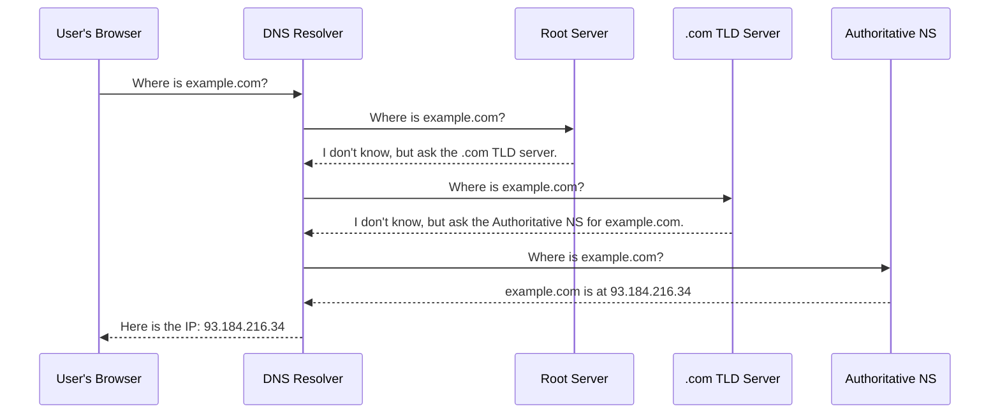
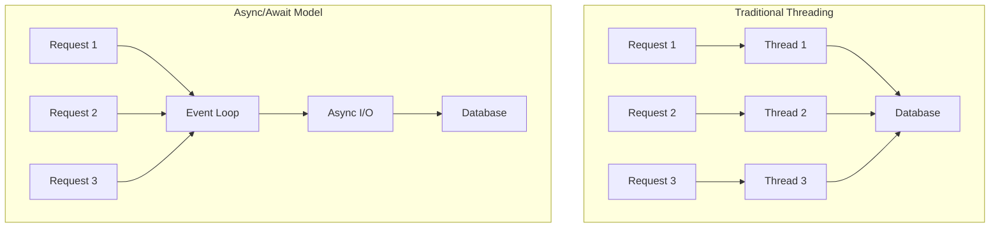

A senior backend engineer's expertise is built on a deep and solid understanding of the fundamentals. Before diving into complex architectural patterns or specific frameworks, it's crucial to have a firm grasp of how the internet works, the principles of good software design, and the core tenets of security. This section lays that essential groundwork, providing not just the what, but the *why* these concepts are critical for building robust, scalable, and secure systems.

## Networking and the Web

At its core, backend development is about communication over a network. A senior engineer doesn't just use HTTP; they understand how it works. This knowledge is invaluable for debugging complex issues, optimizing performance, and making informed architectural decisions.

### DNS (Domain Name System)

Before a browser can send a request to your server, it needs to know its IP address. DNS is the phonebook of the internet, translating human-friendly domain names into IP addresses.



### HTTP/HTTPS

The Hypertext Transfer Protocol is the language of the web. A deep understanding is essential.

- **Request/Response Cycle:** An HTTP request from a client has a method (verb), headers, and an optional body. The server processes this and returns a response with a status code, headers, and an optional body.

- **Idempotent Methods:** An operation is idempotent if making it multiple times has the same effect as making it once. `GET`, `PUT`, and `DELETE` are idempotent. `POST` is not. Understanding this is key to designing predictable APIs.

- **HTTPS & TLS:** Transport Layer Security (TLS) is the protocol that provides the "S" in HTTPS. It uses public-key cryptography to establish a secure, encrypted connection between the client and server, protecting against eavesdropping and Man-in-the-Middle (MITM) attacks.

:::tip Deep Dive: Resources
- [📄 **High Performance Browser Networking** by Ilya Grigorik (O'Reilly)](https://hpbn.co/)
- [▶️ **What happens when you type a URL in your browser?** (Video)](https://www.youtube.com/watch?v=s_h0S8H1mgg)
- [📄 **An overview of HTTP** (MDN Web Docs)](https://developer.mozilla.org/en-US/docs/Web/HTTP/Overview)
:::

---

## Programming Paradigms

How you structure your code is fundamental. A senior engineer should be proficient in multiple paradigms and know when to apply each.

### Object-Oriented Programming (OOP)

OOP models the real world using objects and classes. It's the dominant paradigm in many backend languages like Java and C#.

#### The Four Pillars
- **Encapsulation:** Bundling data and methods together while hiding internal implementation
- **Abstraction:** Hiding complex implementation details behind simple interfaces
- **Inheritance:** Creating new classes based on existing ones
- **Polymorphism:** Objects of different types responding to the same interface

#### SOLID Principles with Code Examples

<details>
<summary>SOLID Principles implementations</summary>

**Single Responsibility Principle (SRP)**
```java
// ❌ Bad: Class has multiple responsibilities
class User {
    private String name;
    private String email;
    
    public void save() { /* database logic */ }
    public void sendEmail() { /* email logic */ }
    public String generateReport() { /* reporting logic */ }
}

// ✅ Good: Each class has one responsibility
class User {
    private String name;
    private String email;
    // getters and setters only
}

class UserRepository {
    public void save(User user) { /* database logic */ }
}

class EmailService {
    public void sendEmail(User user, String message) { /* email logic */ }
}

class UserReportGenerator {
    public String generateReport(User user) { /* reporting logic */ }
}
```

**Open/Closed Principle (OCP)**
```csharp
// ✅ Good: Open for extension, closed for modification
public abstract class PaymentProcessor
{
    public abstract void ProcessPayment(decimal amount);
}

public class CreditCardProcessor : PaymentProcessor
{
    public override void ProcessPayment(decimal amount)
    {
        // Credit card processing logic
    }
}

public class PayPalProcessor : PaymentProcessor
{
    public override void ProcessPayment(decimal amount)
    {
        // PayPal processing logic
    }
}

// Adding new payment method doesn't modify existing code
public class CryptoProcessor : PaymentProcessor
{
    public override void ProcessPayment(decimal amount)
    {
        // Cryptocurrency processing logic
    }
}
```

**Dependency Inversion Principle (DIP)**
```python
from abc import ABC, abstractmethod

# ✅ Good: Depend on abstractions, not concretions
class EmailSender(ABC):
    @abstractmethod
    def send_email(self, to: str, subject: str, body: str):
        pass

class SMTPEmailSender(EmailSender):
    def send_email(self, to: str, subject: str, body: str):
        # SMTP implementation
        pass

class SendGridEmailSender(EmailSender):
    def send_email(self, to: str, subject: str, body: str):
        # SendGrid API implementation
        pass

class NotificationService:
    def __init__(self, email_sender: EmailSender):
        self._email_sender = email_sender  # Depends on abstraction
    
    def notify_user(self, user_email: str, message: str):
        self._email_sender.send_email(user_email, "Notification", message)
```

</details>

### Functional Programming (FP)

FP treats computation as the evaluation of mathematical functions and avoids changing-state and mutable data.

#### Core Concepts with Examples

<details>
<summary>Functional Programming examples</summary>

**Pure Functions**
```javascript
// ✅ Pure function: same input always produces same output, no side effects
function calculateTotal(items) {
    return items.reduce((total, item) => total + item.price, 0);
}

// ❌ Impure function: modifies external state, unpredictable output
let discount = 0.1;
function calculateTotalWithDiscount(items) {
    const total = items.reduce((sum, item) => sum + item.price, 0);
    discount += 0.01; // Side effect: modifies external state
    return total * (1 - Math.random() * discount); // Unpredictable output
}
```

**Immutability**
```python
# ✅ Immutable approach
def add_item_to_cart(cart_items, new_item):
    return cart_items + [new_item]  # Returns new list, original unchanged

# ❌ Mutable approach
def add_item_to_cart_mutable(cart_items, new_item):
    cart_items.append(new_item)  # Modifies original list
    return cart_items
```

**Higher-Order Functions**
```java
// Java 8+ with functional programming concepts
import java.util.function.Function;
import java.util.function.Predicate;

public class OrderProcessor {
    // Higher-order function: takes function as parameter
    public static <T, R> List<R> processOrders(
        List<T> orders, 
        Function<T, R> processor
    ) {
        return orders.stream()
            .map(processor)
            .collect(Collectors.toList());
    }
    
    // Usage examples
    public static void main(String[] args) {
        List<Order> orders = getOrders();
        
        // Transform orders to invoices
        List<Invoice> invoices = processOrders(orders, order -> {
            return new Invoice(order.getId(), order.getTotal());
        });
        
        // Filter and transform
        List<String> expensiveOrderIds = orders.stream()
            .filter(order -> order.getTotal() > 1000)
            .map(Order::getId)
            .collect(Collectors.toList());
    }
}
```
</details>
**Why FP Matters for Backend Systems:**
- **Predictability:** Pure functions are easier to test and debug
- **Concurrency:** Immutable data eliminates race conditions
- **Composability:** Small, pure functions can be easily combined
- **Fault Tolerance:** Less shared state means fewer points of failure


:::tip Deep Dive: Resources
- [📄 **SOLID Principles for C# Developers** (Code-Maze)](https://code-maze.com/solid-principles-csharp/)
- [▶️ **Functional Programming in 40 Minutes** (Video)](https://www.youtube.com/watch?v=pDbcC-xSat4)
- [📄 **Martin Fowler on Design Patterns**](https://martinfowler.com/eaaCatalog/)
:::

---

## Concurrency & Threading

Understanding concurrency is crucial for building high-performance backend systems. Senior developers must master these concepts to build systems that can handle multiple requests efficiently.

### Core Concepts

- **Concurrency vs. Parallelism:** 
  - **Concurrency:** Dealing with multiple tasks at once (not necessarily simultaneously). It's about the structure of your program.
  - **Parallelism:** Actually executing multiple tasks simultaneously. It's about execution.

- **Threading Models:**
  - **Thread-per-request:** Traditional model where each request gets its own thread. Simple but doesn't scale well due to thread overhead.
  - **Thread Pool:** Reuse a fixed number of threads to handle requests. Better resource management.
  - **Event Loop (Async/Await):** Single-threaded event loop that handles I/O operations asynchronously. Very efficient for I/O-bound operations.

### Synchronization Mechanisms

- **Locks (Mutexes):** Ensure mutual exclusion when accessing shared resources. Can lead to deadlocks if not used carefully.
- **Semaphores:** Control access to a resource pool (e.g., database connections).
- **Atomic Operations:** Operations that complete fully or not at all, without interruption.
- **Lock-Free Data Structures:** High-performance structures that avoid traditional locking using atomic operations and memory ordering.



### Best Practices

- **Prefer Immutability:** Immutable objects eliminate many concurrency issues.
- **Minimize Shared State:** The less state you share between threads, the fewer synchronization issues you'll have.
- **Use Higher-Level Abstractions:** Modern languages provide abstractions like async/await, actors, or channels that are safer than raw threads.

:::tip Deep Dive: Resources
- [📄 **Java Concurrency in Practice** by Brian Goetz](https://www.amazon.com/Java-Concurrency-Practice-Brian-Goetz/dp/0321349601)
- [▶️ **Understanding Async/Await** (Video)](https://www.youtube.com/watch?v=hEFs-xU3HCQ)
- [📄 **The Actor Model in 10 Minutes**](https://www.brianstorti.com/the-actor-model/)
:::

---

## Core Web Security Fundamentals

Security is not a feature; it's a foundational requirement. A senior developer must proactively identify and mitigate common vulnerabilities.

- **The OWASP Top 10:** This is the essential checklist for web security. It's a standard awareness document for developers and web application security. It represents a broad consensus about the most critical security risks.
### Common Security Vulnerabilities with Examples

<details>
<summary>Security vulnerability examples</summary>
#### SQL Injection
An attacker can use a web form or URL parameter to send a malicious SQL query.

##### Node.js - DANGEROUS!
```javascript

const userId = req.query.id; // Attacker sends: "1 OR 1=1; DROP TABLE users; --"
const query = `SELECT * FROM users WHERE id = ${userId}`;
db.query(query, (err, results) => { /* This could delete your entire table! */ });
```

##### Python - DANGEROUS!
```python

def get_user(user_id):
    query = f"SELECT * FROM users WHERE id = {user_id}"  # Vulnerable to injection
    cursor.execute(query)
    return cursor.fetchone()
```
</details>

<details>
<summary>Safe Implementation with Parameterized Queries</summary>
#### Node.js - SAFE
```javascript

const userId = req.query.id;
const query = 'SELECT * FROM users WHERE id = ?';
db.query(query, [userId], (err, results) => {
    // Database treats userId as a value, not executable code
});
```


#### Python - SAFE
```python

def get_user(user_id):
    query = "SELECT * FROM users WHERE id = %s"
    cursor.execute(query, (user_id,))  # Parameterized query prevents injection
    return cursor.fetchone()
```
#### C# Entity Framework - SAFE
```csharp

public async Task<User> GetUserAsync(int userId)
{
    return await _context.Users
        .Where(u => u.Id == userId)  // EF Core uses parameterized queries automatically
        .FirstOrDefaultAsync();
}
```
</details>

#### Cross-Site Scripting (XSS) Prevention
```javascript
// ❌ Vulnerable to XSS
app.get('/user/:id', (req, res) => {
    const userInput = req.params.id;
    res.send(`<h1>User: ${userInput}</h1>`); // Raw HTML insertion
});

// ✅ Safe: HTML escaping
const escapeHtml = (unsafe) => {
    return unsafe
        .replace(/&/g, "&amp;")
        .replace(/</g, "&lt;")
        .replace(/>/g, "&gt;")
        .replace(/"/g, "&quot;")
        .replace(/'/g, "&#039;");
};

app.get('/user/:id', (req, res) => {
    const userInput = escapeHtml(req.params.id);
    res.send(`<h1>User: ${userInput}</h1>`); // Escaped output
});
```

#### Input Validation Example
```java
// Java with Bean Validation
public class UserRegistrationRequest {
    @NotBlank(message = "Email is required")
    @Email(message = "Email should be valid")
    private String email;
    
    @NotBlank(message = "Password is required")
    @Size(min = 8, max = 100, message = "Password must be between 8 and 100 characters")
    @Pattern(regexp = "^(?=.*[a-z])(?=.*[A-Z])(?=.*\\d)(?=.*[@$!%*?&])[A-Za-z\\d@$!%*?&]", 
             message = "Password must contain uppercase, lowercase, digit and special character")
    private String password;
    
    // getters and setters
}

@PostMapping("/register")
public ResponseEntity<?> register(@Valid @RequestBody UserRegistrationRequest request) {
    // Validation happens automatically due to @Valid annotation
    // If validation fails, Spring returns 400 Bad Request with error details
    return userService.registerUser(request);
}
```

By using parameterized queries and proper input validation, you create multiple layers of defense against common attacks.


:::tip Deep Dive: Resources
- [📄 **OWASP Top 10** (Official Site)](https://owasp.org/www-project-top-ten/)
- [▶️ **Web Security 101** (Video Playlist by Google)](https://www.youtube.com/playlist?list=PL590L5WQmH8dsxxz7ooJAgmijwOz0me20)
- [📄 **OWASP Cheatsheet Series**](https://cheatsheetseries.owasp.org/)
:::
