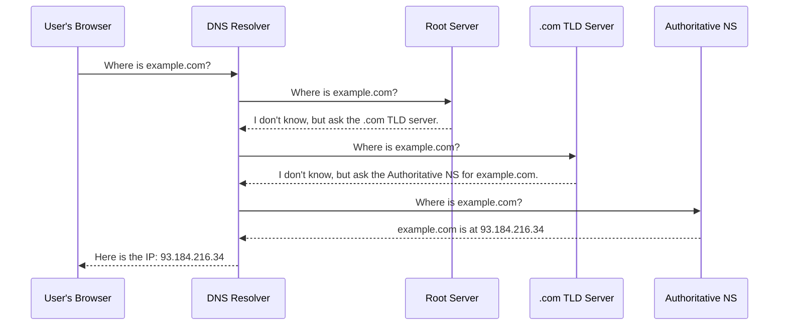
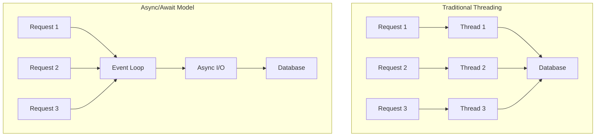

A senior backend engineer's expertise is built on a deep and solid understanding of the fundamentals. Before diving into complex architectural patterns or specific frameworks, it's crucial to have a firm grasp of how the internet works, the principles of good software design, and the core tenets of security. This section lays that essential groundwork, providing not just the what, but the *why* these concepts are critical for building robust, scalable, and secure systems.

## Networking and the Web

At its core, backend development is about communication over a network. A senior engineer doesn't just use HTTP; they understand how it works. This knowledge is invaluable for debugging complex issues, optimizing performance, and making informed architectural decisions.

### DNS (Domain Name System)

Before a browser can send a request to your server, it needs to know its IP address. DNS is the phonebook of the internet, translating human-friendly domain names into IP addresses.



### HTTP/HTTPS

The Hypertext Transfer Protocol is the language of the web. A deep understanding is essential.

- **Request/Response Cycle:** An HTTP request from a client has a method (verb), headers, and an optional body. The server processes this and returns a response with a status code, headers, and an optional body.

- **Idempotent Methods:** An operation is idempotent if making it multiple times has the same effect as making it once. `GET`, `PUT`, and `DELETE` are idempotent. `POST` is not. Understanding this is key to designing predictable APIs.

- **HTTPS & TLS:** Transport Layer Security (TLS) is the protocol that provides the "S" in HTTPS. It uses public-key cryptography to establish a secure, encrypted connection between the client and server, protecting against eavesdropping and Man-in-the-Middle (MITM) attacks.

:::tip Deep Dive: Resources
- [📄 **High Performance Browser Networking** by Ilya Grigorik (O'Reilly)](https://hpbn.co/)
- [▶️ **What happens when you type a URL in your browser?** (Video)](https://www.youtube.com/watch?v=s_h0S8H1mgg)
- [📄 **An overview of HTTP** (MDN Web Docs)](https://developer.mozilla.org/en-US/docs/Web/HTTP/Overview)
:::
:::

## Programming Paradigms

How you structure your code is fundamental. A senior engineer should be proficient in multiple paradigms and know when to apply each.

### Object-Oriented Programming (OOP)

OOP models the real world using objects and classes. It's the dominant paradigm in many backend languages like Java and C#.

- **The Four Pillars:** Encapsulation, Abstraction, Inheritance, and Polymorphism.
- **SOLID Principles:** A set of five design principles for writing maintainable and scalable software.
  - **S**ingle Responsibility: A class should have only one reason to change.
  - **O**pen/Closed: Software entities should be open for extension, but closed for modification.
  - **L**iskov Substitution: Subtypes must be substitutable for their base types.
  - **I**nterface Segregation: Clients should not be forced to depend on interfaces they do not use.
  - **D**ependency Inversion: High-level modules should not depend on low-level modules. Both should depend on abstractions.

### Functional Programming (FP)

FP treats computation as the evaluation of mathematical functions and avoids changing-state and mutable data.

- **Core Concepts:** Pure functions (the same input always returns the same output, with no side effects), immutability, first-class and higher-order functions.
- **Why it matters:** FP leads to more predictable, testable, and concurrent code, which is invaluable in distributed systems.

:::tip Deep Dive: Resources
- [📄 **SOLID Principles for C# Developers** (Code-Maze)](https://code-maze.com/solid-principles-csharp/)
- [▶️ **Functional Programming in 40 Minutes** (Video)](https://www.youtube.com/watch?v=pDbcC-xSat4)
- [📄 **Martin Fowler on Design Patterns**](https://martinfowler.com/eaaCatalog/)
:::
:::

---

## Concurrency & Threading

Understanding concurrency is crucial for building high-performance backend systems. Senior developers must master these concepts to build systems that can handle multiple requests efficiently.

### Core Concepts

- **Concurrency vs. Parallelism:** 
  - **Concurrency:** Dealing with multiple tasks at once (not necessarily simultaneously). It's about the structure of your program.
  - **Parallelism:** Actually executing multiple tasks simultaneously. It's about execution.

- **Threading Models:**
  - **Thread-per-request:** Traditional model where each request gets its own thread. Simple but doesn't scale well due to thread overhead.
  - **Thread Pool:** Reuse a fixed number of threads to handle requests. Better resource management.
  - **Event Loop (Async/Await):** Single-threaded event loop that handles I/O operations asynchronously. Very efficient for I/O-bound operations.

### Synchronization Mechanisms

- **Locks (Mutexes):** Ensure mutual exclusion when accessing shared resources. Can lead to deadlocks if not used carefully.
- **Semaphores:** Control access to a resource pool (e.g., database connections).
- **Atomic Operations:** Operations that complete fully or not at all, without interruption.
- **Lock-Free Data Structures:** High-performance structures that avoid traditional locking using atomic operations and memory ordering.



### Best Practices

- **Prefer Immutability:** Immutable objects eliminate many concurrency issues.
- **Minimize Shared State:** The less state you share between threads, the fewer synchronization issues you'll have.
- **Use Higher-Level Abstractions:** Modern languages provide abstractions like async/await, actors, or channels that are safer than raw threads.

:::tip Deep Dive: Resources
- [📄 **Java Concurrency in Practice** by Brian Goetz](https://www.amazon.com/Java-Concurrency-Practice-Brian-Goetz/dp/0321349601)
- [▶️ **Understanding Async/Await** (Video)](https://www.youtube.com/watch?v=hEFs-xU3HCQ)
- [📄 **The Actor Model in 10 Minutes**](https://www.brianstorti.com/the-actor-model/)
:::

## Core Web Security Fundamentals

Security is not a feature; it's a foundational requirement. A senior developer must proactively identify and mitigate common vulnerabilities.

- **The OWASP Top 10:** This is the essential checklist for web security. It's a standard awareness document for developers and web application security. It represents a broad consensus about the most critical security risks.
- **Example Vulnerability: SQL Injection**
  An attacker can use a web form or URL parameter to send a malicious SQL query.

  **Vulnerable Code (Node.js):**
  ```javascript
  const userId = req.query.id; // e.g., "1 OR 1=1"
  const query = `SELECT * FROM users WHERE id = ${userId}`; // DANGEROUS!
  db.query(query, (err, results) => { ... });
  ```

  **Prevention: Parameterized Queries (Prepared Statements)**
  ```javascript
  const userId = req.query.id;
  const query = 'SELECT * FROM users WHERE id = ?'; // SAFE
  db.query(query, [userId], (err, results) => { ... });
  ```
  By using parameterized queries, the database driver treats the user input as a value, not as executable code, neutralizing the attack.

:::tip Deep Dive: Resources
- [📄 **OWASP Top 10** (Official Site)](https://owasp.org/www-project-top-ten/)
- [▶️ **Web Security 101** (Video Playlist by Google)](https://www.youtube.com/playlist?list=PL590L5WQmH8dsxxz7ooJAgmijwOz0me20)
- [📄 **OWASP Cheatsheet Series**](https://cheatsheetseries.owasp.org/)
:::
:::
