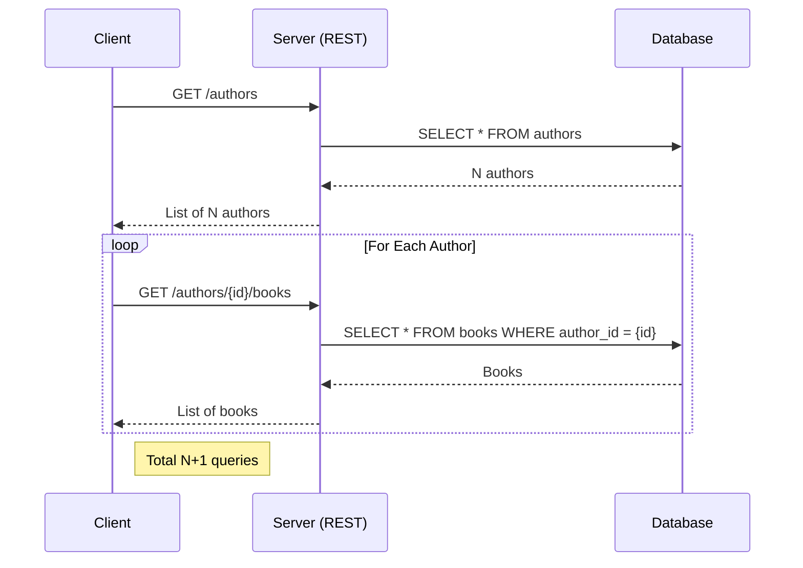
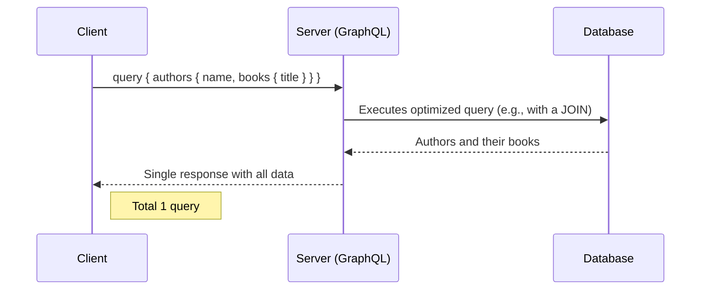
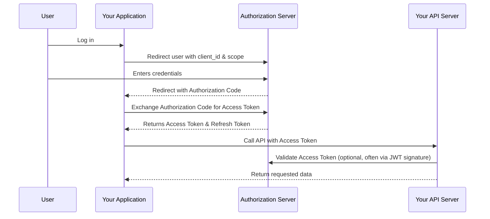
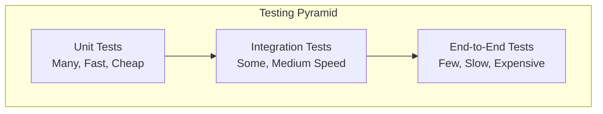

The Application Programming Interface (API) is the backbone of modern software. For a senior backend engineer, mastering API design is not just about exposing data; it's about creating a clear, consistent, and secure contract that empowers consumers of your service.

## REST APIs

REST (Representational State Transfer) has been the dominant architectural style for web APIs for years because it's built on the same principles as the web itself: simplicity, scalability, and statelessness.

- **Resource-Based Naming:** A core tenet of REST is thinking in terms of resources. URIs should identify resources, not actions.
  - **Good:** `/users/123/orders` (Get all orders for user 123)
  - **Bad:** `/getOrdersForUser?userId=123`
- **Use HTTP Verbs Correctly:** Use the semantics of HTTP methods to express actions on resources.
  - `GET`: Retrieve a resource.
  - `POST`: Create a new resource.
  - `PUT`: Replace an existing resource entirely.
  - `PATCH`: Partially update an existing resource.
  - `DELETE`: Remove a resource.
- **API Versioning:** As your API evolves, you'll inevitably need to introduce breaking changes. A versioning strategy is essential for a smooth transition for your clients. URI versioning (`/api/v1/...`) is the most common and explicit approach.

:::tip Deep Dive: Resources
- [📄 **Microsoft REST API Guidelines**](https://github.com/microsoft/api-guidelines/blob/vNext/azure/Guidelines.md)
- [📄 **How to Design a Great API** (FreeCodeCamp)](https://www.freecodecamp.org/news/how-to-design-a-great-api-with-these-10-api-design-best-practices/)
- [📄 **OpenAPI Specification**](https://swagger.io/specification/)
:::
:::

---

## GraphQL

GraphQL is a query language for your API that gives clients the power to ask for exactly what they need and nothing more. It's a powerful alternative to REST, especially for applications with complex data requirements or diverse clients (e.g., web and mobile).

### Solving the N+1 Problem

A classic issue with REST is under-fetching, which often leads to the "N+1" query problem. Imagine fetching a list of authors (`1` query) and then fetching the books for each of those `N` authors (`N` queries).



GraphQL solves this by fetching all the required information in a single, declarative query.



:::tip Deep Dive: Resources
- [📄 **Introduction to GraphQL** (Official Site)](https://graphql.org/learn/)
- [▶️ **GraphQL Full Course** (YouTube)](https://www.youtube.com/watch?v=ed8SzALpx1Q)
- [📄 **Apollo GraphQL Platform**](https://www.apollographql.com/)
:::
:::

---

## API Security Best Practices

Securing your APIs is critical. An insecure API can expose sensitive data and put your entire system at risk.

### Authentication & Authorization

- **Authentication:** Verifying who a user is.
- **Authorization:** Determining what an authenticated user is allowed to do.

**OAuth 2.0** is the industry-standard protocol for authorization. The "Authorization Code" flow is the most common and secure for web applications.



**JSON Web Tokens (JWT)** are a common way to implement stateless authentication. The server creates a signed token containing user claims, and the client sends this token with each request. The server can verify the token's signature without needing to store session state.

:::tip Deep Dive: Resources
- [📄 **OAuth 2.0 Simplified**](https://www.oauth.com/)
- [📄 **JWT.io Introduction**](https://jwt.io/introduction)
- [📄 **API Security Checklist** (OWASP)](https://cheatsheetseries.owasp.org/API_Security_Cheat_Sheet.html)
:::
:::

---

## Testing Strategies for APIs

A senior developer must ensure code quality through comprehensive testing. APIs require special attention due to their role as contracts between systems.

### Testing Pyramid



### Types of API Testing

- **Unit Tests:** Test individual functions and methods in isolation. Mock external dependencies.
- **Integration Tests:** Test how your code interacts with external systems (databases, other services).
- **Contract Tests:** Ensure APIs meet their documented contracts. Tools like **Pact** enable consumer-driven contract testing.
- **End-to-End Tests:** Test the complete user workflow through the system. Expensive but catch integration issues.

### Testing Best Practices

- **Test-Driven Development (TDD):** Write tests before implementation. Red → Green → Refactor cycle.
- **Arrange-Act-Assert (AAA) Pattern:** Structure tests clearly:
  - **Arrange:** Set up test data and mocks
  - **Act:** Execute the code under test
  - **Assert:** Verify the results

**Example: Testing a REST API endpoint**
```javascript
// Jest/Node.js example
describe('POST /api/users', () => {
  it('should create a new user', async () => {
    // Arrange
    const userData = { name: 'John Doe', email: 'john@example.com' };
    const mockUser = { id: 1, ...userData };
    jest.spyOn(userService, 'create').mockResolvedValue(mockUser);

    // Act
    const response = await request(app)
      .post('/api/users')
      .send(userData);

    // Assert
    expect(response.status).toBe(201);
    expect(response.body).toEqual(mockUser);
    expect(userService.create).toHaveBeenCalledWith(userData);
  });
});
```

### API Documentation & Testing Tools

- **OpenAPI/Swagger:** Document your APIs and generate interactive documentation.
- **Postman/Insomnia:** Manual API testing and automation.
- **Newman:** Run Postman collections in CI/CD pipelines.

:::tip Deep Dive: Resources
- [📄 **The Practical Test Pyramid** by Martin Fowler](https://martinfowler.com/articles/practical-test-pyramid.html)
- [▶️ **Test-Driven Development** (Video)](https://www.youtube.com/watch?v=QCif_-r8eK4)
- [📄 **Contract Testing with Pact**](https://docs.pact.io/)
- [📄 **API Testing Best Practices**](https://assertible.com/blog/13-things-you-should-do-to-build-better-restful-web-apis)
:::
