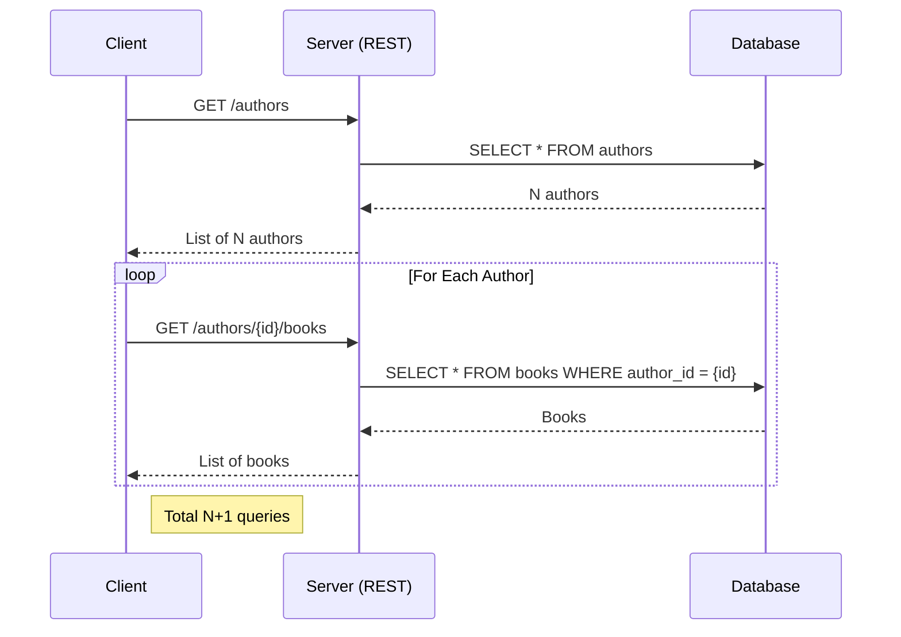
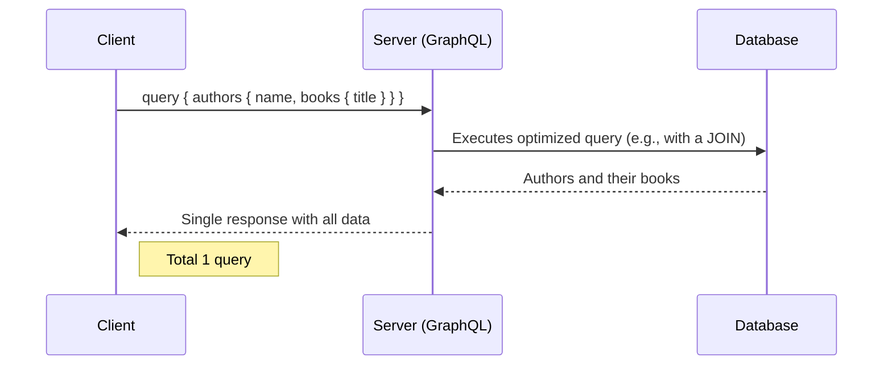
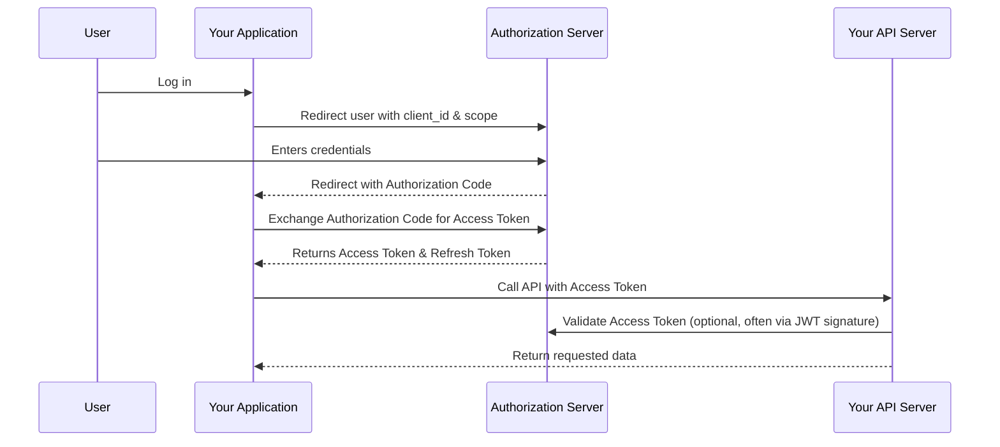
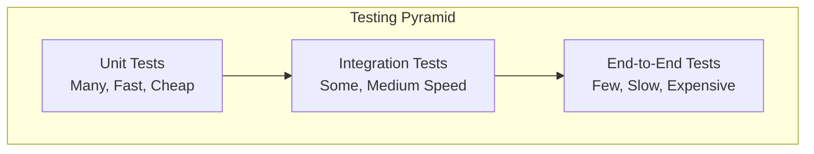

The Application Programming Interface (API) is the backbone of modern software. For a senior backend engineer, mastering API design is not just about exposing data; it's about creating a clear, consistent, and secure contract that empowers consumers of your service.

## REST APIs

REST (Representational State Transfer) has been the dominant architectural style for web APIs for years because it's built on the same principles as the web itself: simplicity, scalability, and statelessness.

### Resource-Based Design Examples

**Good REST API Design:**
```http
# Users Resource
GET    /api/v1/users              # Get all users
GET    /api/v1/users/123          # Get specific user
POST   /api/v1/users              # Create new user
PUT    /api/v1/users/123          # Replace entire user
PATCH  /api/v1/users/123          # Partially update user
DELETE /api/v1/users/123          # Delete user

# Nested Resources
GET    /api/v1/users/123/orders   # Get all orders for user 123
POST   /api/v1/users/123/orders   # Create order for user 123
GET    /api/v1/users/123/orders/456 # Get specific order for user
```

**Bad REST API Design:**
```http
# ❌ RPC-style endpoints (avoid these)
GET /getUser?id=123
POST /createUser
POST /updateUserPassword
POST /deleteUser
GET /getUserOrders?userId=123
```

### Complete REST API Implementation Examples

**Node.js/Express Example:**
```javascript
const express = require('express');
const app = express();

// User Resource Controller
class UserController {
    // GET /api/v1/users
    static async getAllUsers(req, res) {
        try {
            const { page = 1, limit = 10, search } = req.query;
            const users = await userService.getUsers({ page, limit, search });
            
            res.status(200).json({
                data: users.items,
                pagination: {
                    page: parseInt(page),
                    limit: parseInt(limit),
                    total: users.total,
                    pages: Math.ceil(users.total / limit)
                },
                links: {
                    self: `/api/v1/users?page=${page}&limit=${limit}`,
                    next: page < Math.ceil(users.total / limit) 
                        ? `/api/v1/users?page=${parseInt(page) + 1}&limit=${limit}` 
                        : null
                }
            });
        } catch (error) {
            res.status(500).json({ error: 'Internal server error' });
        }
    }
    
    // POST /api/v1/users
    static async createUser(req, res) {
        try {
            const { name, email, password } = req.body;
            
            // Validation
            if (!name || !email || !password) {
                return res.status(400).json({
                    error: 'Validation failed',
                    details: {
                        name: !name ? 'Name is required' : null,
                        email: !email ? 'Email is required' : null,
                        password: !password ? 'Password is required' : null
                    }
                });
            }
            
            const user = await userService.createUser({ name, email, password });
            
            res.status(201).json({
                data: user,
                links: {
                    self: `/api/v1/users/${user.id}`,
                    orders: `/api/v1/users/${user.id}/orders`
                }
            });
        } catch (error) {
            if (error.code === 'DUPLICATE_EMAIL') {
                return res.status(409).json({ error: 'Email already exists' });
            }
            res.status(500).json({ error: 'Internal server error' });
        }
    }
    
    // PATCH /api/v1/users/:id
    static async updateUser(req, res) {
        try {
            const { id } = req.params;
            const updates = req.body;
            
            const user = await userService.updateUser(id, updates);
            if (!user) {
                return res.status(404).json({ error: 'User not found' });
            }
            
            res.status(200).json({ data: user });
        } catch (error) {
            res.status(500).json({ error: 'Internal server error' });
        }
    }
}

// Routes
app.get('/api/v1/users', UserController.getAllUsers);
app.post('/api/v1/users', UserController.createUser);
app.patch('/api/v1/users/:id', UserController.updateUser);
```

**Java Spring Boot Example:**
```java
@RestController
@RequestMapping("/api/v1/users")
@Validated
public class UserController {
    
    @Autowired
    private UserService userService;
    
    @GetMapping
    public ResponseEntity<PagedResponse<UserDto>> getAllUsers(
            @RequestParam(defaultValue = "1") int page,
            @RequestParam(defaultValue = "10") int limit,
            @RequestParam(required = false) String search) {
        
        Page<User> users = userService.getUsers(page - 1, limit, search);
        
        PagedResponse<UserDto> response = new PagedResponse<>();
        response.setData(users.getContent().stream()
            .map(UserDto::fromEntity)
            .collect(Collectors.toList()));
        response.setPagination(new PaginationInfo(
            page, limit, users.getTotalElements(), users.getTotalPages()
        ));
        
        return ResponseEntity.ok(response);
    }
    
    @PostMapping
    public ResponseEntity<ApiResponse<UserDto>> createUser(
            @Valid @RequestBody CreateUserRequest request) {
        
        User user = userService.createUser(request);
        UserDto userDto = UserDto.fromEntity(user);
        
        ApiResponse<UserDto> response = new ApiResponse<>();
        response.setData(userDto);
        response.setLinks(Map.of(
            "self", "/api/v1/users/" + user.getId(),
            "orders", "/api/v1/users/" + user.getId() + "/orders"
        ));
        
        return ResponseEntity.status(HttpStatus.CREATED).body(response);
    }
    
    @PatchMapping("/{id}")
    public ResponseEntity<ApiResponse<UserDto>> updateUser(
            @PathVariable Long id,
            @RequestBody UpdateUserRequest request) {
        
        Optional<User> userOpt = userService.updateUser(id, request);
        if (userOpt.isEmpty()) {
            return ResponseEntity.notFound().build();
        }
        
        ApiResponse<UserDto> response = new ApiResponse<>();
        response.setData(UserDto.fromEntity(userOpt.get()));
        
        return ResponseEntity.ok(response);
    }
}
```

### HTTP Status Codes in Practice

```javascript
// Comprehensive status code usage
const StatusCodes = {
    // 2xx Success
    OK: 200,                    // GET successful
    CREATED: 201,               // POST successful
    NO_CONTENT: 204,            // DELETE successful
    
    // 4xx Client Errors
    BAD_REQUEST: 400,           // Invalid request data
    UNAUTHORIZED: 401,          // Authentication required
    FORBIDDEN: 403,             // Authenticated but not authorized
    NOT_FOUND: 404,             // Resource doesn't exist
    CONFLICT: 409,              // Resource already exists
    UNPROCESSABLE_ENTITY: 422,  // Validation errors
    
    // 5xx Server Errors
    INTERNAL_SERVER_ERROR: 500, // Generic server error
    SERVICE_UNAVAILABLE: 503    // Temporary server issue
};

// Usage in error handling
app.use((error, req, res, next) => {
    if (error instanceof ValidationError) {
        return res.status(StatusCodes.UNPROCESSABLE_ENTITY).json({
            error: 'Validation failed',
            details: error.details
        });
    }
    
    if (error instanceof NotFoundError) {
        return res.status(StatusCodes.NOT_FOUND).json({
            error: 'Resource not found'
        });
    }
    
    // Log the error for debugging
    console.error('Unhandled error:', error);
    
    res.status(StatusCodes.INTERNAL_SERVER_ERROR).json({
        error: 'Internal server error'
    });
});
```

:::tip Deep Dive: Resources
- [📄 **Microsoft REST API Guidelines**](https://github.com/microsoft/api-guidelines/blob/vNext/azure/Guidelines.md)
- [📄 **How to Design a Great API** (FreeCodeCamp)](https://www.freecodecamp.org/news/how-to-design-a-great-api-with-these-10-api-design-best-practices/)
- [📄 **OpenAPI Specification**](https://swagger.io/specification/)
:::
:::

---

## GraphQL

GraphQL is a query language for your API that gives clients the power to ask for exactly what they need and nothing more. It's a powerful alternative to REST, especially for applications with complex data requirements or diverse clients (e.g., web and mobile).

---

## gRPC (Google Remote Procedure Call)

gRPC is a high-performance, open-source RPC framework that uses HTTP/2 and Protocol Buffers. It's ideal for internal microservice communication and high-throughput systems.

### Protocol Buffers Definition

:::details Protocol Buffers Definition
**Click to expand Proto file example**

```protobuf
// user.proto
syntax = "proto3";

package user.v1;

option go_package = "github.com/yourcompany/user-service/api/user/v1";
option java_package = "com.yourcompany.user.v1";
option csharp_namespace = "YourCompany.User.V1";

import "google/protobuf/timestamp.proto";
import "google/protobuf/empty.proto";

// User service definition
service UserService {
  // Creates a new user
  rpc CreateUser(CreateUserRequest) returns (CreateUserResponse);
  
  // Gets a user by ID
  rpc GetUser(GetUserRequest) returns (GetUserResponse);
  
  // Updates user information
  rpc UpdateUser(UpdateUserRequest) returns (UpdateUserResponse);
  
  // Deletes a user
  rpc DeleteUser(DeleteUserRequest) returns (google.protobuf.Empty);
  
  // Lists users with pagination
  rpc ListUsers(ListUsersRequest) returns (ListUsersResponse);
  
  // Server streaming: Get user events
  rpc GetUserEvents(GetUserEventsRequest) returns (stream UserEvent);
  
  // Client streaming: Batch create users
  rpc BatchCreateUsers(stream CreateUserRequest) returns (BatchCreateUsersResponse);
  
  // Bidirectional streaming: Real-time user updates
  rpc StreamUserUpdates(stream UserUpdateRequest) returns (stream UserUpdateResponse);
}

// Message definitions
message User {
  string id = 1;
  string email = 2;
  string first_name = 3;
  string last_name = 4;
  UserStatus status = 5;
  google.protobuf.Timestamp created_at = 6;
  google.protobuf.Timestamp updated_at = 7;
  Address address = 8;
  repeated string roles = 9;
}

message Address {
  string street = 1;
  string city = 2;
  string state = 3;
  string zip_code = 4;
  string country = 5;
}

enum UserStatus {
  USER_STATUS_UNSPECIFIED = 0;
  USER_STATUS_ACTIVE = 1;
  USER_STATUS_INACTIVE = 2;
  USER_STATUS_SUSPENDED = 3;
}

// Request/Response messages
message CreateUserRequest {
  string email = 1;
  string first_name = 2;
  string last_name = 3;
  Address address = 4;
}

message CreateUserResponse {
  User user = 1;
  string message = 2;
}

message GetUserRequest {
  string id = 1;
}

message GetUserResponse {
  User user = 1;
}

message UpdateUserRequest {
  string id = 1;
  string email = 2;
  string first_name = 3;
  string last_name = 4;
  Address address = 5;
}

message UpdateUserResponse {
  User user = 1;
}

message DeleteUserRequest {
  string id = 1;
}

message ListUsersRequest {
  int32 page_size = 1;
  string page_token = 2;
  string filter = 3; // e.g., "status=ACTIVE"
}

message ListUsersResponse {
  repeated User users = 1;
  string next_page_token = 2;
  int32 total_count = 3;
}

message UserEvent {
  string event_id = 1;
  string user_id = 2;
  EventType event_type = 3;
  google.protobuf.Timestamp timestamp = 4;
  string data = 5; // JSON payload
}

enum EventType {
  EVENT_TYPE_UNSPECIFIED = 0;
  EVENT_TYPE_CREATED = 1;
  EVENT_TYPE_UPDATED = 2;
  EVENT_TYPE_DELETED = 3;
  EVENT_TYPE_LOGIN = 4;
  EVENT_TYPE_LOGOUT = 5;
}

message GetUserEventsRequest {
  string user_id = 1;
  google.protobuf.Timestamp since = 2;
}

message BatchCreateUsersResponse {
  repeated CreateUserResponse results = 1;
  int32 success_count = 2;
  int32 failure_count = 3;
}

message UserUpdateRequest {
  string user_id = 1;
  string field_name = 2;
  string field_value = 3;
}

message UserUpdateResponse {
  string user_id = 1;
  bool success = 2;
  string error_message = 3;
}
```

:::

### gRPC Server Implementation Examples

:::details Go Server Implementation
**Click to expand Go gRPC server code**

```go
// server.go
package main

import (
    "context"
    "fmt"
    "io"
    "log"
    "net"
    "time"

    "google.golang.org/grpc"
    "google.golang.org/grpc/codes"
    "google.golang.org/grpc/status"
    "google.golang.org/protobuf/types/known/emptypb"
    "google.golang.org/protobuf/types/known/timestamppb"

    pb "github.com/yourcompany/user-service/api/user/v1"
)

type userServiceServer struct {
    pb.UnimplementedUserServiceServer
    users map[string]*pb.User
}

func newUserServiceServer() *userServiceServer {
    return &userServiceServer{
        users: make(map[string]*pb.User),
    }
}

func (s *userServiceServer) CreateUser(ctx context.Context, req *pb.CreateUserRequest) (*pb.CreateUserResponse, error) {
    // Validation
    if req.Email == "" {
        return nil, status.Errorf(codes.InvalidArgument, "email is required")
    }

    // Check if user already exists
    for _, user := range s.users {
        if user.Email == req.Email {
            return nil, status.Errorf(codes.AlreadyExists, "user with email %s already exists", req.Email)
        }
    }

    // Create user
    userID := fmt.Sprintf("user_%d", time.Now().Unix())
    user := &pb.User{
        Id:        userID,
        Email:     req.Email,
        FirstName: req.FirstName,
        LastName:  req.LastName,
        Status:    pb.UserStatus_USER_STATUS_ACTIVE,
        CreatedAt: timestamppb.Now(),
        UpdatedAt: timestamppb.Now(),
        Address:   req.Address,
        Roles:     []string{"user"},
    }

    s.users[userID] = user

    log.Printf("Created user: %s (%s)", user.Id, user.Email)

    return &pb.CreateUserResponse{
        User:    user,
        Message: "User created successfully",
    }, nil
}

func (s *userServiceServer) GetUser(ctx context.Context, req *pb.GetUserRequest) (*pb.GetUserResponse, error) {
    if req.Id == "" {
        return nil, status.Errorf(codes.InvalidArgument, "user ID is required")
    }

    user, exists := s.users[req.Id]
    if !exists {
        return nil, status.Errorf(codes.NotFound, "user with ID %s not found", req.Id)
    }

    return &pb.GetUserResponse{
        User: user,
    }, nil
}

func (s *userServiceServer) ListUsers(ctx context.Context, req *pb.ListUsersRequest) (*pb.ListUsersResponse, error) {
    pageSize := req.PageSize
    if pageSize <= 0 || pageSize > 100 {
        pageSize = 10 // Default page size
    }

    var users []*pb.User
    for _, user := range s.users {
        // Apply filter if provided
        if req.Filter != "" {
            // Simple filter implementation
            if req.Filter == "status=ACTIVE" && user.Status != pb.UserStatus_USER_STATUS_ACTIVE {
                continue
            }
        }
        users = append(users, user)
    }

    // Simple pagination
    start := 0
    if req.PageToken != "" {
        // Parse page token (simplified)
        fmt.Sscanf(req.PageToken, "%d", &start)
    }

    end := start + int(pageSize)
    if end > len(users) {
        end = len(users)
    }

    var nextPageToken string
    if end < len(users) {
        nextPageToken = fmt.Sprintf("%d", end)
    }

    return &pb.ListUsersResponse{
        Users:         users[start:end],
        NextPageToken: nextPageToken,
        TotalCount:    int32(len(users)),
    }, nil
}

// Server streaming example
func (s *userServiceServer) GetUserEvents(req *pb.GetUserEventsRequest, stream pb.UserService_GetUserEventsServer) error {
    // Simulate streaming events
    events := []*pb.UserEvent{
        {
            EventId:   "evt_1",
            UserId:    req.UserId,
            EventType: pb.EventType_EVENT_TYPE_CREATED,
            Timestamp: timestamppb.Now(),
            Data:      `{"action": "user_created"}`,
        },
        {
            EventId:   "evt_2",
            UserId:    req.UserId,
            EventType: pb.EventType_EVENT_TYPE_LOGIN,
            Timestamp: timestamppb.Now(),
            Data:      `{"ip": "192.168.1.1", "user_agent": "Chrome"}`,
        },
    }

    for _, event := range events {
        if err := stream.Send(event); err != nil {
            return err
        }
        time.Sleep(1 * time.Second) // Simulate real-time events
    }

    return nil
}

// Client streaming example
func (s *userServiceServer) BatchCreateUsers(stream pb.UserService_BatchCreateUsersServer) error {
    var results []*pb.CreateUserResponse
    var successCount, failureCount int32

    for {
        req, err := stream.Recv()
        if err == io.EOF {
            // Client finished sending
            return stream.SendAndClose(&pb.BatchCreateUsersResponse{
                Results:      results,
                SuccessCount: successCount,
                FailureCount: failureCount,
            })
        }
        if err != nil {
            return err
        }

        // Process each user creation
        resp, err := s.CreateUser(context.Background(), req)
        if err != nil {
            failureCount++
            results = append(results, &pb.CreateUserResponse{
                Message: err.Error(),
            })
        } else {
            successCount++
            results = append(results, resp)
        }
    }
}

// Bidirectional streaming example
func (s *userServiceServer) StreamUserUpdates(stream pb.UserService_StreamUserUpdatesServer) error {
    for {
        req, err := stream.Recv()
        if err == io.EOF {
            return nil
        }
        if err != nil {
            return err
        }

        // Process update
        user, exists := s.users[req.UserId]
        if !exists {
            stream.Send(&pb.UserUpdateResponse{
                UserId:       req.UserId,
                Success:      false,
                ErrorMessage: "User not found",
            })
            continue
        }

        // Update field (simplified)
        switch req.FieldName {
        case "first_name":
            user.FirstName = req.FieldValue
        case "last_name":
            user.LastName = req.FieldValue
        default:
            stream.Send(&pb.UserUpdateResponse{
                UserId:       req.UserId,
                Success:      false,
                ErrorMessage: "Invalid field name",
            })
            continue
        }

        user.UpdatedAt = timestamppb.Now()

        stream.Send(&pb.UserUpdateResponse{
            UserId:  req.UserId,
            Success: true,
        })
    }
}

func main() {
    lis, err := net.Listen("tcp", ":50051")
    if err != nil {
        log.Fatalf("Failed to listen: %v", err)
    }

    // Create gRPC server with interceptors
    s := grpc.NewServer(
        grpc.UnaryInterceptor(loggingInterceptor),
        grpc.StreamInterceptor(streamLoggingInterceptor),
    )

    pb.RegisterUserServiceServer(s, newUserServiceServer())

    log.Printf("gRPC server listening on :50051")
    if err := s.Serve(lis); err != nil {
        log.Fatalf("Failed to serve: %v", err)
    }
}

// Interceptors for logging and middleware
func loggingInterceptor(ctx context.Context, req interface{}, info *grpc.UnaryServerInfo, handler grpc.UnaryHandler) (interface{}, error) {
    start := time.Now()
    
    log.Printf("gRPC call: %s started", info.FullMethod)
    resp, err := handler(ctx, req)
    
    duration := time.Since(start)
    if err != nil {
        log.Printf("gRPC call: %s failed in %v: %v", info.FullMethod, duration, err)
    } else {
        log.Printf("gRPC call: %s completed in %v", info.FullMethod, duration)
    }
    
    return resp, err
}

func streamLoggingInterceptor(srv interface{}, stream grpc.ServerStream, info *grpc.StreamServerInfo, handler grpc.StreamHandler) error {
    log.Printf("gRPC stream: %s started", info.FullMethod)
    err := handler(srv, stream)
    if err != nil {
        log.Printf("gRPC stream: %s failed: %v", info.FullMethod, err)
    } else {
        log.Printf("gRPC stream: %s completed", info.FullMethod)
    }
    return err
}
```

:::

:::details Node.js Server Implementation
**Click to expand Node.js gRPC server code**

```javascript
// server.js
const grpc = require('@grpc/grpc-js');
const protoLoader = require('@grpc/proto-loader');
const path = require('path');

// Load proto file
const PROTO_PATH = path.join(__dirname, 'user.proto');
const packageDefinition = protoLoader.loadSync(PROTO_PATH, {
  keepCase: true,
  longs: String,
  enums: String,
  defaults: true,
  oneofs: true
});

const userProto = grpc.loadPackageDefinition(packageDefinition).user.v1;

// In-memory user storage
const users = new Map();

// User service implementation
const userService = {
  createUser: (call, callback) => {
    const request = call.request;
    
    // Validation
    if (!request.email) {
      return callback({
        code: grpc.status.INVALID_ARGUMENT,
        message: 'Email is required'
      });
    }

    // Check if user already exists
    for (const user of users.values()) {
      if (user.email === request.email) {
        return callback({
          code: grpc.status.ALREADY_EXISTS,
          message: `User with email ${request.email} already exists`
        });
      }
    }

    // Create user
    const userId = `user_${Date.now()}`;
    const user = {
      id: userId,
      email: request.email,
      first_name: request.first_name,
      last_name: request.last_name,
      status: 'USER_STATUS_ACTIVE',
      created_at: { seconds: Math.floor(Date.now() / 1000) },
      updated_at: { seconds: Math.floor(Date.now() / 1000) },
      address: request.address,
      roles: ['user']
    };

    users.set(userId, user);

    console.log(`Created user: ${user.id} (${user.email})`);

    callback(null, {
      user: user,
      message: 'User created successfully'
    });
  },

  getUser: (call, callback) => {
    const userId = call.request.id;
    
    if (!userId) {
      return callback({
        code: grpc.status.INVALID_ARGUMENT,
        message: 'User ID is required'
      });
    }

    const user = users.get(userId);
    if (!user) {
      return callback({
        code: grpc.status.NOT_FOUND,
        message: `User with ID ${userId} not found`
      });
    }

    callback(null, { user });
  },

  updateUser: (call, callback) => {
    const request = call.request;
    const user = users.get(request.id);

    if (!user) {
      return callback({
        code: grpc.status.NOT_FOUND,
        message: `User with ID ${request.id} not found`
      });
    }

    // Update user fields
    if (request.email) user.email = request.email;
    if (request.first_name) user.first_name = request.first_name;
    if (request.last_name) user.last_name = request.last_name;
    if (request.address) user.address = request.address;
    
    user.updated_at = { seconds: Math.floor(Date.now() / 1000) };

    callback(null, { user });
  },

  deleteUser: (call, callback) => {
    const userId = call.request.id;
    
    if (!users.has(userId)) {
      return callback({
        code: grpc.status.NOT_FOUND,
        message: `User with ID ${userId} not found`
      });
    }

    users.delete(userId);
    console.log(`Deleted user: ${userId}`);
    
    callback(null, {}); // Empty response
  },

  listUsers: (call, callback) => {
    const request = call.request;
    let pageSize = request.page_size || 10;
    
    if (pageSize > 100) pageSize = 100;

    const allUsers = Array.from(users.values());
    
    // Simple filter implementation
    let filteredUsers = allUsers;
    if (request.filter === 'status=ACTIVE') {
      filteredUsers = allUsers.filter(user => user.status === 'USER_STATUS_ACTIVE');
    }

    // Simple pagination
    const startIndex = request.page_token ? parseInt(request.page_token) : 0;
    const endIndex = Math.min(startIndex + pageSize, filteredUsers.length);
    const pageUsers = filteredUsers.slice(startIndex, endIndex);

    const nextPageToken = endIndex < filteredUsers.length ? endIndex.toString() : '';

    callback(null, {
      users: pageUsers,
      next_page_token: nextPageToken,
      total_count: filteredUsers.length
    });
  },

  // Server streaming
  getUserEvents: (call) => {
    const userId = call.request.user_id;
    
    // Simulate streaming events
    const events = [
      {
        event_id: 'evt_1',
        user_id: userId,
        event_type: 'EVENT_TYPE_CREATED',
        timestamp: { seconds: Math.floor(Date.now() / 1000) },
        data: JSON.stringify({ action: 'user_created' })
      },
      {
        event_id: 'evt_2',
        user_id: userId,
        event_type: 'EVENT_TYPE_LOGIN',
        timestamp: { seconds: Math.floor(Date.now() / 1000) },
        data: JSON.stringify({ ip: '192.168.1.1', user_agent: 'Chrome' })
      }
    ];

    let index = 0;
    const interval = setInterval(() => {
      if (index < events.length) {
        call.write(events[index]);
        index++;
      } else {
        clearInterval(interval);
        call.end();
      }
    }, 1000);

    call.on('cancelled', () => {
      clearInterval(interval);
      console.log('Client cancelled getUserEvents stream');
    });
  },

  // Client streaming
  batchCreateUsers: (call, callback) => {
    const results = [];
    let successCount = 0;
    let failureCount = 0;

    call.on('data', (request) => {
      // Simulate user creation
      try {
        if (!request.email) {
          throw new Error('Email is required');
        }

        const userId = `user_${Date.now()}_${Math.random()}`;
        const user = {
          id: userId,
          email: request.email,
          first_name: request.first_name,
          last_name: request.last_name,
          status: 'USER_STATUS_ACTIVE',
          created_at: { seconds: Math.floor(Date.now() / 1000) },
          updated_at: { seconds: Math.floor(Date.now() / 1000) },
          address: request.address,
          roles: ['user']
        };

        users.set(userId, user);
        results.push({ user, message: 'User created successfully' });
        successCount++;
      } catch (error) {
        results.push({ message: error.message });
        failureCount++;
      }
    });

    call.on('end', () => {
      callback(null, {
        results,
        success_count: successCount,
        failure_count: failureCount
      });
    });
  },

  // Bidirectional streaming
  streamUserUpdates: (call) => {
    call.on('data', (request) => {
      const user = users.get(request.user_id);
      
      if (!user) {
        call.write({
          user_id: request.user_id,
          success: false,
          error_message: 'User not found'
        });
        return;
      }

      // Update field
      switch (request.field_name) {
        case 'first_name':
          user.first_name = request.field_value;
          break;
        case 'last_name':
          user.last_name = request.field_value;
          break;
        default:
          call.write({
            user_id: request.user_id,
            success: false,
            error_message: 'Invalid field name'
          });
          return;
      }

      user.updated_at = { seconds: Math.floor(Date.now() / 1000) };

      call.write({
        user_id: request.user_id,
        success: true
      });
    });

    call.on('end', () => {
      call.end();
    });
  }
};

// Create and start server
function main() {
  const server = new grpc.Server();
  
  server.addService(userProto.UserService.service, userService);
  
  const address = '0.0.0.0:50051';
  server.bindAsync(address, grpc.ServerCredentials.createInsecure(), (err, port) => {
    if (err) {
      console.error('Failed to bind server:', err);
      return;
    }
    
    console.log(`gRPC server listening on ${address}`);
    server.start();
  });
}

main();
```

:::

### gRPC Client Examples

:::details gRPC Client Examples
**Click to expand client implementations**

**Go Client:**
```go
// client.go
package main

import (
    "context"
    "io"
    "log"
    "time"

    "google.golang.org/grpc"
    "google.golang.org/grpc/credentials/insecure"

    pb "github.com/yourcompany/user-service/api/user/v1"
)

func main() {
    // Connect to server
    conn, err := grpc.Dial("localhost:50051", grpc.WithTransportCredentials(insecure.NewCredentials()))
    if err != nil {
        log.Fatalf("Failed to connect: %v", err)
    }
    defer conn.Close()

    client := pb.NewUserServiceClient(conn)
    ctx, cancel := context.WithTimeout(context.Background(), 10*time.Second)
    defer cancel()

    // Unary call example
    createResp, err := client.CreateUser(ctx, &pb.CreateUserRequest{
        Email:     "john@example.com",
        FirstName: "John",
        LastName:  "Doe",
        Address: &pb.Address{
            Street:  "123 Main St",
            City:    "Springfield",
            State:   "IL",
            ZipCode: "62701",
            Country: "US",
        },
    })
    if err != nil {
        log.Fatalf("CreateUser failed: %v", err)
    }
    log.Printf("Created user: %v", createResp.User)

    // Server streaming example
    stream, err := client.GetUserEvents(ctx, &pb.GetUserEventsRequest{
        UserId: createResp.User.Id,
    })
    if err != nil {
        log.Fatalf("GetUserEvents failed: %v", err)
    }

    for {
        event, err := stream.Recv()
        if err == io.EOF {
            break
        }
        if err != nil {
            log.Fatalf("Failed to receive event: %v", err)
        }
        log.Printf("Received event: %v", event)
    }
}
```

**Node.js Client:**
```javascript
// client.js
const grpc = require('@grpc/grpc-js');
const protoLoader = require('@grpc/proto-loader');
const path = require('path');

const PROTO_PATH = path.join(__dirname, 'user.proto');
const packageDefinition = protoLoader.loadSync(PROTO_PATH, {
  keepCase: true,
  longs: String,
  enums: String,
  defaults: true,
  oneofs: true
});

const userProto = grpc.loadPackageDefinition(packageDefinition).user.v1;
const client = new userProto.UserService('localhost:50051', grpc.credentials.createInsecure());

// Unary call
function createUser() {
  return new Promise((resolve, reject) => {
    client.createUser({
      email: 'jane@example.com',
      first_name: 'Jane',
      last_name: 'Smith',
      address: {
        street: '456 Oak Ave',
        city: 'Springfield',
        state: 'IL',
        zip_code: '62702',
        country: 'US'
      }
    }, (err, response) => {
      if (err) {
        reject(err);
      } else {
        resolve(response);
      }
    });
  });
}

// Server streaming
function getUserEvents(userId) {
  const call = client.getUserEvents({ user_id: userId });
  
  call.on('data', (event) => {
    console.log('Received event:', event);
  });
  
  call.on('end', () => {
    console.log('Stream ended');
  });
  
  call.on('error', (err) => {
    console.error('Stream error:', err);
  });
}

// Client streaming
function batchCreateUsers() {
  return new Promise((resolve, reject) => {
    const call = client.batchCreateUsers((err, response) => {
      if (err) {
        reject(err);
      } else {
        resolve(response);
      }
    });

    // Send multiple user creation requests
    const users = [
      { email: 'user1@example.com', first_name: 'User', last_name: 'One' },
      { email: 'user2@example.com', first_name: 'User', last_name: 'Two' },
      { email: 'user3@example.com', first_name: 'User', last_name: 'Three' }
    ];

    users.forEach(user => {
      call.write(user);
    });

    call.end();
  });
}

// Main execution
async function main() {
  try {
    // Create a user
    const createResponse = await createUser();
    console.log('Created user:', createResponse.user);

    // Get user events (streaming)
    getUserEvents(createResponse.user.id);

    // Batch create users
    const batchResponse = await batchCreateUsers();
    console.log('Batch create result:', batchResponse);

  } catch (error) {
    console.error('Error:', error);
  }
}

main();
```

:::

### gRPC vs REST vs GraphQL Comparison

| Feature | REST | GraphQL | gRPC |
|---------|------|---------|------|
| **Protocol** | HTTP/1.1 | HTTP/1.1 | HTTP/2 |
| **Data Format** | JSON/XML | JSON | Protocol Buffers |
| **Performance** | Good | Good | Excellent |
| **Streaming** | Limited | Subscriptions | Built-in (4 types) |
| **Type Safety** | No | Schema-based | Strong (Proto) |
| **Caching** | Excellent | Complex | Limited |
| **Browser Support** | Native | Native | Limited (grpc-web) |
| **Learning Curve** | Easy | Medium | Steep |
| **Best For** | Public APIs | Complex queries | Internal services |

### When to Use gRPC

✅ **Great for:**
- Internal microservice communication
- High-performance requirements
- Real-time streaming data
- Polyglot environments (multi-language)
- Strong typing requirements

❌ **Not ideal for:**
- Public web APIs (limited browser support)
- Simple CRUD operations
- When HTTP caching is critical
- Team unfamiliar with Protocol Buffers

### GraphQL Schema and Resolvers Examples

**Schema Definition (GraphQL SDL):**
```graphql
type User {
  id: ID!
  name: String!
  email: String!
  posts: [Post!]!
  createdAt: String!
}

type Post {
  id: ID!
  title: String!
  content: String!
  author: User!
  comments: [Comment!]!
  publishedAt: String
}

type Comment {
  id: ID!
  content: String!
  author: User!
  post: Post!
  createdAt: String!
}

type Query {
  users(limit: Int, offset: Int): [User!]!
  user(id: ID!): User
  posts(authorId: ID, published: Boolean): [Post!]!
  post(id: ID!): Post
}

type Mutation {
  createUser(input: CreateUserInput!): User!
  updateUser(id: ID!, input: UpdateUserInput!): User!
  createPost(input: CreatePostInput!): Post!
  publishPost(id: ID!): Post!
}

input CreateUserInput {
  name: String!
  email: String!
}

input UpdateUserInput {
  name: String
  email: String
}

input CreatePostInput {
  title: String!
  content: String!
  authorId: ID!
}
```

**Resolver Implementation (Node.js):**
```javascript
const resolvers = {
  Query: {
    users: async (parent, { limit = 10, offset = 0 }) => {
      return await userService.getUsers({ limit, offset });
    },
    
    user: async (parent, { id }) => {
      const user = await userService.getUserById(id);
      if (!user) {
        throw new Error(`User with id ${id} not found`);
      }
      return user;
    },
    
    posts: async (parent, { authorId, published }) => {
      return await postService.getPosts({ authorId, published });
    }
  },
  
  Mutation: {
    createUser: async (parent, { input }) => {
      try {
        return await userService.createUser(input);
      } catch (error) {
        if (error.code === 'DUPLICATE_EMAIL') {
          throw new Error('Email already exists');
        }
        throw error;
      }
    },
    
    createPost: async (parent, { input }, context) => {
      // Check authentication
      if (!context.user) {
        throw new Error('Authentication required');
      }
      
      // Check authorization
      if (context.user.id !== input.authorId) {
        throw new Error('You can only create posts for yourself');
      }
      
      return await postService.createPost(input);
    }
  },
  
  // Nested field resolvers
  User: {
    posts: async (user, args, context, info) => {
      // Check if posts are already loaded (to avoid N+1)
      if (user.posts) {
        return user.posts;
      }
      
      // Use DataLoader to batch requests
      return context.loaders.postsByAuthor.load(user.id);
    }
  },
  
  Post: {
    author: async (post, args, context) => {
      return context.loaders.userById.load(post.authorId);
    },
    
    comments: async (post, args, context) => {
      return context.loaders.commentsByPost.load(post.id);
    }
  }
};
```

**DataLoader for N+1 Problem Prevention:**
```javascript
const DataLoader = require('dataloader');

// Batch function for loading users
const batchUsers = async (userIds) => {
  const users = await userService.getUsersByIds(userIds);
  // Return users in the same order as requested IDs
  return userIds.map(id => users.find(user => user.id === id));
};

// Batch function for loading posts by author
const batchPostsByAuthor = async (authorIds) => {
  const posts = await postService.getPostsByAuthorIds(authorIds);
  // Group posts by author ID
  return authorIds.map(authorId => 
    posts.filter(post => post.authorId === authorId)
  );
};

// Create loaders in context
const createLoaders = () => ({
  userById: new DataLoader(batchUsers),
  postsByAuthor: new DataLoader(batchPostsByAuthor),
  commentsByPost: new DataLoader(batchCommentsByPost)
});

// Apollo Server setup
const server = new ApolloServer({
  typeDefs,
  resolvers,
  context: ({ req }) => {
    return {
      user: req.user, // from authentication middleware
      loaders: createLoaders()
    };
  }
});
```

**Client Query Examples:**
```graphql
# Fetch specific fields only
query GetUsers {
  users(limit: 5) {
    id
    name
    email
    posts {
      id
      title
      publishedAt
    }
  }
}

# Complex nested query
query GetUserWithRecentActivity($userId: ID!) {
  user(id: $userId) {
    id
    name
    email
    posts(limit: 3) {
      id
      title
      comments(limit: 2) {
        id
        content
        author {
          name
        }
      }
    }
  }
}

# Mutation with error handling
mutation CreatePost($input: CreatePostInput!) {
  createPost(input: $input) {
    id
    title
    content
    author {
      name
    }
    createdAt
  }
}
```

### Solving the N+1 Problem

A classic issue with REST is under-fetching, which often leads to the "N+1" query problem. Imagine fetching a list of authors (`1` query) and then fetching the books for each of those `N` authors (`N` queries).



GraphQL solves this by fetching all the required information in a single, declarative query.



:::tip Deep Dive: Resources
- [📄 **Introduction to GraphQL** (Official Site)](https://graphql.org/learn/)
- [▶️ **GraphQL Full Course** (YouTube)](https://www.youtube.com/watch?v=ed8SzALpx1Q)
- [📄 **Apollo GraphQL Platform**](https://www.apollographql.com/)
:::
:::

---

## API Security Best Practices

Securing your APIs is critical. An insecure API can expose sensitive data and put your entire system at risk.

### Authentication & Authorization

- **Authentication:** Verifying who a user is.
- **Authorization:** Determining what an authenticated user is allowed to do.

**OAuth 2.0** is the industry-standard protocol for authorization. The "Authorization Code" flow is the most common and secure for web applications.



**JSON Web Tokens (JWT)** are a common way to implement stateless authentication. The server creates a signed token containing user claims, and the client sends this token with each request. The server can verify the token's signature without needing to store session state.

### JWT Implementation Examples

**JWT Creation and Validation (Node.js):**
```javascript
const jwt = require('jsonwebtoken');
const bcrypt = require('bcrypt');

class AuthService {
    static async login(email, password) {
        // 1. Validate user credentials
        const user = await userService.getUserByEmail(email);
        if (!user) {
            throw new Error('Invalid credentials');
        }
        
        const isValidPassword = await bcrypt.compare(password, user.hashedPassword);
        if (!isValidPassword) {
            throw new Error('Invalid credentials');
        }
        
        // 2. Create JWT payload
        const payload = {
            userId: user.id,
            email: user.email,
            roles: user.roles,
            iat: Math.floor(Date.now() / 1000), // Issued at
            exp: Math.floor(Date.now() / 1000) + (60 * 60 * 24) // Expires in 24 hours
        };
        
        // 3. Sign the token
        const accessToken = jwt.sign(payload, process.env.JWT_SECRET, {
            algorithm: 'HS256'
        });
        
        // 4. Create refresh token
        const refreshToken = jwt.sign(
            { userId: user.id, type: 'refresh' },
            process.env.JWT_REFRESH_SECRET,
            { expiresIn: '7d' }
        );
        
        return {
            accessToken,
            refreshToken,
            expiresIn: 86400, // 24 hours in seconds
            user: {
                id: user.id,
                email: user.email,
                name: user.name
            }
        };
    }
    
    static async verifyToken(token) {
        try {
            const decoded = jwt.verify(token, process.env.JWT_SECRET);
            return decoded;
        } catch (error) {
            if (error.name === 'TokenExpiredError') {
                throw new Error('Token expired');
            }
            throw new Error('Invalid token');
        }
    }
    
    static async refreshAccessToken(refreshToken) {
        try {
            const decoded = jwt.verify(refreshToken, process.env.JWT_REFRESH_SECRET);
            
            if (decoded.type !== 'refresh') {
                throw new Error('Invalid refresh token');
            }
            
            const user = await userService.getUserById(decoded.userId);
            if (!user) {
                throw new Error('User not found');
            }
            
            // Generate new access token
            return this.generateAccessToken(user);
        } catch (error) {
            throw new Error('Invalid refresh token');
        }
    }
}

// Authentication middleware
const authenticateToken = async (req, res, next) => {
    const authHeader = req.headers['authorization'];
    const token = authHeader && authHeader.split(' ')[1]; // Bearer TOKEN
    
    if (!token) {
        return res.status(401).json({ error: 'Access token required' });
    }
    
    try {
        const decoded = await AuthService.verifyToken(token);
        req.user = decoded;
        next();
    } catch (error) {
        return res.status(403).json({ error: error.message });
    }
};

// Role-based authorization middleware
const requireRoles = (...roles) => {
    return (req, res, next) => {
        if (!req.user) {
            return res.status(401).json({ error: 'Authentication required' });
        }
        
        const hasRequiredRole = roles.some(role => req.user.roles.includes(role));
        if (!hasRequiredRole) {
            return res.status(403).json({ error: 'Insufficient permissions' });
        }
        
        next();
    };
};

// Usage in routes
app.post('/api/auth/login', async (req, res) => {
    try {
        const { email, password } = req.body;
        const authResult = await AuthService.login(email, password);
        res.json(authResult);
    } catch (error) {
        res.status(401).json({ error: error.message });
    }
});

app.get('/api/profile', authenticateToken, (req, res) => {
    res.json({ user: req.user });
});

app.delete('/api/users/:id', authenticateToken, requireRoles('admin'), (req, res) => {
    // Only admins can delete users
    userService.deleteUser(req.params.id);
    res.status(204).send();
});
```

**C# JWT Implementation:**
```csharp
using Microsoft.IdentityModel.Tokens;
using System.IdentityModel.Tokens.Jwt;
using System.Security.Claims;

public class JwtService
{
    private readonly IConfiguration _configuration;
    
    public JwtService(IConfiguration configuration)
    {
        _configuration = configuration;
    }
    
    public string GenerateToken(User user)
    {
        var claims = new List<Claim>
        {
            new Claim(ClaimTypes.NameIdentifier, user.Id.ToString()),
            new Claim(ClaimTypes.Email, user.Email),
            new Claim(ClaimTypes.Name, user.Name)
        };
        
        // Add role claims
        foreach (var role in user.Roles)
        {
            claims.Add(new Claim(ClaimTypes.Role, role));
        }
        
        var key = new SymmetricSecurityKey(Encoding.UTF8.GetBytes(_configuration["Jwt:Secret"]));
        var credentials = new SigningCredentials(key, SecurityAlgorithms.HmacSha256);
        
        var token = new JwtSecurityToken(
            issuer: _configuration["Jwt:Issuer"],
            audience: _configuration["Jwt:Audience"],
            claims: claims,
            expires: DateTime.UtcNow.AddHours(24),
            signingCredentials: credentials
        );
        
        return new JwtSecurityTokenHandler().WriteToken(token);
    }
    
    public ClaimsPrincipal ValidateToken(string token)
    {
        var tokenHandler = new JwtSecurityTokenHandler();
        var key = Encoding.UTF8.GetBytes(_configuration["Jwt:Secret"]);
        
        var validationParameters = new TokenValidationParameters
        {
            ValidateIssuerSigningKey = true,
            IssuerSigningKey = new SymmetricSecurityKey(key),
            ValidateIssuer = true,
            ValidIssuer = _configuration["Jwt:Issuer"],
            ValidateAudience = true,
            ValidAudience = _configuration["Jwt:Audience"],
            ValidateLifetime = true,
            ClockSkew = TimeSpan.Zero
        };
        
        var principal = tokenHandler.ValidateToken(token, validationParameters, out _);
        return principal;
    }
}

// Usage in ASP.NET Core controller
[ApiController]
[Route("api/[controller]")]
public class AuthController : ControllerBase
{
    private readonly JwtService _jwtService;
    private readonly UserService _userService;
    
    [HttpPost("login")]
    public async Task<IActionResult> Login([FromBody] LoginRequest request)
    {
        var user = await _userService.ValidateCredentialsAsync(request.Email, request.Password);
        if (user == null)
        {
            return Unauthorized(new { Error = "Invalid credentials" });
        }
        
        var token = _jwtService.GenerateToken(user);
        
        return Ok(new
        {
            AccessToken = token,
            ExpiresIn = 86400,
            User = new
            {
                Id = user.Id,
                Email = user.Email,
                Name = user.Name
            }
        });
    }
}

// Authorization attribute usage
[Authorize(Roles = "Admin")]
[HttpDelete("{id}")]
public async Task<IActionResult> DeleteUser(int id)
{
    await _userService.DeleteUserAsync(id);
    return NoContent();
}
```

:::tip Deep Dive: Resources
- [📄 **OAuth 2.0 Simplified**](https://www.oauth.com/)
- [📄 **JWT.io Introduction**](https://jwt.io/introduction)
- [📄 **API Security Checklist** (OWASP)](https://cheatsheetseries.owasp.org/API_Security_Cheat_Sheet.html)
:::
:::

---

## Testing Strategies for APIs

A senior developer must ensure code quality through comprehensive testing. APIs require special attention due to their role as contracts between systems.

### Testing Pyramid



### Types of API Testing

- **Unit Tests:** Test individual functions and methods in isolation. Mock external dependencies.
- **Integration Tests:** Test how your code interacts with external systems (databases, other services).
- **Contract Tests:** Ensure APIs meet their documented contracts. Tools like **Pact** enable consumer-driven contract testing.
- **End-to-End Tests:** Test the complete user workflow through the system. Expensive but catch integration issues.

### Testing Best Practices

- **Test-Driven Development (TDD):** Write tests before implementation. Red → Green → Refactor cycle.
- **Arrange-Act-Assert (AAA) Pattern:** Structure tests clearly:
  - **Arrange:** Set up test data and mocks
  - **Act:** Execute the code under test
  - **Assert:** Verify the results

### Comprehensive API Testing Examples

**Unit Testing with Mocking (Jest/Node.js):**
```javascript
// userController.test.js
const request = require('supertest');
const app = require('../app');
const userService = require('../services/userService');

// Mock the service layer
jest.mock('../services/userService');

describe('User API Endpoints', () => {
  afterEach(() => {
    jest.clearAllMocks();
  });
  
  describe('POST /api/users', () => {
    it('should create a new user', async () => {
      // Arrange
      const userData = { name: 'John Doe', email: 'john@example.com' };
      const mockUser = { id: 1, ...userData, createdAt: '2023-01-01T00:00:00Z' };
      userService.createUser.mockResolvedValue(mockUser);

      // Act
      const response = await request(app)
        .post('/api/users')
        .send(userData)
        .expect('Content-Type', /json/);

      // Assert
      expect(response.status).toBe(201);
      expect(response.body.data).toEqual(mockUser);
      expect(response.body.links.self).toBe(`/api/users/${mockUser.id}`);
      expect(userService.createUser).toHaveBeenCalledWith(userData);
    });
    
    it('should return 400 for invalid data', async () => {
      // Arrange
      const invalidData = { name: '', email: 'invalid-email' };
      
      // Act
      const response = await request(app)
        .post('/api/users')
        .send(invalidData);
      
      // Assert
      expect(response.status).toBe(400);
      expect(response.body.error).toBe('Validation failed');
      expect(response.body.details).toHaveProperty('name');
      expect(response.body.details).toHaveProperty('email');
      expect(userService.createUser).not.toHaveBeenCalled();
    });
    
    it('should return 409 for duplicate email', async () => {
      // Arrange
      const userData = { name: 'John Doe', email: 'existing@example.com' };
      const duplicateError = new Error('Email already exists');
      duplicateError.code = 'DUPLICATE_EMAIL';
      userService.createUser.mockRejectedValue(duplicateError);
      
      // Act
      const response = await request(app)
        .post('/api/users')
        .send(userData);
      
      // Assert
      expect(response.status).toBe(409);
      expect(response.body.error).toBe('Email already exists');
    });
  });
  
  describe('GET /api/users/:id', () => {
    it('should return user by id', async () => {
      // Arrange
      const mockUser = { id: 1, name: 'John Doe', email: 'john@example.com' };
      userService.getUserById.mockResolvedValue(mockUser);
      
      // Act
      const response = await request(app)
        .get('/api/users/1');
      
      // Assert
      expect(response.status).toBe(200);
      expect(response.body.data).toEqual(mockUser);
    });
    
    it('should return 404 for non-existent user', async () => {
      // Arrange
      userService.getUserById.mockResolvedValue(null);
      
      // Act
      const response = await request(app)
        .get('/api/users/999');
      
      // Assert
      expect(response.status).toBe(404);
      expect(response.body.error).toBe('User not found');
    });
  });
});
```

**Integration Testing (Database + API):**
```javascript
// integration/userApi.test.js
const request = require('supertest');
const app = require('../app');
const { setupTestDB, teardownTestDB } = require('./helpers/dbHelper');

describe('User API Integration Tests', () => {
  beforeAll(async () => {
    await setupTestDB();
  });
  
  afterAll(async () => {
    await teardownTestDB();
  });
  
  it('should create and retrieve a user', async () => {
    // Create user
    const userData = { name: 'Integration Test User', email: 'integration@test.com' };
    const createResponse = await request(app)
      .post('/api/users')
      .send(userData)
      .expect(201);
    
    const createdUser = createResponse.body.data;
    expect(createdUser).toHaveProperty('id');
    expect(createdUser.name).toBe(userData.name);
    
    // Retrieve user
    const getResponse = await request(app)
      .get(`/api/users/${createdUser.id}`)
      .expect(200);
    
    expect(getResponse.body.data).toEqual(createdUser);
  });
});
```

**Contract Testing with Pact (Consumer Side):**
```javascript
// userApiPact.test.js
const { Pact } = require('@pact-foundation/pact');
const axios = require('axios');

const provider = new Pact({
  consumer: 'UserWebApp',
  provider: 'UserAPI',
  port: 3001,
  log: './pact/logs/pact.log',
  dir: './pact/pacts',
  logLevel: 'INFO'
});

describe('User API Contract Tests', () => {
  beforeAll(() => provider.setup());
  afterEach(() => provider.verify());
  afterAll(() => provider.finalize());
  
  it('should get user by id', async () => {
    // Arrange - Define expected interaction
    await provider.addInteraction({
      state: 'user with id 1 exists',
      uponReceiving: 'a request for user 1',
      withRequest: {
        method: 'GET',
        path: '/api/users/1',
        headers: {
          'Accept': 'application/json'
        }
      },
      willRespondWith: {
        status: 200,
        headers: {
          'Content-Type': 'application/json'
        },
        body: {
          data: {
            id: 1,
            name: 'John Doe',
            email: 'john@example.com'
          }
        }
      }
    });
    
    // Act
    const response = await axios.get('http://localhost:3001/api/users/1', {
      headers: { 'Accept': 'application/json' }
    });
    
    // Assert
    expect(response.status).toBe(200);
    expect(response.data.data.id).toBe(1);
    expect(response.data.data.name).toBe('John Doe');
  });
});
```

**End-to-End API Testing (with authentication):**
```javascript
// e2e/userFlow.test.js
const request = require('supertest');
const app = require('../app');

describe('User Management E2E Flow', () => {
  let authToken;
  let createdUserId;
  
  it('should authenticate admin user', async () => {
    const response = await request(app)
      .post('/api/auth/login')
      .send({
        email: 'admin@test.com',
        password: 'adminpassword'
      })
      .expect(200);
    
    authToken = response.body.accessToken;
    expect(authToken).toBeDefined();
  });
  
  it('should create, read, update, and delete user', async () => {
    // Create
    const createResponse = await request(app)
      .post('/api/users')
      .set('Authorization', `Bearer ${authToken}`)
      .send({
        name: 'E2E Test User',
        email: 'e2e@test.com'
      })
      .expect(201);
    
    createdUserId = createResponse.body.data.id;
    
    // Read
    await request(app)
      .get(`/api/users/${createdUserId}`)
      .set('Authorization', `Bearer ${authToken}`)
      .expect(200);
    
    // Update
    await request(app)
      .patch(`/api/users/${createdUserId}`)
      .set('Authorization', `Bearer ${authToken}`)
      .send({ name: 'Updated Name' })
      .expect(200);
    
    // Delete
    await request(app)
      .delete(`/api/users/${createdUserId}`)
      .set('Authorization', `Bearer ${authToken}`)
      .expect(204);
    
    // Verify deletion
    await request(app)
      .get(`/api/users/${createdUserId}`)
      .set('Authorization', `Bearer ${authToken}`)
      .expect(404);
  });
});
```

**Load Testing with Artillery:**
```yaml
# artillery-config.yml
config:
  target: 'http://localhost:3000'
  phases:
    - duration: 60
      arrivalRate: 10
    - duration: 120
      arrivalRate: 50
  defaults:
    headers:
      Content-Type: 'application/json'

scenarios:
  - name: 'Create and retrieve users'
    weight: 70
    flow:
      - post:
          url: '/api/users'
          json:
            name: 'Load Test User {{ $randomString() }}'
            email: 'load{{ $randomInt(1, 10000) }}@test.com'
          capture:
            - json: '$.data.id'
              as: 'userId'
      - get:
          url: '/api/users/{{ userId }}'
  
  - name: 'Get all users'
    weight: 30
    flow:
      - get:
          url: '/api/users?limit=20'
```

### API Documentation & Testing Tools

**OpenAPI/Swagger Documentation:**
```yaml
# openapi.yml
openapi: 3.0.3
info:
  title: User Management API
  description: A comprehensive API for managing users
  version: 1.0.0
  contact:
    name: API Support
    email: support@example.com

servers:
  - url: https://api.example.com/v1
    description: Production server
  - url: https://staging-api.example.com/v1
    description: Staging server

paths:
  /users:
    get:
      summary: Get all users
      description: Retrieve a paginated list of users
      parameters:
        - name: page
          in: query
          schema:
            type: integer
            default: 1
            minimum: 1
        - name: limit
          in: query
          schema:
            type: integer
            default: 10
            minimum: 1
            maximum: 100
        - name: search
          in: query
          schema:
            type: string
          description: Search users by name or email
      responses:
        '200':
          description: Successful response
          content:
            application/json:
              schema:
                type: object
                properties:
                  data:
                    type: array
                    items:
                      $ref: '#/components/schemas/User'
                  pagination:
                    $ref: '#/components/schemas/Pagination'
    
    post:
      summary: Create a new user
      requestBody:
        required: true
        content:
          application/json:
            schema:
              $ref: '#/components/schemas/CreateUserRequest'
      responses:
        '201':
          description: User created successfully
          content:
            application/json:
              schema:
                type: object
                properties:
                  data:
                    $ref: '#/components/schemas/User'
        '400':
          $ref: '#/components/responses/ValidationError'
        '409':
          $ref: '#/components/responses/ConflictError'

components:
  schemas:
    User:
      type: object
      properties:
        id:
          type: integer
          example: 123
        name:
          type: string
          example: "John Doe"
        email:
          type: string
          format: email
          example: "john@example.com"
        createdAt:
          type: string
          format: date-time
          example: "2023-01-01T00:00:00Z"
    
    CreateUserRequest:
      type: object
      required:
        - name
        - email
      properties:
        name:
          type: string
          minLength: 1
          maxLength: 100
        email:
          type: string
          format: email
  
  responses:
    ValidationError:
      description: Validation error
      content:
        application/json:
          schema:
            type: object
            properties:
              error:
                type: string
                example: "Validation failed"
              details:
                type: object

  securitySchemes:
    bearerAuth:
      type: http
      scheme: bearer
      bearerFormat: JWT

security:
  - bearerAuth: []
```

**Newman (Postman CLI) Configuration:**
```json
{
  "info": {
    "name": "User API Test Suite",
    "schema": "https://schema.getpostman.com/json/collection/v2.1.0/collection.json"
  },
  "item": [
    {
      "name": "Authentication",
      "item": [
        {
          "name": "Login",
          "event": [
            {
              "listen": "test",
              "script": {
                "exec": [
                  "pm.test('Status code is 200', () => {",
                  "    pm.response.to.have.status(200);",
                  "});",
                  "",
                  "pm.test('Response has access token', () => {",
                  "    const responseJson = pm.response.json();",
                  "    pm.expect(responseJson).to.have.property('accessToken');",
                  "    pm.environment.set('authToken', responseJson.accessToken);",
                  "});"
                ]
              }
            }
          ],
          "request": {
            "method": "POST",
            "header": [],
            "body": {
              "mode": "raw",
              "raw": "{\n  \"email\": \"{{userEmail}}\",\n  \"password\": \"{{userPassword}}\"\n}",
              "options": {
                "raw": {
                  "language": "json"
                }
              }
            },
            "url": {
              "raw": "{{baseUrl}}/auth/login",
              "host": ["{{baseUrl}}"],
              "path": ["auth", "login"]
            }
          }
        }
      ]
    }
  ],
  "variable": [
    {
      "key": "baseUrl",
      "value": "https://api.example.com/v1"
    }
  ]
}
```

**Running API Tests in CI/CD:**
```bash
# Install Newman globally
npm install -g newman

# Run Postman collection with environment
newman run user-api-tests.json \
  --environment production.json \
  --reporters cli,json \
  --reporter-json-export results.json

# Run with data file for multiple test scenarios
newman run user-api-tests.json \
  --data test-data.csv \
  --iteration-count 10
```

:::tip Deep Dive: Resources
- [📄 **The Practical Test Pyramid** by Martin Fowler](https://martinfowler.com/articles/practical-test-pyramid.html)
- [▶️ **Test-Driven Development** (Video)](https://www.youtube.com/watch?v=QCif_-r8eK4)
- [📄 **Contract Testing with Pact**](https://docs.pact.io/)
- [📄 **API Testing Best Practices**](https://assertible.com/blog/13-things-you-should-do-to-build-better-restful-web-apis)
- [📄 **OpenAPI Specification**](https://swagger.io/specification/)
- [🛠️ **Newman Documentation**](https://learning.postman.com/docs/running-collections/using-newman-cli/command-line-integration-with-newman/)
- [📄 **GraphQL Testing Guide**](https://www.apollographql.com/docs/apollo-server/testing/testing/)
:::
