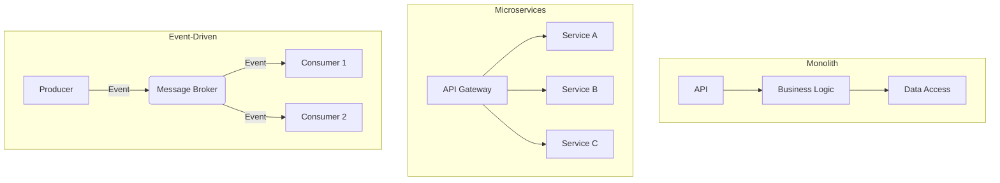
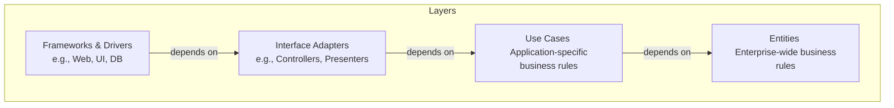
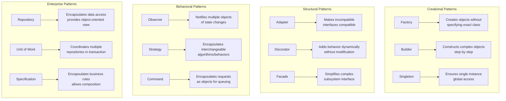

System architecture is the high-level structure of a software system. For a senior engineer, making sound architectural decisions is paramount, as these choices have long-lasting effects on scalability, maintainability, and team productivity. This section covers the key architectural styles and patterns that define modern backend systems.

## Architectural Styles

The architectural style is the foundational choice that dictates how the system will be organized. There is no "best" style; the choice is a trade-off based on team size, business requirements, and scalability needs.



- **Monolithic Architecture:** A single, unified codebase. It's simple to start with but can become a "big ball of mud" if not carefully managed.
- **Microservices Architecture:** Breaks the system into small, independent services. This promotes team autonomy and technological diversity but introduces significant operational complexity.
- **Event-Driven Architecture (EDA):** A paradigm where components communicate asynchronously via events. This promotes loose coupling and resilience, making it a natural fit for microservices.

:::tip Deep Dive: Resources
- [📄 **Monolith vs Microservices** by Martin Fowler](https://martinfowler.com/articles/microservices.html)
- [▶️ **The Power of Event-Driven Architecture** (Video by Gregor Hohpe)](https://www.youtube.com/watch?v=k8Ssh3-aE-c)
- [📄 **What is Event-Driven Architecture?** (AWS)](https://aws.amazon.com/event-driven-architecture/)
:::

---

## Domain-Driven Design (DDD)

DDD is an approach to software development for complex business domains. It aligns the software model with the business model by establishing a **Ubiquitous Language**—a shared vocabulary between developers and domain experts.

- **Strategic DDD:** The "macro" level. It's about decomposing the system into **Bounded Contexts**, which are logical boundaries for your domain models. **Context Mapping** is used to define the relationships between these contexts (e.g., via an **Anticorruption Layer**).
- **Tactical DDD:** The "micro" level. It provides a rich set of patterns for designing the model within a Bounded Context, including **Aggregates**, **Entities**, and **Value Objects**.

:::tip Deep Dive: Resources
- [📄 **Domain-Driven Design** by Martin Fowler](https://martinfowler.com/tags/domain%20driven%20design.html)
- [▶️ **What is DDD?** (Video by Eric Evans)](https://www.youtube.com/watch?v=g_h6d6j1qIs)
:::

---

## Advanced Architectural Patterns

These patterns solve specific, recurring problems in distributed systems.

- **CQRS (Command Query Responsibility Segregation):** Separates the models for reading data (Queries) and writing data (Commands). This is powerful because read and write workloads often have very different performance and consistency requirements. You can scale your read database independently of your write database.
- **Event Sourcing:** Instead of storing the current state of your data, you store a full, immutable sequence of the events that have happened to it. This provides a perfect audit log and allows you to derive the current state or any past state by replaying events. It's a natural fit for the command side of a CQRS system.
- **SAGA Pattern:** Manages data consistency across microservices without using distributed transactions. A saga is a sequence of local transactions. If one transaction fails, the saga executes compensating transactions to undo the preceding work. This is essential for maintaining data integrity in a distributed environment.

:::tip Deep Dive: Resources
- [📄 **CQRS** by Martin Fowler](https://martinfowler.com/bliki/CQRS.html)
- [▶️ **Exploring CQRS and Event Sourcing** (Video by Greg Young)](https://www.youtube.com/watch?v=JHGkaShoyNs)
- [📄 **Pattern: Saga** by Chris Richardson](https://microservices.io/patterns/data/saga.html)
:::

---

## Patterns for In-Service Design

These patterns focus on how to structure the code *within* a single service.

- **Clean Architecture:** Organizes the system in concentric layers, with a strict **Dependency Rule**: all dependencies must point inwards. This isolates your core business logic (Entities and Use Cases) from external concerns like databases, frameworks, and the UI.



- **Hexagonal Architecture (Ports & Adapters):** Similar to Clean Architecture, it isolates the core application logic from external dependencies. The core logic defines "ports" (interfaces), and external tools are implemented as "adapters" that plug into these ports.
- **Mediator Pattern:** A behavioral pattern that reduces coupling between components by having them communicate indirectly through a central "mediator" object. This is useful for decoupling command handlers from the business logic they orchestrate within a service.

---

## Essential Design Patterns for Senior Developers

These are the fundamental **Gang of Four (GoF)** and **Enterprise Patterns** that every senior backend developer should master. They provide proven solutions to recurring design problems.

### Creational Patterns

#### Factory Pattern
Encapsulates object creation logic, making code more flexible and testable.

<details>
<summary>Java Implementation</summary>

```java
// Product interface
public interface PaymentProcessor {
    void processPayment(BigDecimal amount);
    String getProviderName();
}

// Concrete implementations
public class StripePaymentProcessor implements PaymentProcessor {
    @Override
    public void processPayment(BigDecimal amount) {
        System.out.println("Processing $" + amount + " via Stripe");
        // Stripe-specific payment logic
    }
    
    @Override
    public String getProviderName() {
        return "Stripe";
    }
}

public class PayPalPaymentProcessor implements PaymentProcessor {
    @Override
    public void processPayment(BigDecimal amount) {
        System.out.println("Processing $" + amount + " via PayPal");
        // PayPal-specific payment logic
    }
    
    @Override
    public String getProviderName() {
        return "PayPal";
    }
}

// Factory
public class PaymentProcessorFactory {
    public static PaymentProcessor createProcessor(String type) {
        switch (type.toLowerCase()) {
            case "stripe":
                return new StripePaymentProcessor();
            case "paypal":
                return new PayPalPaymentProcessor();
            default:
                throw new IllegalArgumentException("Unknown payment processor: " + type);
        }
    }
}

// Usage
PaymentProcessor processor = PaymentProcessorFactory.createProcessor("stripe");
processor.processPayment(new BigDecimal("99.99"));
```

</details>

<details>
<summary>C# Implementation with Dependency Injection</summary>

```csharp
public interface IPaymentProcessor
{
    Task<PaymentResult> ProcessPaymentAsync(decimal amount);
    string ProviderName { get; }
}

public class StripePaymentProcessor : IPaymentProcessor
{
    public string ProviderName => "Stripe";
    
    public async Task<PaymentResult> ProcessPaymentAsync(decimal amount)
    {
        // Stripe API call
        await Task.Delay(100); // Simulate API call
        return new PaymentResult { Success = true, TransactionId = Guid.NewGuid().ToString() };
    }
}

public class PaymentProcessorFactory
{
    private readonly IServiceProvider _serviceProvider;
    
    public PaymentProcessorFactory(IServiceProvider serviceProvider)
    {
        _serviceProvider = serviceProvider;
    }
    
    public IPaymentProcessor CreateProcessor(PaymentProvider provider)
    {
        return provider switch
        {
            PaymentProvider.Stripe => _serviceProvider.GetService<StripePaymentProcessor>(),
            PaymentProvider.PayPal => _serviceProvider.GetService<PayPalPaymentProcessor>(),
            _ => throw new ArgumentException($"Unsupported provider: {provider}")
        };
    }
}
```

</details>

#### Builder Pattern
Constructs complex objects step by step, especially useful for objects with many optional parameters.

<details>
<summary>Java Implementation</summary>

```java
public class DatabaseConnection {
    private final String host;
    private final int port;
    private final String database;
    private final String username;
    private final String password;
    private final boolean useSSL;
    private final int connectionTimeout;
    private final int maxPoolSize;
    
    // Private constructor
    private DatabaseConnection(Builder builder) {
        this.host = builder.host;
        this.port = builder.port;
        this.database = builder.database;
        this.username = builder.username;
        this.password = builder.password;
        this.useSSL = builder.useSSL;
        this.connectionTimeout = builder.connectionTimeout;
        this.maxPoolSize = builder.maxPoolSize;
    }
    
    public static class Builder {
        // Required parameters
        private final String host;
        private final String database;
        
        // Optional parameters with defaults
        private int port = 5432;
        private String username = "postgres";
        private String password = "";
        private boolean useSSL = false;
        private int connectionTimeout = 30000;
        private int maxPoolSize = 10;
        
        public Builder(String host, String database) {
            this.host = host;
            this.database = database;
        }
        
        public Builder port(int port) {
            this.port = port;
            return this;
        }
        
        public Builder credentials(String username, String password) {
            this.username = username;
            this.password = password;
            return this;
        }
        
        public Builder useSSL(boolean useSSL) {
            this.useSSL = useSSL;
            return this;
        }
        
        public Builder connectionTimeout(int timeout) {
            this.connectionTimeout = timeout;
            return this;
        }
        
        public Builder maxPoolSize(int size) {
            this.maxPoolSize = size;
            return this;
        }
        
        public DatabaseConnection build() {
            // Validation
            if (host == null || host.isEmpty()) {
                throw new IllegalArgumentException("Host cannot be null or empty");
            }
            return new DatabaseConnection(this);
        }
    }
    
    // Usage example
    public static void main(String[] args) {
        DatabaseConnection connection = new DatabaseConnection.Builder("localhost", "myapp")
            .port(5432)
            .credentials("admin", "secret")
            .useSSL(true)
            .connectionTimeout(60000)
            .maxPoolSize(20)
            .build();
    }
}
```

</details>

### Structural Patterns

#### Adapter Pattern
Allows incompatible interfaces to work together.

<details>
<summary>Python Implementation</summary>

```python
from abc import ABC, abstractmethod
from typing import Dict, Any

# Target interface that our application expects
class EmailSender(ABC):
    @abstractmethod
    def send_email(self, to: str, subject: str, body: str) -> bool:
        pass

# Third-party library with different interface
class ThirdPartyEmailService:
    def send_message(self, recipient: str, title: str, content: str, options: Dict[str, Any]) -> Dict[str, Any]:
        # Simulate third-party API call
        print(f"Third-party API: Sending '{title}' to {recipient}")
        return {"status": "success", "message_id": "12345"}

# Adapter to make third-party service compatible with our interface
class ThirdPartyEmailAdapter(EmailSender):
    def __init__(self, third_party_service: ThirdPartyEmailService):
        self._service = third_party_service
    
    def send_email(self, to: str, subject: str, body: str) -> bool:
        # Adapt the interface
        options = {"priority": "normal", "format": "html"}
        result = self._service.send_message(
            recipient=to,
            title=subject,
            content=body,
            options=options
        )
        return result.get("status") == "success"

# Usage
class NotificationService:
    def __init__(self, email_sender: EmailSender):
        self._email_sender = email_sender
    
    def notify_user(self, user_email: str, message: str):
        success = self._email_sender.send_email(
            to=user_email,
            subject="Notification",
            body=message
        )
        if success:
            print("Notification sent successfully")
        else:
            print("Failed to send notification")

# Example usage
third_party_service = ThirdPartyEmailService()
email_adapter = ThirdPartyEmailAdapter(third_party_service)
notification_service = NotificationService(email_adapter)
notification_service.notify_user("user@example.com", "Hello, World!")
```

</details>

#### Decorator Pattern
Adds behavior to objects dynamically without altering their structure.

<details>
<summary>Node.js/JavaScript Implementation</summary>

```javascript
// Base coffee interface
class Coffee {
    cost() {
        throw new Error('cost() method must be implemented');
    }
    
    description() {
        throw new Error('description() method must be implemented');
    }
}

// Concrete coffee implementation
class SimpleCoffee extends Coffee {
    cost() {
        return 2.00;
    }
    
    description() {
        return 'Simple coffee';
    }
}

// Base decorator
class CoffeeDecorator extends Coffee {
    constructor(coffee) {
        super();
        this._coffee = coffee;
    }
    
    cost() {
        return this._coffee.cost();
    }
    
    description() {
        return this._coffee.description();
    }
}

// Concrete decorators
class MilkDecorator extends CoffeeDecorator {
    cost() {
        return super.cost() + 0.50;
    }
    
    description() {
        return super.description() + ', milk';
    }
}

class SugarDecorator extends CoffeeDecorator {
    cost() {
        return super.cost() + 0.25;
    }
    
    description() {
        return super.description() + ', sugar';
    }
}

class WhipDecorator extends CoffeeDecorator {
    cost() {
        return super.cost() + 0.75;
    }
    
    description() {
        return super.description() + ', whip';
    }
}

// Usage
let coffee = new SimpleCoffee();
console.log(`${coffee.description()}: $${coffee.cost()}`);
// Simple coffee: $2

coffee = new MilkDecorator(coffee);
console.log(`${coffee.description()}: $${coffee.cost()}`);
// Simple coffee, milk: $2.5

coffee = new SugarDecorator(coffee);
console.log(`${coffee.description()}: $${coffee.cost()}`);
// Simple coffee, milk, sugar: $2.75

coffee = new WhipDecorator(coffee);
console.log(`${coffee.description()}: $${coffee.cost()}`);
// Simple coffee, milk, sugar, whip: $3.5
```

</details>

### Behavioral Patterns

#### Observer Pattern
Defines a one-to-many dependency between objects for event-driven architectures.

<details>
<summary>Java Implementation</summary>

```java
import java.util.*;

// Subject interface
interface Subject {
    void attach(Observer observer);
    void detach(Observer observer);
    void notifyObservers();
}

// Observer interface
interface Observer {
    void update(String event, Object data);
}

// Concrete subject - Order management system
public class OrderService implements Subject {
    private List<Observer> observers = new ArrayList<>();
    private String lastEvent;
    private Object lastData;
    
    @Override
    public void attach(Observer observer) {
        observers.add(observer);
    }
    
    @Override
    public void detach(Observer observer) {
        observers.remove(observer);
    }
    
    @Override
    public void notifyObservers() {
        for (Observer observer : observers) {
            observer.update(lastEvent, lastData);
        }
    }
    
    public void createOrder(Order order) {
        // Business logic to create order
        System.out.println("Order created: " + order.getId());
        
        // Notify observers
        this.lastEvent = "ORDER_CREATED";
        this.lastData = order;
        notifyObservers();
    }
    
    public void cancelOrder(String orderId) {
        System.out.println("Order cancelled: " + orderId);
        
        this.lastEvent = "ORDER_CANCELLED";
        this.lastData = orderId;
        notifyObservers();
    }
}

// Concrete observers
class EmailNotificationService implements Observer {
    @Override
    public void update(String event, Object data) {
        switch (event) {
            case "ORDER_CREATED":
                Order order = (Order) data;
                sendOrderConfirmationEmail(order);
                break;
            case "ORDER_CANCELLED":
                String orderId = (String) data;
                sendOrderCancellationEmail(orderId);
                break;
        }
    }
    
    private void sendOrderConfirmationEmail(Order order) {
        System.out.println("Sending confirmation email for order: " + order.getId());
    }
    
    private void sendOrderCancellationEmail(String orderId) {
        System.out.println("Sending cancellation email for order: " + orderId);
    }
}

class InventoryService implements Observer {
    @Override
    public void update(String event, Object data) {
        if ("ORDER_CREATED".equals(event)) {
            Order order = (Order) data;
            updateInventory(order);
        }
    }
    
    private void updateInventory(Order order) {
        System.out.println("Updating inventory for order: " + order.getId());
        // Reduce stock quantities
    }
}

class AnalyticsService implements Observer {
    @Override
    public void update(String event, Object data) {
        System.out.println("Recording analytics event: " + event);
        // Send to analytics platform
    }
}

// Usage
public class ObserverPatternDemo {
    public static void main(String[] args) {
        OrderService orderService = new OrderService();
        
        // Register observers
        orderService.attach(new EmailNotificationService());
        orderService.attach(new InventoryService());
        orderService.attach(new AnalyticsService());
        
        // Create an order - all observers will be notified
        Order order = new Order("ORD-123", "Customer-456");
        orderService.createOrder(order);
    }
}
```

</details>

#### Strategy Pattern
Encapsulates algorithms and makes them interchangeable at runtime.

<details>
<summary>C# Implementation</summary>

```csharp
public interface IDiscountStrategy
{
    decimal CalculateDiscount(decimal totalAmount, Customer customer);
    string GetDescription();
}

public class NoDiscountStrategy : IDiscountStrategy
{
    public decimal CalculateDiscount(decimal totalAmount, Customer customer)
    {
        return 0;
    }
    
    public string GetDescription() => "No discount";
}

public class PercentageDiscountStrategy : IDiscountStrategy
{
    private readonly decimal _percentage;
    
    public PercentageDiscountStrategy(decimal percentage)
    {
        _percentage = percentage;
    }
    
    public decimal CalculateDiscount(decimal totalAmount, Customer customer)
    {
        return totalAmount * (_percentage / 100);
    }
    
    public string GetDescription() => $"{_percentage}% discount";
}

public class VipCustomerDiscountStrategy : IDiscountStrategy
{
    public decimal CalculateDiscount(decimal totalAmount, Customer customer)
    {
        if (customer.IsVip)
        {
            return totalAmount * 0.15m; // 15% for VIP customers
        }
        return 0;
    }
    
    public string GetDescription() => "VIP customer discount (15%)";
}

public class BulkOrderDiscountStrategy : IDiscountStrategy
{
    private readonly decimal _minimumAmount;
    private readonly decimal _discountPercentage;
    
    public BulkOrderDiscountStrategy(decimal minimumAmount, decimal discountPercentage)
    {
        _minimumAmount = minimumAmount;
        _discountPercentage = discountPercentage;
    }
    
    public decimal CalculateDiscount(decimal totalAmount, Customer customer)
    {
        return totalAmount >= _minimumAmount 
            ? totalAmount * (_discountPercentage / 100) 
            : 0;
    }
    
    public string GetDescription() => $"Bulk order discount ({_discountPercentage}% for orders over ${_minimumAmount})";
}

public class PricingContext
{
    private IDiscountStrategy _discountStrategy;
    
    public PricingContext(IDiscountStrategy discountStrategy)
    {
        _discountStrategy = discountStrategy;
    }
    
    public void SetDiscountStrategy(IDiscountStrategy strategy)
    {
        _discountStrategy = strategy;
    }
    
    public PricingResult CalculatePrice(decimal totalAmount, Customer customer)
    {
        var discount = _discountStrategy.CalculateDiscount(totalAmount, customer);
        var finalAmount = totalAmount - discount;
        
        return new PricingResult
        {
            OriginalAmount = totalAmount,
            DiscountAmount = discount,
            FinalAmount = finalAmount,
            DiscountDescription = _discountStrategy.GetDescription()
        };
    }
}

// Usage
var customer = new Customer { IsVip = true, TotalPurchases = 5000 };
var orderAmount = 1000m;

// Try different strategies
var strategies = new IDiscountStrategy[]
{
    new NoDiscountStrategy(),
    new PercentageDiscountStrategy(10),
    new VipCustomerDiscountStrategy(),
    new BulkOrderDiscountStrategy(500, 12)
};

var pricingContext = new PricingContext(new NoDiscountStrategy());

foreach (var strategy in strategies)
{
    pricingContext.SetDiscountStrategy(strategy);
    var result = pricingContext.CalculatePrice(orderAmount, customer);
    
    Console.WriteLine($"{result.DiscountDescription}: ${result.OriginalAmount} - ${result.DiscountAmount} = ${result.FinalAmount}");
}
```

</details>

### Enterprise Patterns

#### Repository Pattern
Encapsulates data access logic and provides a clean separation between business logic and data access.

<details>
<summary>C# Implementation with Entity Framework</summary>

```csharp
public interface IRepository<T> where T : class
{
    Task<T> GetByIdAsync(int id);
    Task<IEnumerable<T>> GetAllAsync();
    Task<IEnumerable<T>> FindAsync(Expression<Func<T, bool>> predicate);
    Task<T> AddAsync(T entity);
    Task UpdateAsync(T entity);
    Task DeleteAsync(T entity);
    Task<int> CountAsync(Expression<Func<T, bool>> predicate = null);
}

public class Repository<T> : IRepository<T> where T : class
{
    protected readonly DbContext _context;
    protected readonly DbSet<T> _dbSet;
    
    public Repository(DbContext context)
    {
        _context = context;
        _dbSet = context.Set<T>();
    }
    
    public virtual async Task<T> GetByIdAsync(int id)
    {
        return await _dbSet.FindAsync(id);
    }
    
    public virtual async Task<IEnumerable<T>> GetAllAsync()
    {
        return await _dbSet.ToListAsync();
    }
    
    public virtual async Task<IEnumerable<T>> FindAsync(Expression<Func<T, bool>> predicate)
    {
        return await _dbSet.Where(predicate).ToListAsync();
    }
    
    public virtual async Task<T> AddAsync(T entity)
    {
        _dbSet.Add(entity);
        await _context.SaveChangesAsync();
        return entity;
    }
    
    public virtual async Task UpdateAsync(T entity)
    {
        _dbSet.Attach(entity);
        _context.Entry(entity).State = EntityState.Modified;
        await _context.SaveChangesAsync();
    }
    
    public virtual async Task DeleteAsync(T entity)
    {
        if (_context.Entry(entity).State == EntityState.Detached)
        {
            _dbSet.Attach(entity);
        }
        _dbSet.Remove(entity);
        await _context.SaveChangesAsync();
    }
    
    public virtual async Task<int> CountAsync(Expression<Func<T, bool>> predicate = null)
    {
        return predicate == null 
            ? await _dbSet.CountAsync() 
            : await _dbSet.CountAsync(predicate);
    }
}

// Specific repository with custom methods
public interface IUserRepository : IRepository<User>
{
    Task<User> GetByEmailAsync(string email);
    Task<IEnumerable<User>> GetActiveUsersAsync();
    Task<bool> EmailExistsAsync(string email);
}

public class UserRepository : Repository<User>, IUserRepository
{
    public UserRepository(ApplicationDbContext context) : base(context)
    {
    }
    
    public async Task<User> GetByEmailAsync(string email)
    {
        return await _dbSet.FirstOrDefaultAsync(u => u.Email == email);
    }
    
    public async Task<IEnumerable<User>> GetActiveUsersAsync()
    {
        return await _dbSet
            .Where(u => u.IsActive && !u.IsDeleted)
            .OrderBy(u => u.LastName)
            .ToListAsync();
    }
    
    public async Task<bool> EmailExistsAsync(string email)
    {
        return await _dbSet.AnyAsync(u => u.Email == email);
    }
}

// Service layer using repository
public class UserService
{
    private readonly IUserRepository _userRepository;
    private readonly ILogger<UserService> _logger;
    
    public UserService(IUserRepository userRepository, ILogger<UserService> logger)
    {
        _userRepository = userRepository;
        _logger = logger;
    }
    
    public async Task<User> CreateUserAsync(CreateUserRequest request)
    {
        // Validation
        if (await _userRepository.EmailExistsAsync(request.Email))
        {
            throw new InvalidOperationException("Email already exists");
        }
        
        var user = new User
        {
            Email = request.Email,
            FirstName = request.FirstName,
            LastName = request.LastName,
            CreatedAt = DateTime.UtcNow,
            IsActive = true
        };
        
        var createdUser = await _userRepository.AddAsync(user);
        _logger.LogInformation("User created with ID: {UserId}", createdUser.Id);
        
        return createdUser;
    }
    
    public async Task<PagedResult<User>> GetUsersAsync(int page, int pageSize)
    {
        var users = await _userRepository.GetActiveUsersAsync();
        var totalCount = await _userRepository.CountAsync(u => u.IsActive && !u.IsDeleted);
        
        var pagedUsers = users
            .Skip((page - 1) * pageSize)
            .Take(pageSize)
            .ToList();
        
        return new PagedResult<User>
        {
            Items = pagedUsers,
            TotalCount = totalCount,
            Page = page,
            PageSize = pageSize
        };
    }
}
```

</details>

#### Unit of Work Pattern
Maintains a list of objects affected by a business transaction and coordinates writing out changes.

<details>
<summary>C# Implementation</summary>
```csharp
public interface IUnitOfWork : IDisposable
{
    IUserRepository Users { get; }
    IOrderRepository Orders { get; }
    IProductRepository Products { get; }
    
    Task<int> SaveChangesAsync();
    Task BeginTransactionAsync();
    Task CommitTransactionAsync();
    Task RollbackTransactionAsync();
}

public class UnitOfWork : IUnitOfWork
{
    private readonly ApplicationDbContext _context;
    private IDbContextTransaction _transaction;
    
    public UnitOfWork(ApplicationDbContext context)
    {
        _context = context;
        Users = new UserRepository(_context);
        Orders = new OrderRepository(_context);
        Products = new ProductRepository(_context);
    }
    
    public IUserRepository Users { get; private set; }
    public IOrderRepository Orders { get; private set; }
    public IProductRepository Products { get; private set; }
    
    public async Task<int> SaveChangesAsync()
    {
        return await _context.SaveChangesAsync();
    }
    
    public async Task BeginTransactionAsync()
    {
        _transaction = await _context.Database.BeginTransactionAsync();
    }
    
    public async Task CommitTransactionAsync()
    {
        try
        {
            await SaveChangesAsync();
            await _transaction?.CommitAsync();
        }
        catch
        {
            await RollbackTransactionAsync();
            throw;
        }
        finally
        {
            _transaction?.Dispose();
            _transaction = null;
        }
    }
    
    public async Task RollbackTransactionAsync()
    {
        await _transaction?.RollbackAsync();
        _transaction?.Dispose();
        _transaction = null;
    }
    
    public void Dispose()
    {
        _transaction?.Dispose();
        _context?.Dispose();
    }
}

// Usage in service
public class OrderService
{
    private readonly IUnitOfWork _unitOfWork;
    
    public OrderService(IUnitOfWork unitOfWork)
    {
        _unitOfWork = unitOfWork;
    }
    
    public async Task<Order> ProcessOrderAsync(CreateOrderRequest request)
    {
        await _unitOfWork.BeginTransactionAsync();
        
        try
        {
            // 1. Validate customer
            var customer = await _unitOfWork.Users.GetByIdAsync(request.CustomerId);
            if (customer == null)
                throw new InvalidOperationException("Customer not found");
            
            // 2. Check product availability and reserve inventory
            var products = new List<Product>();
            foreach (var item in request.Items)
            {
                var product = await _unitOfWork.Products.GetByIdAsync(item.ProductId);
                if (product == null || product.Stock < item.Quantity)
                    throw new InvalidOperationException($"Insufficient stock for product {item.ProductId}");
                
                product.Stock -= item.Quantity;
                await _unitOfWork.Products.UpdateAsync(product);
                products.Add(product);
            }
            
            // 3. Create order
            var order = new Order
            {
                CustomerId = request.CustomerId,
                Items = request.Items.Select(item => new OrderItem
                {
                    ProductId = item.ProductId,
                    Quantity = item.Quantity,
                    Price = products.First(p => p.Id == item.ProductId).Price
                }).ToList(),
                CreatedAt = DateTime.UtcNow
            };
            
            await _unitOfWork.Orders.AddAsync(order);
            
            // 4. All operations succeed - commit transaction
            await _unitOfWork.CommitTransactionAsync();
            
            return order;
        }
        catch
        {
            await _unitOfWork.RollbackTransactionAsync();
            throw;
        }
    }
}
```
</details>


:::tip Deep Dive: Resources
- [📄 **Design Patterns: Elements of Reusable Object-Oriented Software** (Gang of Four Book)](https://www.amazon.com/Design-Patterns-Elements-Reusable-Object-Oriented/dp/0201633612)
- [📄 **Patterns of Enterprise Application Architecture** by Martin Fowler](https://martinfowler.com/eaaCatalog/)
- [▶️ **Design Patterns in Plain English** (Video Series)](https://www.youtube.com/watch?v=v9ejT8FO-7I)
- [📄 **Refactoring.Guru Design Patterns**](https://refactoring.guru/design-patterns)
- [📄 **Repository Pattern in C#**](https://docs.microsoft.com/en-us/dotnet/architecture/microservices/microservice-ddd-cqrs-patterns/infrastructure-persistence-layer-design)
- [🛠️ **Design Patterns in Java**](https://java-design-patterns.com/)
- [📄 **Python Design Patterns**](https://python-patterns.guide/)
- [📄 **Enterprise Integration Patterns**](https://www.enterpriseintegrationpatterns.com/)
:::