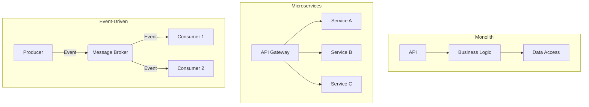
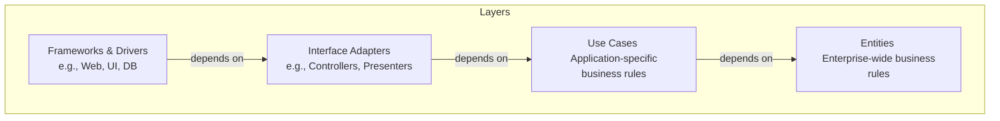
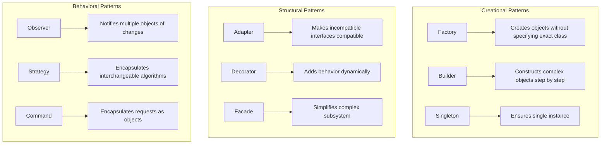

System architecture is the high-level structure of a software system. For a senior engineer, making sound architectural decisions is paramount, as these choices have long-lasting effects on scalability, maintainability, and team productivity. This section covers the key architectural styles and patterns that define modern backend systems.

## Architectural Styles

The architectural style is the foundational choice that dictates how the system will be organized. There is no "best" style; the choice is a trade-off based on team size, business requirements, and scalability needs.

- **Monolithic Architecture:** A single, unified codebase. It's simple to start with but can become a "big ball of mud" if not carefully managed.
- **Microservices Architecture:** Breaks the system into small, independent services. This promotes team autonomy and technological diversity but introduces significant operational complexity.
- **Event-Driven Architecture (EDA):** A paradigm where components communicate asynchronously via events. This promotes loose coupling and resilience, making it a natural fit for microservices.

:::tip Deep Dive: Resources
- [📄 **Monolith vs Microservices** by Martin Fowler](https://martinfowler.com/articles/microservices.html)
- [▶️ **The Power of Event-Driven Architecture** (Video by Gregor Hohpe)](https://www.youtube.com/watch?v=k8Ssh3-aE-c)
- [📄 **What is Event-Driven Architecture?** (AWS)](https://aws.amazon.com/event-driven-architecture/)
:::
:::

---

## Domain-Driven Design (DDD)

DDD is an approach to software development for complex business domains. It aligns the software model with the business model by establishing a **Ubiquitous Language**—a shared vocabulary between developers and domain experts.

- **Strategic DDD:** The "macro" level. It's about decomposing the system into **Bounded Contexts**, which are logical boundaries for your domain models. **Context Mapping** is used to define the relationships between these contexts (e.g., via an **Anticorruption Layer**).
- **Tactical DDD:** The "micro" level. It provides a rich set of patterns for designing the model within a Bounded Context, including **Aggregates**, **Entities**, and **Value Objects**.

:::tip Deep Dive: Resources
- [📄 **Domain-Driven Design** by Martin Fowler](https://martinfowler.com/tags/domain%20driven%20design.html)
- [▶️ **What is DDD?** (Video by Eric Evans)](https://www.youtube.com/watch?v=g_h6d6j1qIs)
:::
:::

---

## Advanced Architectural Patterns

These patterns solve specific, recurring problems in distributed systems.

- **CQRS (Command Query Responsibility Segregation):** Separates the models for reading data (Queries) and writing data (Commands). This is powerful because read and write workloads often have very different performance and consistency requirements. You can scale your read database independently of your write database.
- **Event Sourcing:** Instead of storing the current state of your data, you store a full, immutable sequence of the events that have happened to it. This provides a perfect audit log and allows you to derive the current state or any past state by replaying events. It's a natural fit for the command side of a CQRS system.
- **SAGA Pattern:** Manages data consistency across microservices without using distributed transactions. A saga is a sequence of local transactions. If one transaction fails, the saga executes compensating transactions to undo the preceding work. This is essential for maintaining data integrity in a distributed environment.

:::tip Deep Dive: Resources
- [📄 **CQRS** by Martin Fowler](https://martinfowler.com/bliki/CQRS.html)
- [▶️ **Exploring CQRS and Event Sourcing** (Video by Greg Young)](https://www.youtube.com/watch?v=JHGkaShoyNs)
- [📄 **Pattern: Saga** by Chris Richardson](https://microservices.io/patterns/data/saga.html)
:::
:::

---

## Patterns for In-Service Design

These patterns focus on how to structure the code *within* a single service.

- **Clean Architecture:** Organizes the system in concentric layers, with a strict **Dependency Rule**: all dependencies must point inwards. This isolates your core business logic (Entities and Use Cases) from external concerns like databases, frameworks, and the UI.

- **Hexagonal Architecture (Ports & Adapters):** Similar to Clean Architecture, it isolates the core application logic from external dependencies. The core logic defines "ports" (interfaces), and external tools are implemented as "adapters" that plug into these ports.
- **Mediator Pattern:** A behavioral pattern that reduces coupling between components by having them communicate indirectly through a central "mediator" object. This is useful for decoupling command handlers from the business logic they orchestrate within a service.

---

## Essential Design Patterns for Senior Developers

These are the fundamental **Gang of Four (GoF)** and **Enterprise Patterns** that every senior backend developer should master. They provide proven solutions to recurring design problems.

### Creational Patterns

- **Factory Pattern:** Encapsulates object creation logic. Instead of calling constructors directly, you use a factory method to create objects. This is especially useful when the exact type of object depends on runtime conditions.
- **Builder Pattern:** Constructs complex objects step by step. Perfect for creating objects with many optional parameters (avoiding telescoping constructor anti-pattern).
- **Singleton Pattern:** Ensures a class has only one instance and provides global access to it. Use sparingly—often dependency injection is a better alternative.

### Structural Patterns

- **Adapter Pattern:** Allows incompatible interfaces to work together. Essential when integrating with third-party libraries or legacy systems.
- **Decorator Pattern:** Adds behavior to objects dynamically without altering their structure. Common in middleware chains and aspect-oriented programming.
- **Facade Pattern:** Provides a simplified interface to a complex subsystem. Reduces coupling between clients and complex subsystems.

### Behavioral Patterns

- **Observer Pattern:** Defines a one-to-many dependency between objects. When one object changes state, all dependents are notified. Foundation of event-driven architectures.
- **Strategy Pattern:** Encapsulates algorithms and makes them interchangeable. Perfect for implementing different business rules or algorithms at runtime.
- **Command Pattern:** Encapsulates a request as an object, allowing you to parameterize clients with different requests, queue operations, and support undo operations.
- **Template Method Pattern:** Defines the skeleton of an algorithm in a base class, letting subclasses override specific steps without changing the algorithm's structure.

### Enterprise Patterns

- **Repository Pattern:** Encapsulates data access logic and provides a more object-oriented view of the persistence layer. Essential for clean architecture and testability.
- **Unit of Work Pattern:** Maintains a list of objects affected by a business transaction and coordinates writing out changes and resolving concurrency problems.
- **Specification Pattern:** Encapsulates business rules in a reusable way. Allows combining business rules using logical operators (AND, OR, NOT).

:::tip Deep Dive: Resources
- [📄 **Design Patterns: Elements of Reusable Object-Oriented Software** (Gang of Four Book)](https://www.amazon.com/Design-Patterns-Elements-Reusable-Object-Oriented/dp/0201633612)
- [📄 **Patterns of Enterprise Application Architecture** by Martin Fowler](https://martinfowler.com/eaaCatalog/)
- [▶️ **Design Patterns in Plain English** (Video Series)](https://www.youtube.com/watch?v=v9ejT8FO-7I)
- [📄 **Refactoring.Guru Design Patterns**](https://refactoring.guru/design-patterns)
- [📄 **Repository Pattern in C#**](https://docs.microsoft.com/en-us/dotnet/architecture/microservices/microservice-ddd-cqrs-patterns/infrastructure-persistence-layer-design)
:::
