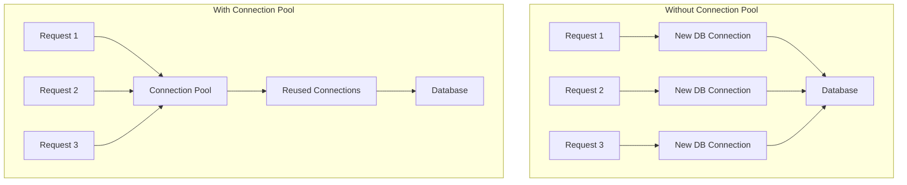
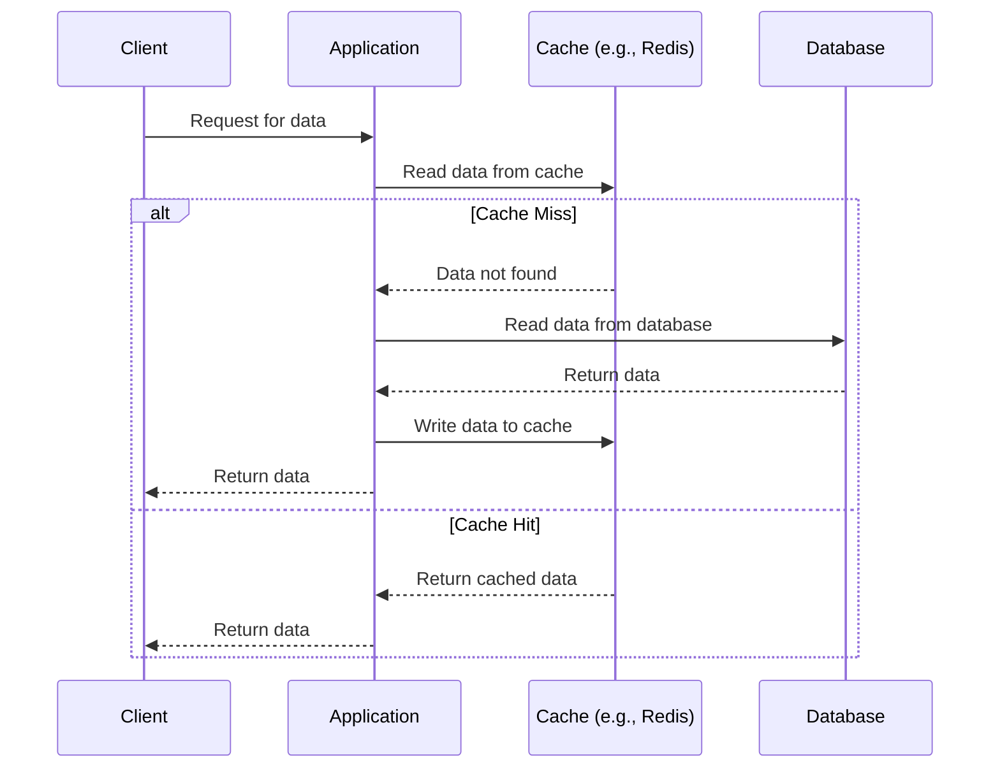

import MessagingChart from '@site/src/components/MessagingChart';

Data is the lifeblood of any application. How you choose to store, manage, and model that data has profound implications for your system's performance, scalability, and complexity. This section covers the critical technologies and patterns for managing data in modern backend systems.

## Choosing the Right Database

There is no "one size fits all" database. The right choice is a trade-off between consistency, availability, and partition tolerance, famously captured by the **CAP Theorem**.

- **Consistency (C):** Every read receives the most recent write or an error.
- **Availability (A):** Every request receives a (non-error) response, without the guarantee that it contains the most recent write.
- **Partition Tolerance (P):** The system continues to operate despite an arbitrary number of messages being dropped (or delayed) by the network between nodes.

In a distributed system, you must choose between C and A. SQL databases traditionally choose C, while many NoSQL databases choose A.

### SQL (Relational) Databases

- **Examples:** PostgreSQL, MySQL
- **Key Strength:** **ACID** compliance (Atomicity, Consistency, Isolation, Durability) makes them the gold standard for transactional systems where data integrity is paramount.
- **Best For:** Systems requiring strong consistency and complex, structured queries (e.g., e-commerce, financial systems).

### NoSQL (Non-Relational) Databases

NoSQL databases emerged to provide better scalability and flexibility.
- **Document Databases (e.g., MongoDB):** Store flexible, JSON-like documents. Great for content management and user profiles.
- **Key-Value Stores (e.g., Redis):** A simple key-value model. Blazing fast for simple lookups, making them ideal for caching and session management.
- **Wide-Column Stores (e.g., Cassandra):** Optimized for queries over large datasets. Excellent for time-series data and analytics.
- **Graph Databases (e.g., Neo4j):** Model data as nodes and edges. Perfect for interconnected data like social networks and recommendation engines.

:::tip Deep Dive: Resources
- [📄 **CAP Theorem: A Plain English Explanation**](https://www.consul.io/docs/intro/vs/cap-theorem)
- [▶️ **SQL vs. NoSQL Explained** (Video)](https://www.youtube.com/watch?v=cDatabase_Video)
- [📄 **PostgreSQL Official Documentation**](https://www.postgresql.org/docs/)
- [📄 **MongoDB Official Documentation**](https://www.mongodb.com/docs/)
:::
---

---

## Database Performance & Optimization

Performance is critical for data-intensive applications. Senior developers must understand how to optimize database interactions.

### Indexing Strategies

- **Primary Indexes:** Unique identifiers for rows (usually the primary key).
- **Secondary Indexes:** Speed up queries on non-primary key columns. Trade-off between read performance and write performance.
- **Composite Indexes:** Index on multiple columns. Order matters for query optimization.
- **Partial Indexes:** Index only rows that meet certain conditions, saving space.

### Query Optimization

- **Explain Plans:** Understand how the database executes your queries. Use `EXPLAIN` in SQL.
- **N+1 Query Problem:** Avoid making N additional queries for N results. Use JOINs or eager loading.
- **Connection Pooling:** Reuse database connections to avoid the overhead of creating new connections.

### Transaction Management

- **ACID Properties:** 
  - **Atomicity:** All operations in a transaction succeed or fail together.
  - **Consistency:** Transactions preserve database invariants.
  - **Isolation:** Concurrent transactions don't interfere with each other.
  - **Durability:** Committed transactions survive system failures.

- **Isolation Levels:**
  - **Read Uncommitted:** Lowest isolation, allows dirty reads.
  - **Read Committed:** Prevents dirty reads but allows non-repeatable reads.
  - **Repeatable Read:** Prevents dirty and non-repeatable reads.
  - **Serializable:** Highest isolation, prevents all phenomena.

:::tip Deep Dive: Resources
- [📄 **Database Indexing Best Practices**](https://use-the-index-luke.com/)
- [▶️ **Database Transactions Explained** (Video)](https://www.youtube.com/watch?v=ZX-wdXB8bQg)
- [📄 **PostgreSQL Performance Tuning Guide**](https://wiki.postgresql.org/wiki/Performance_Optimization)
:::
---

---

## Caching Strategies

Caching reduces latency and load on your primary data store by keeping frequently accessed data in a faster, closer location.

- **Cache-Aside (Lazy Loading):** This is the most common caching strategy. The application is responsible for managing the cache.

- **Write-Through:** Data is written to the cache and database simultaneously. Ensures consistency but adds latency to writes.
- **Write-Back:** Data is written only to the cache, which then asynchronously writes to the database. Fastest for writes, but carries a risk of data loss.

:::tip Deep Dive: Resources
- [📄 **Caching Patterns and Best Practices** (AWS)](https://aws.amazon.com/caching/best-practices/)
- [▶️ **Introduction to Redis** (Video)](https://www.youtube.com/watch?v=rP9_b429sW4)
:::
---

---

## Messaging Paradigms

For asynchronous communication, the choice of message broker is a critical architectural decision.

<MessagingChart />

- **Message Broker (Smart Broker):**
  - **Examples:** RabbitMQ, ActiveMQ
  - **Paradigm:** The broker has sophisticated routing logic. Ideal for complex routing, task queues, and ensuring messages are delivered to specific consumers.
- **Event Streaming Platform (Dumb Broker):**
  - **Examples:** Apache Kafka, AWS Kinesis
  - **Paradigm:** A durable, append-only log. The consumer is responsible for tracking its position. Best for high-throughput data pipelines and event sourcing.

:::tip Deep Dive: Resources
- [📄 **RabbitMQ vs. Kafka** (CloudAMQP)](https://www.cloudamqp.com/blog/rabbitmq-vs-kafka.html)
- [▶️ **What is Apache Kafka?** (Video by Confluent)](https://www.youtube.com/watch?v=0Kpg_pny_gI)
:::
---

