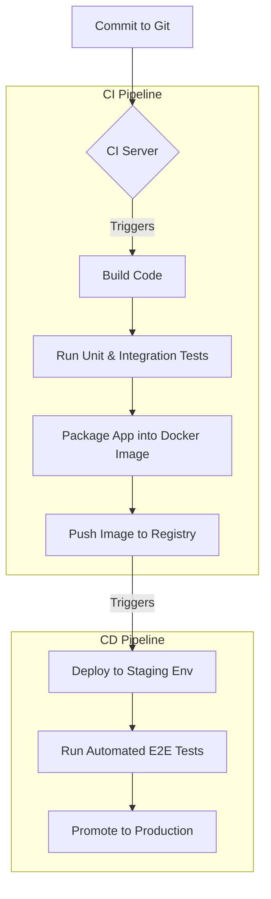
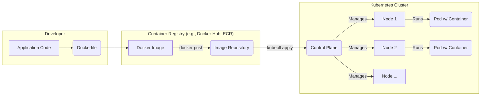

A senior engineer's responsibility extends beyond writing code to ensuring the entire system runs reliably and efficiently in production. This section covers the crucial "DevOps" aspects of packaging, deploying, and managing modern backend systems, embracing the philosophy that "you build it, you run it."

## Automation: CI/CD & Infrastructure as Code

Automation is the bedrock of modern software operations. It enables speed, reliability, and repeatability.

- **CI/CD (Continuous Integration/Continuous Deployment):** This is the practice of automating the software delivery lifecycle. It's a pipeline that takes code from a developer's machine to production with minimal human intervention.

- **Infrastructure as Code (IaC):** The practice of managing and provisioning infrastructure through code and automation. Tools like **Terraform** and **Pulumi** allow you to define your infrastructure in version-controlled files, making your deployments auditable, repeatable, and less prone to human error.

:::tip Deep Dive: Resources
- [📄 **Continuous Delivery** by Martin Fowler](https://martinfowler.com/bliki/ContinuousDelivery.html)
- [▶️ **What is CI/CD?** (Video by Red Hat)](https://www.youtube.com/watch?v=k2a_ZtB1YmA)
- [📄 **Terraform: Up & Running** (Book by Yevgeniy Brikman)](https://www.terraformupandrunning.com/)
:::
:::

---

## The Universal Runtime: Docker & Kubernetes

- **Docker:** A platform for developing, shipping, and running applications in containers. It packages an application and its dependencies into a standardized unit, ensuring that it runs consistently everywhere.
- **Kubernetes (K8s):** The de facto industry standard for orchestrating containers at scale. It takes your Docker containers and manages their lifecycle, ensuring they are running, healthy, and accessible.

:::tip Deep Dive: Resources
- [▶️ **Docker in 100 Seconds** (Video)](https://www.youtube.com/watch?v=Gjnup-PuquQ)
- [▶️ **Kubernetes in 100 Seconds** (Video)](https://www.youtube.com/watch?v=PziYfl8q_wE)
- [📄 **Kubernetes.io Documentation**](https://kubernetes.io/docs/home/)
:::
:::

---

## Cloud Deployment Models

Understanding the cloud service models is key to choosing the right platform for your needs, balancing control with convenience.

- **Infrastructure as a Service (IaaS):** You manage the VMs, storage, and networking.
  - **Pros:** Maximum control and flexibility.
  - **Cons:** Highest operational burden.
- **Platform as a Service (PaaS):** You just deploy your application code; the provider manages the underlying infrastructure.
  - **Pros:** Accelerates development, reduces operational overhead.
  - **Cons:** Less control over the environment; potential for vendor lock-in.
- **Function as a Service (FaaS / Serverless):** You provide code in the form of functions, and the provider manages everything else.
  - **Pros:** Pay-per-use model, automatic scaling (including to zero).
  - **Cons:** Can be challenging for long-running or stateful applications. Potential for "cold starts."

:::tip Deep Dive: Resources
- [📄 **IaaS vs PaaS vs SaaS** (Microsoft Azure)](https://azure.microsoft.com/en-us/resources/cloud-computing-dictionary/iaas-vs-paas-vs-saas/)
- [▶️ **What is Serverless?** (Video by IBM)](https://www.youtube.com/watch?v=v_y3z_5gG7g)
:::
:::
