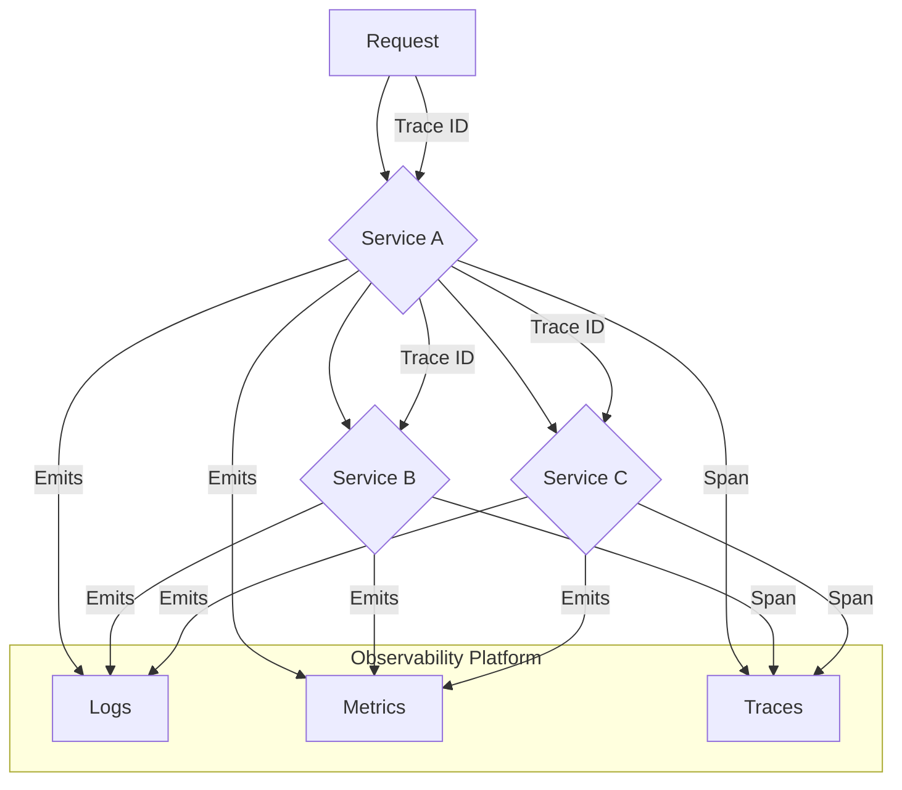
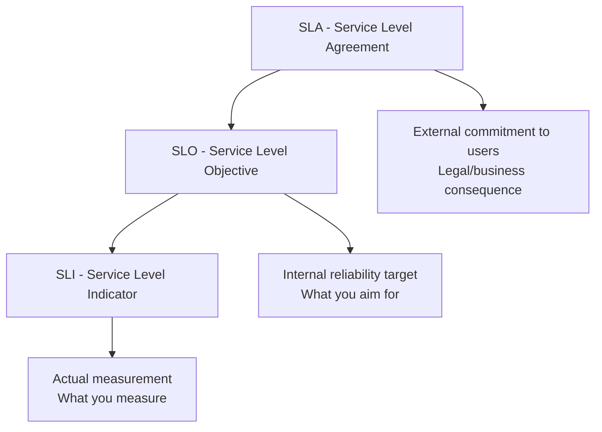
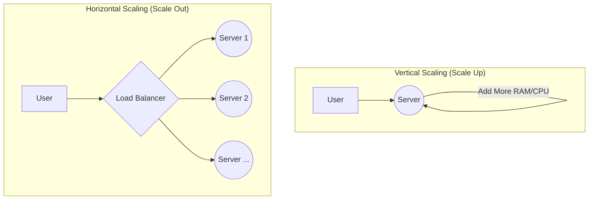

Building a system is one thing; ensuring it runs well and can handle growth is another. This final section covers two deeply intertwined topics: observability (the ability to understand your system's internal state from the outside) and performance (the strategies for making your system faster and more scalable). You can't improve what you can't measure.

## Observability: The Three Pillars

Observability is crucial for debugging complex, distributed systems. It's not just about having dashboards; it's about being able to ask arbitrary questions about your system to understand "unknown unknowns." It is built on three pillars:

1.  **Logging:** A detailed, timestamped record of a discrete event. Use **structured logging** (e.g., JSON) so logs can be easily searched and filtered. Centralize logs into a single platform (e.g., ELK Stack, Splunk, Datadog).
2.  **Metrics:** Aggregated numerical data measured over time. Monitor the **"Four Golden Signals"**:
    - **Latency:** The time it takes to service a request.
    - **Traffic:** A measure of how much demand is being placed on your system.
    - **Errors:** The rate of requests that fail.
    - **Saturation:** How "full" your service is (e.g., CPU, memory).
3.  **Distributed Tracing:** Traces the lifecycle of a single request as it propagates through multiple services. This is essential for pinpointing bottlenecks and understanding failures in a microservices architecture.

:::tip Deep Dive: Resources
- [📄 **The Three Pillars of Observability** by Honeycomb.io](https://www.honeycomb.io/blog/three-pillars-of-observability-logs-metrics-traces)
- [▶️ **What is OpenTelemetry?** (Video)](https://www.youtube.com/watch?v=y-G-iA-i5-Y)
- [📄 **Prometheus Official Documentation**](https://prometheus.io/docs/introduction/overview/)
:::
:::

---

## Service Level Objectives (SLOs) & Error Budgets

Senior engineers must define and measure service reliability using quantifiable metrics.

### The SLI/SLO/SLA Hierarchy

- **SLI (Service Level Indicator):** A quantifiable measure of service level (e.g., "99.9% of requests return in under 100ms").
- **SLO (Service Level Objective):** The target reliability for a service, based on SLIs (e.g., "99.95% uptime").
- **SLA (Service Level Agreement):** The legal/business agreement with consequences if not met.

### Error Budgets

An **error budget** is the maximum amount of downtime/errors acceptable within a period (e.g., 0.1% error rate = 43.2 minutes downtime per month).

- **Benefits:** Balances reliability with development velocity. Teams can spend their error budget on new features.
- **When Budget is Exceeded:** Focus shifts to reliability over new features.

### Common SLIs for Backend Services

- **Availability:** Percentage of successful requests over total requests.
- **Latency:** Response time distribution (e.g., 95th percentile < 200ms).
- **Throughput:** Requests per second the service can handle.
- **Error Rate:** Percentage of requests that result in errors.

:::tip Deep Dive: Resources
- [📄 **Site Reliability Engineering Book** (Google)](https://sre.google/sre-book/table-of-contents/)
- [▶️ **SLIs, SLOs, SLAs, oh my!** (Video by Google)](https://www.youtube.com/watch?v=tEylFyxbDLE)
- [📄 **Implementing SLOs** (Datadog)](https://www.datadoghq.com/blog/slo-monitoring-tracking/)
:::

---

## Fundamental Scaling Strategies

Scaling is the process of increasing a system's capacity to handle more load.

- **Vertical Scaling (Scaling Up):** Increasing the resources (CPU, RAM) of a single server. It's simple to implement but has a hard physical limit and can be very expensive. It's also a single point of failure.
- **Horizontal Scaling (Scaling Out):** Adding more servers to a pool and distributing the load between them. This is the foundation of modern, scalable systems. It's more cost-effective and fault-tolerant but requires applications to be designed as **stateless** services.
- **Load Balancing:** A load balancer sits in front of your horizontally scaled services and distributes incoming traffic, preventing any single server from being overwhelmed.
- **Content Delivery Network (CDN):** A geographically distributed network of proxy servers that caches static content closer to users, dramatically reducing latency and offloading traffic from your origin servers.

:::tip Deep Dive: Resources
- [▶️ **System Design 101: Scaling and Load Balancers** (Video)](https://www.youtube.com/watch?v=K0Ta65OqQkY)
- [📄 **What is a CDN?** (Cloudflare)](https://www.cloudflare.com/learning/cdn/what-is-a-cdn/)
:::
:::
