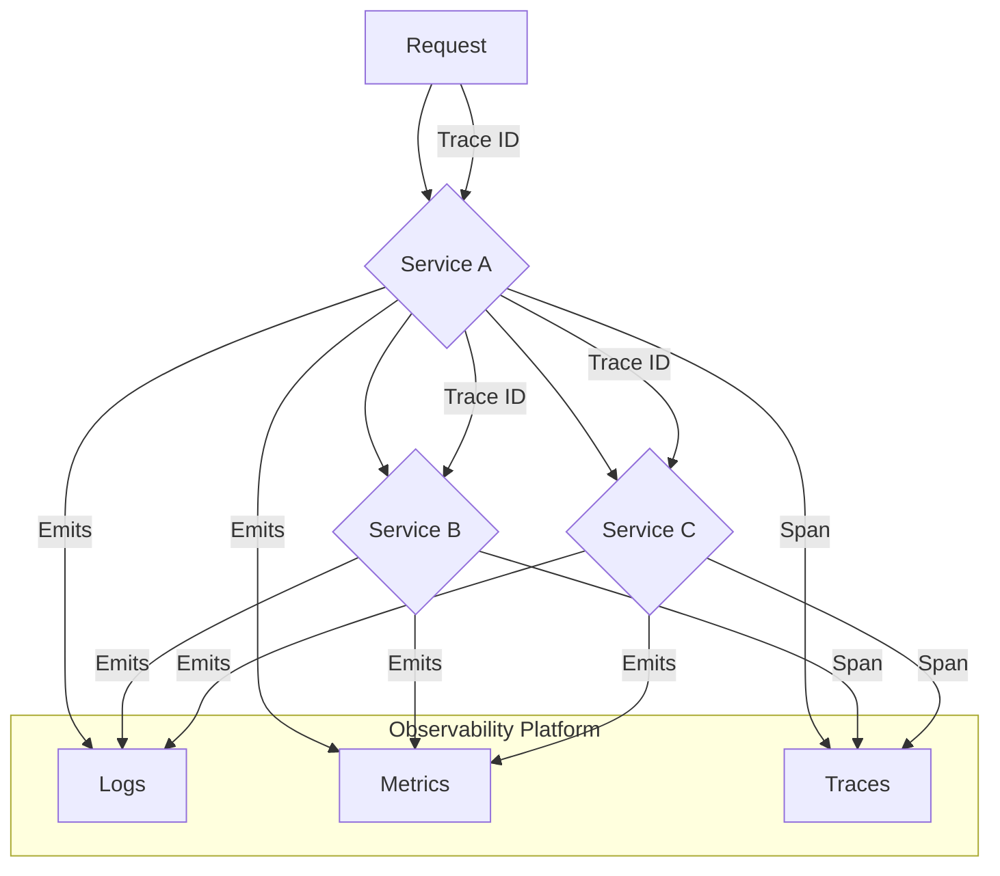
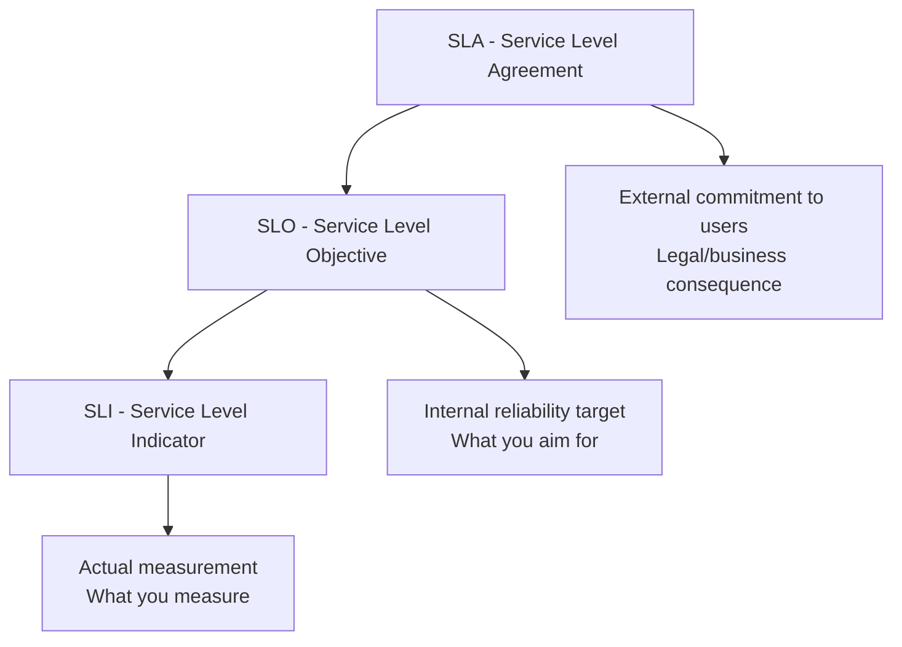
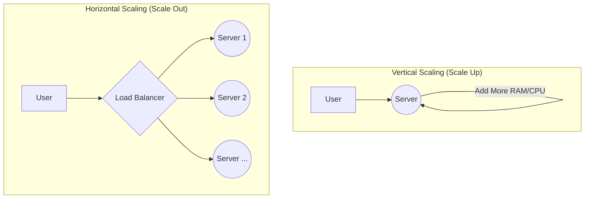

Building a system is one thing; ensuring it runs well and can handle growth is another. This final section covers two deeply intertwined topics: observability (the ability to understand your system's internal state from the outside) and performance (the strategies for making your system faster and more scalable). You can't improve what you can't measure.

## Observability: The Three Pillars

Observability is crucial for debugging complex, distributed systems. It's not just about having dashboards; it's about being able to ask arbitrary questions about your system to understand "unknown unknowns." It is built on three pillars:



### 1. Logging Implementation Examples

**Structured Logging with Winston (Node.js):**
```javascript
const winston = require('winston');
const { ElasticsearchTransport } = require('winston-elasticsearch');

const logger = winston.createLogger({
  level: 'info',
  format: winston.format.combine(
    winston.format.timestamp(),
    winston.format.errors({ stack: true }),
    winston.format.json()
  ),
  defaultMeta: { 
    service: 'user-service',
    version: process.env.APP_VERSION || '1.0.0'
  },
  transports: [
    // Console for development
    new winston.transports.Console({
      format: winston.format.combine(
        winston.format.colorize(),
        winston.format.simple()
      )
    }),
    
    // File for production
    new winston.transports.File({ 
      filename: 'logs/error.log', 
      level: 'error' 
    }),
    new winston.transports.File({ 
      filename: 'logs/combined.log' 
    }),
    
    // Elasticsearch for centralized logging
    new ElasticsearchTransport({
      level: 'info',
      clientOpts: { node: process.env.ELASTICSEARCH_URL },
      index: 'application-logs'
    })
  ]
});

// Usage in application
class UserService {
  async createUser(userData) {
    const userId = crypto.randomUUID();
    
    logger.info('Creating user', {
      operation: 'create_user',
      userId,
      email: userData.email,
      metadata: {
        ip: req.ip,
        userAgent: req.get('User-Agent')
      }
    });
    
    try {
      const user = await this.userRepository.create({
        id: userId,
        ...userData
      });
      
      logger.info('User created successfully', {
        operation: 'create_user',
        userId,
        duration: Date.now() - startTime
      });
      
      return user;
    } catch (error) {
      logger.error('Failed to create user', {
        operation: 'create_user',
        userId,
        error: error.message,
        stack: error.stack,
        userData: { email: userData.email } // Don't log sensitive data
      });
      throw error;
    }
  }
}
```

### 2. Metrics Collection with Prometheus

**Express.js Metrics Middleware:**
```javascript
const prometheus = require('prom-client');
const express = require('express');

// Create metrics
const httpRequestsTotal = new prometheus.Counter({
  name: 'http_requests_total',
  help: 'Total number of HTTP requests',
  labelNames: ['method', 'route', 'status_code']
});

const httpRequestDuration = new prometheus.Histogram({
  name: 'http_request_duration_seconds',
  help: 'Duration of HTTP requests in seconds',
  labelNames: ['method', 'route', 'status_code'],
  buckets: [0.1, 0.5, 1, 2, 5]
});

const activeConnections = new prometheus.Gauge({
  name: 'active_connections',
  help: 'Number of active connections'
});

const databaseConnectionPool = new prometheus.Gauge({
  name: 'database_connection_pool_active',
  help: 'Active database connections in pool'
});

// Middleware to collect metrics
const metricsMiddleware = (req, res, next) => {
  const startTime = Date.now();
  
  activeConnections.inc();
  
  res.on('finish', () => {
    const duration = (Date.now() - startTime) / 1000;
    const route = req.route?.path || req.path;
    
    httpRequestsTotal
      .labels(req.method, route, res.statusCode.toString())
      .inc();
    
    httpRequestDuration
      .labels(req.method, route, res.statusCode.toString())
      .observe(duration);
    
    activeConnections.dec();
  });
  
  next();
};

// Custom business metrics
const orderMetrics = {
  ordersCreated: new prometheus.Counter({
    name: 'orders_created_total',
    help: 'Total number of orders created',
    labelNames: ['payment_method', 'customer_segment']
  }),
  
  orderValue: new prometheus.Histogram({
    name: 'order_value_dollars',
    help: 'Order value in dollars',
    buckets: [10, 50, 100, 250, 500, 1000]
  }),
  
  inventoryLevel: new prometheus.Gauge({
    name: 'inventory_level',
    help: 'Current inventory level',
    labelNames: ['product_id', 'warehouse']
  })
};

// Usage in business logic
class OrderService {
  async createOrder(orderData) {
    try {
      const order = await this.orderRepository.create(orderData);
      
      // Track business metrics
      orderMetrics.ordersCreated
        .labels(order.paymentMethod, order.customerSegment)
        .inc();
        
      orderMetrics.orderValue
        .observe(order.totalAmount);
      
      return order;
    } catch (error) {
      // Error metrics are tracked automatically by middleware
      throw error;
    }
  }
}

// Metrics endpoint
app.use('/metrics', async (req, res) => {
  try {
    // Update gauge metrics before serving
    const dbPool = await db.getPoolStatus();
    databaseConnectionPool.set(dbPool.activeConnections);
    
    res.set('Content-Type', prometheus.register.contentType);
    res.end(await prometheus.register.metrics());
  } catch (error) {
    res.status(500).end(error.message);
  }
});
```

### 3. Distributed Tracing with OpenTelemetry

**OpenTelemetry Setup:**
```javascript
const { NodeSDK } = require('@opentelemetry/sdk-node');
const { Resource } = require('@opentelemetry/resources');
const { SemanticResourceAttributes } = require('@opentelemetry/semantic-conventions');
const { JaegerExporter } = require('@opentelemetry/exporter-jaeger');
const { getNodeAutoInstrumentations } = require('@opentelemetry/auto-instrumentations-node');

// Initialize OpenTelemetry
const sdk = new NodeSDK({
  resource: new Resource({
    [SemanticResourceAttributes.SERVICE_NAME]: 'user-service',
    [SemanticResourceAttributes.SERVICE_VERSION]: '1.0.0',
    [SemanticResourceAttributes.DEPLOYMENT_ENVIRONMENT]: process.env.NODE_ENV
  }),
  traceExporter: new JaegerExporter({
    endpoint: 'http://jaeger:14268/api/traces'
  }),
  instrumentations: [
    getNodeAutoInstrumentations({
      '@opentelemetry/instrumentation-fs': {
        enabled: false // Disable filesystem instrumentation
      }
    })
  ]
});

sdk.start();

// Manual instrumentation
const { trace, SpanStatusCode } = require('@opentelemetry/api');

class UserService {
  async getUserWithOrders(userId) {
    const tracer = trace.getTracer('user-service');
    
    return tracer.startActiveSpan('get_user_with_orders', async (span) => {
      try {
        span.setAttributes({
          'user.id': userId,
          'operation': 'get_user_with_orders'
        });
        
        // Get user data
        const user = await tracer.startActiveSpan('database.get_user', async (userSpan) => {
          userSpan.setAttributes({
            'db.operation': 'SELECT',
            'db.table': 'users'
          });
          
          const userData = await this.userRepository.findById(userId);
          userSpan.setStatus({ code: SpanStatusCode.OK });
          return userData;
        });
        
        if (!user) {
          span.recordException(new Error('User not found'));
          span.setStatus({ 
            code: SpanStatusCode.ERROR, 
            message: 'User not found' 
          });
          throw new Error('User not found');
        }
        
        // Get user orders
        const orders = await tracer.startActiveSpan('get_user_orders', async (ordersSpan) => {
          ordersSpan.setAttributes({
            'user.id': userId,
            'operation': 'get_orders'
          });
          
          const orderData = await this.orderService.getOrdersByUserId(userId);
          ordersSpan.setAttributes({
            'orders.count': orderData.length
          });
          
          return orderData;
        });
        
        span.setAttributes({
          'user.email': user.email,
          'orders.count': orders.length,
          'result.success': true
        });
        
        span.setStatus({ code: SpanStatusCode.OK });
        return { user, orders };
        
      } catch (error) {
        span.recordException(error);
        span.setStatus({ 
          code: SpanStatusCode.ERROR, 
          message: error.message 
        });
        throw error;
      } finally {
        span.end();
      }
    });
  }
}
```

### Four Golden Signals Dashboard Configuration

**Grafana Dashboard JSON:**
```json
{
  "dashboard": {
    "title": "Application Golden Signals",
    "panels": [
      {
        "title": "Request Rate (Traffic)",
        "type": "graph",
        "targets": [
          {
            "expr": "rate(http_requests_total[5m])",
            "legendFormat": "{{method}} {{route}}"
          }
        ]
      },
      {
        "title": "Request Latency",
        "type": "graph",
        "targets": [
          {
            "expr": "histogram_quantile(0.95, rate(http_request_duration_seconds_bucket[5m]))",
            "legendFormat": "95th percentile"
          },
          {
            "expr": "histogram_quantile(0.50, rate(http_request_duration_seconds_bucket[5m]))",
            "legendFormat": "50th percentile"
          }
        ]
      },
      {
        "title": "Error Rate",
        "type": "graph",
        "targets": [
          {
            "expr": "rate(http_requests_total{status_code=~\"5..\"}[5m]) / rate(http_requests_total[5m])",
            "legendFormat": "Error Rate"
          }
        ]
      },
      {
        "title": "Saturation (CPU & Memory)",
        "type": "graph",
        "targets": [
          {
            "expr": "rate(process_cpu_seconds_total[5m]) * 100",
            "legendFormat": "CPU Usage %"
          },
          {
            "expr": "process_resident_memory_bytes / 1024 / 1024",
            "legendFormat": "Memory Usage MB"
          }
        ]
      }
    ]
  }
}
```

:::tip Deep Dive: Resources
- [📄 **The Three Pillars of Observability** by Honeycomb.io](https://www.honeycomb.io/blog/three-pillars-of-observability-logs-metrics-traces)
- [▶️ **What is OpenTelemetry?** (Video)](https://www.youtube.com/watch?v=y-G-iA-i5-Y)
- [📄 **Prometheus Official Documentation**](https://prometheus.io/docs/introduction/overview/)
:::
:::

---

## Service Level Objectives (SLOs) & Error Budgets

Senior engineers must define and measure service reliability using quantifiable metrics.

### The SLI/SLO/SLA Hierarchy



- **SLI (Service Level Indicator):** A quantifiable measure of service level (e.g., "99.9% of requests return in under 100ms").
- **SLO (Service Level Objective):** The target reliability for a service, based on SLIs (e.g., "99.95% uptime").
- **SLA (Service Level Agreement):** The legal/business agreement with consequences if not met.

### Error Budgets

An **error budget** is the maximum amount of downtime/errors acceptable within a period (e.g., 0.1% error rate = 43.2 minutes downtime per month).

- **Benefits:** Balances reliability with development velocity. Teams can spend their error budget on new features.
- **When Budget is Exceeded:** Focus shifts to reliability over new features.

### Common SLIs for Backend Services

- **Availability:** Percentage of successful requests over total requests.
- **Latency:** Response time distribution (e.g., 95th percentile < 200ms).
- **Throughput:** Requests per second the service can handle.
- **Error Rate:** Percentage of requests that result in errors.

:::tip Deep Dive: Resources
- [📄 **Site Reliability Engineering Book** (Google)](https://sre.google/sre-book/table-of-contents/)
- [▶️ **SLIs, SLOs, SLAs, oh my!** (Video by Google)](https://www.youtube.com/watch?v=tEylFyxbDLE)
- [📄 **Implementing SLOs** (Datadog)](https://www.datadoghq.com/blog/slo-monitoring-tracking/)
:::

---

## Fundamental Scaling Strategies

Scaling is the process of increasing a system's capacity to handle more load.



- **Vertical Scaling (Scaling Up):** Increasing the resources (CPU, RAM) of a single server. It's simple to implement but has a hard physical limit and can be very expensive. It's also a single point of failure.
- **Horizontal Scaling (Scaling Out):** Adding more servers to a pool and distributing the load between them. This is the foundation of modern, scalable systems. It's more cost-effective and fault-tolerant but requires applications to be designed as **stateless** services.
- **Load Balancing:** A load balancer sits in front of your horizontally scaled services and distributes incoming traffic, preventing any single server from being overwhelmed.
- **Content Delivery Network (CDN):** A geographically distributed network of proxy servers that caches static content closer to users, dramatically reducing latency and offloading traffic from your origin servers.

:::tip Deep Dive: Resources
- [▶️ **System Design 101: Scaling and Load Balancers** (Video)](https://www.youtube.com/watch?v=K0Ta65OqQkY)
- [📄 **What is a CDN?** (Cloudflare)](https://www.cloudflare.com/learning/cdn/what-is-a-cdn/)
:::
:::
