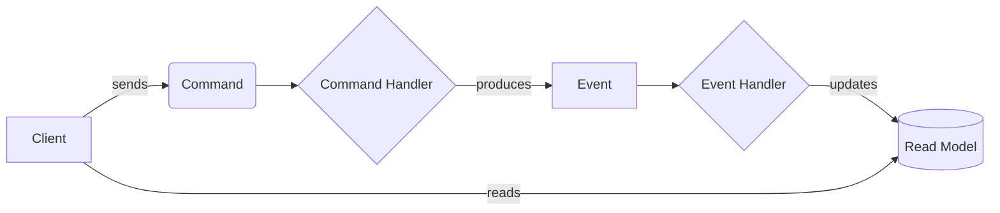

This section dives into the specific, advanced patterns required to build the internal logic of modern services. Here you'll find solutions for critical challenges like data consistency across services (SAGA), optimizing data access (CQRS), and managing state changes over time (Event Sourcing). Mastering these patterns is a hallmark of a senior developer.

## Chapter 3: Tactical DDD: Implementing the Domain Model

Tactical DDD provides the building blocks for designing a rich domain model within a Bounded Context.

- **Entities vs. Value Objects:** An Entity has a unique identity and lifecycle (e.g., a `Customer`). A Value Object is defined by its attributes and is immutable (e.g., an `Address`).
- **Aggregates:** A cluster of domain objects treated as a single unit for data changes. The Aggregate Root is the single entry point and enforces business rules (invariants).
- **Rules for Aggregate Design:**
  1. Design small aggregates.
  2. Reference other aggregates by ID only.
  3. Modify one aggregate per transaction.
  4. Use eventual consistency outside the boundary.
- **Repositories:** Provide the illusion of an in-memory collection of Aggregates, decoupling the domain from persistence.
- **Domain Events:** An immutable record of something significant that happened in the domain (e.g., `OrderShippedEvent`).

---

## Chapter 4: Mastering Data with CQRS and Event Sourcing

### CQRS (Command Query Responsibility Segregation)
A pattern that separates the model for updating data (Commands) from the model for reading data (Queries). This allows for independent optimization and scaling of reads and writes.

#### Visualizing the CQRS Flow


### Event Sourcing (ES)
Instead of storing only the current state, you store the full sequence of immutable events that have ever affected an entity. The current state is derived by replaying these events. This provides a full, auditable history of every change.

:::tip Resource
- [▶️ Watch: CQRS and Event Sourcing by Greg Young](https://www.youtube.com/watch?v=JHGkaShoyNs)
:::

---

## Chapter 5: The SAGA Pattern

The SAGA pattern manages data consistency across multiple services without using blocking distributed transactions. It is a sequence of local transactions with corresponding compensating actions for failures.

### Two Coordination Models

<div class="grid grid-cols-1 md:grid-cols-2 gap-6">
  <div>
    <h4>Choreography (Event-Driven)</h4>
    <p>Services communicate via events without a central controller.</p>
    ```mermaid
    graph LR
        A[Order Service] -- OrderCreated event --> B[Payment Service];
        B -- PaymentProcessed event --> C[Inventory Service];
    ```
  </div>
  <div>
    <h4>Orchestration (Centralized)</h4>
    <p>A central orchestrator directs the services.</p>
    ```mermaid
    graph TD
        A[Orchestrator] -- Command --> B[Payment Service];
        B -- Reply --> A;
        A -- Command --> C[Inventory Service];
    ```
  </div>
</div>

:::tip Resource
- [📄 Read: Pattern: Saga](https://microservices.io/patterns/data/saga.html)
:::

---

## Chapter 6: The Mediator Pattern

The Mediator pattern solves the problem of complex, many-to-many dependencies between objects *within a single service*. It introduces a central mediator object that encapsulates all interaction logic, promoting loose coupling. The other objects (Colleagues) only communicate with the Mediator, not with each other.
