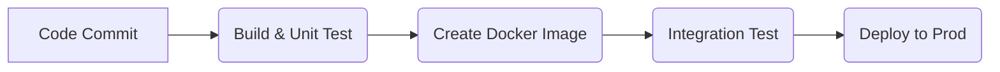

A senior developer's responsibility extends to the entire application lifecycle. This final section covers the crucial "DevOps" aspects of packaging, deploying, managing, and observing systems in production. This includes containerization with Docker and Kubernetes, automation with CI/CD, and the three pillars of observability.

## Chapter 10: The Universal Runtime: Docker & Kubernetes

- **Docker:** Packages an application and its dependencies into a portable container, ensuring it runs consistently everywhere.
- **Kubernetes:** The de facto standard for orchestrating containers at scale, providing self-healing, automated rollouts, and service discovery.

---

## Chapter 11: Automation: CI/CD & Infrastructure as Code

- **CI/CD (Continuous Integration/Deployment):** Each microservice must have its own isolated pipeline that automatically builds, tests, and deploys a versioned Docker image.

#### CI/CD Pipeline Flow

- **IaC (Infrastructure as Code) (e.g., Terraform):** Manages infrastructure (clusters, databases) with version-controlled code, making deployments safe and repeatable.

---

## Chapter 12: Deploying to the Cloud: AWS, Azure & GCP

The major cloud providers offer a spectrum of services, from full control to fully managed.

- **AWS:** Amazon EKS (managed Kubernetes), Amazon ECS with Fargate (serverless containers).
- **Azure:** Azure Kubernetes Service (AKS), Azure Spring Apps (fully managed PaaS for Spring).
- **GCP:** Google Kubernetes Engine (GKE), Google Cloud Run (serverless containers with scale-to-zero).

---

## Chapter 13: Observability: The Three Pillars

Observability is the ability to ask arbitrary questions about your system's internal state to debug "unknown unknowns". It is built on three pillars:

1. **Logging:** Structured, centralized logs (e.g., ELK, Splunk) to record discrete events.
2. **Metrics:** Aggregated numerical data (e.g., Prometheus, Grafana) to track trends and alert on anomalies.
3. **Distributed Tracing:** Traces the path of a request across services (e.g., Jaeger, Zipkin) to pinpoint bottlenecks and failures.

:::tip Resource
- [📄 Read: The Three Pillars of Observability](https://www.honeycomb.io/blog/three-pillars-of-observability-logs-metrics-traces)
:::
