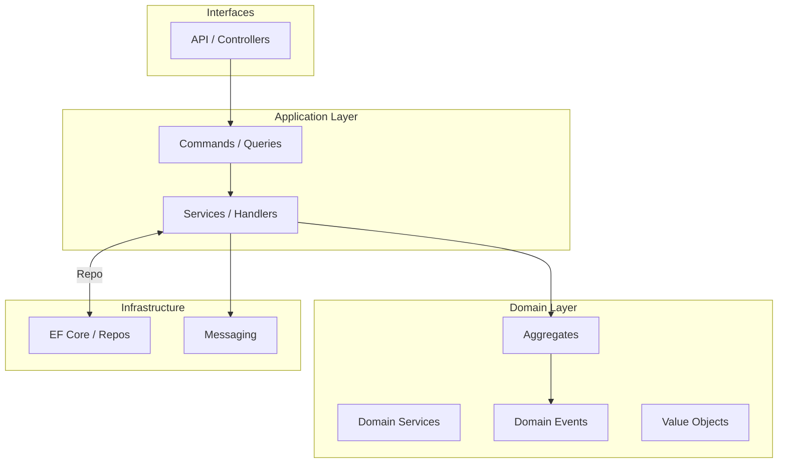
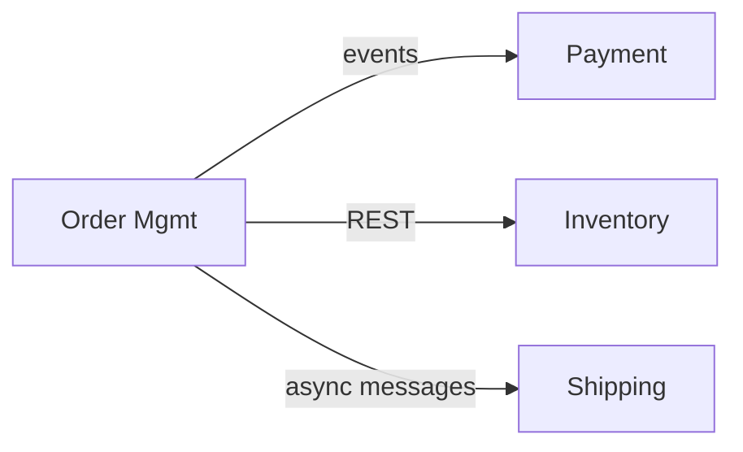
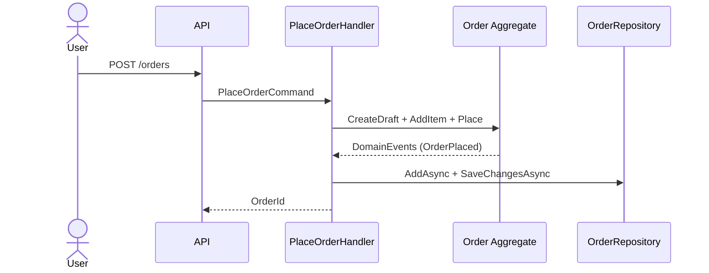
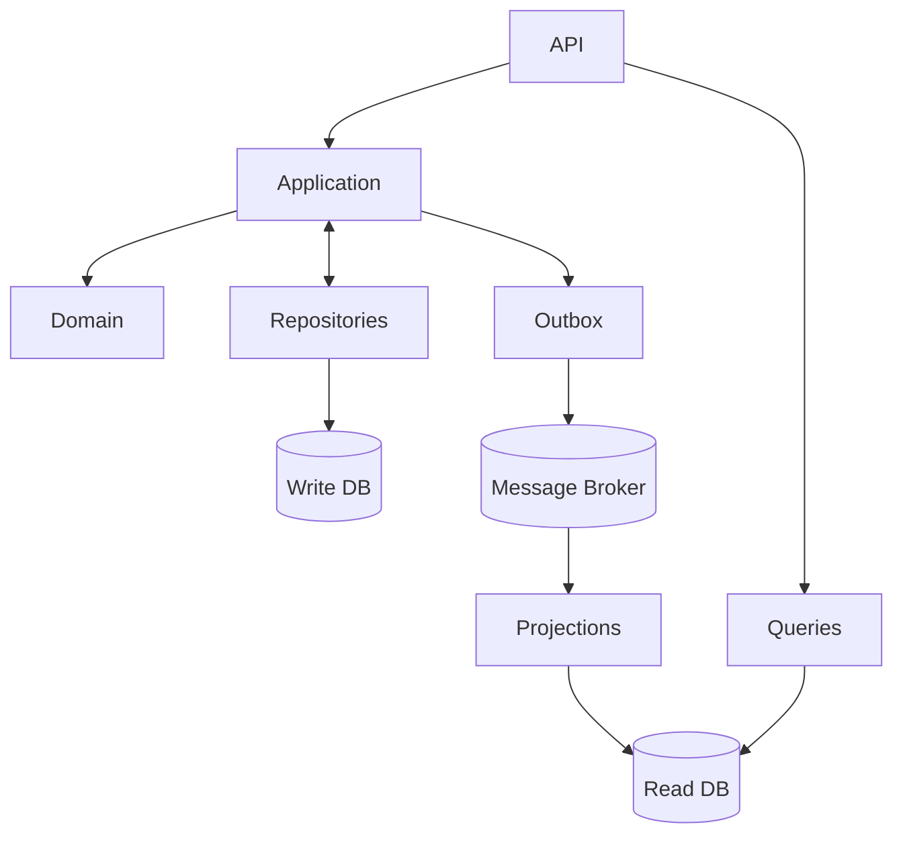
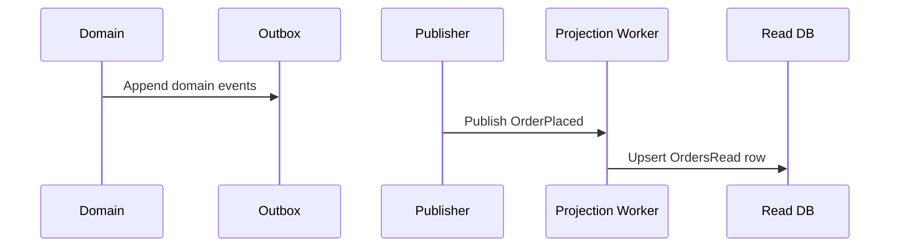
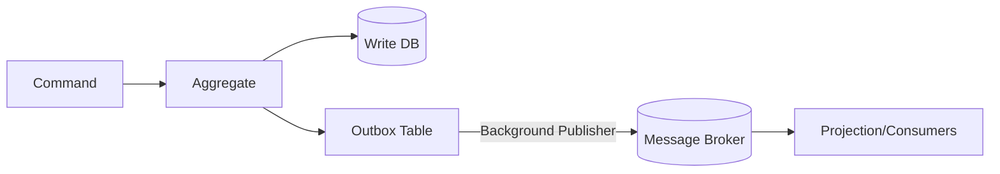
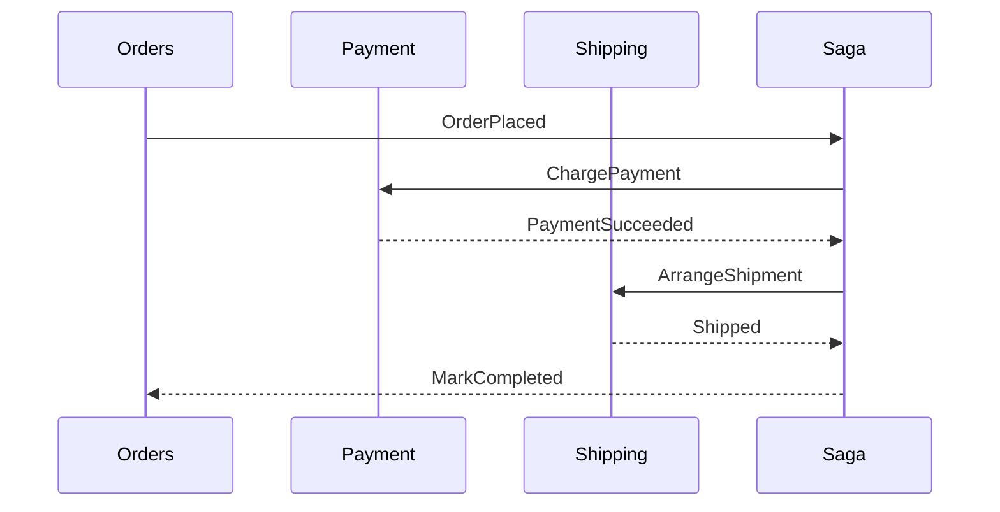

import Tabs from '@theme/Tabs';
import TabItem from '@theme/TabItem';

> A concise, practical guide to DDD with C# examples. Large code listings are collapsed by default for easy reading.

### What you will learn

- Understand DDD essentials: ubiquitous language, bounded contexts, aggregates, and domain events.
- Design an order domain in C# with entities, value objects, repositories, and application services.
- Apply a layered architecture and optional CQRS.
- Visualize flows with Mermaid diagrams.

:::info
This guide focuses on pragmatic DDD for typical service-backed systems. It balances rigor with practicality.
:::

## Core concepts

- **Ubiquitous Language**: Shared terms between domain experts and developers.
- **Bounded Context**: A semantic boundary around a model. Integrations occur at the boundaries.
- **Entity**: Has identity and lifecycle. Example: `Order`.
- **Value Object**: Immutable, equality by value. Example: `Money`, `Address`.
- **Aggregate**: A cluster of entities/value objects with a single root (e.g., `Order` as root). Invariants are enforced inside the aggregate.
- **Domain Event**: Something that happened in the domain (e.g., `OrderPlaced`).
- **Repository**: Collection-like interface to persist aggregates.

## Big picture



## Context mapping



## Example domain: Orders

We will model a minimal Order domain:

- **Aggregate Root**: `Order`
- **Child Entity**: `OrderItem`
- **Value Objects**: `Money`, `ProductId`, `OrderId`
- **Domain Events**: `OrderPlaced`
- **Repository**: `IOrderRepository`

### Value objects

<details>
<summary>Base ValueObject and Money</summary>

```csharp
using System.Collections.Generic;
using System.Linq;

public abstract class ValueObject
{
    protected abstract IEnumerable<object?> GetEqualityComponents();

    public override bool Equals(object? obj)
    {
        if (obj is null || obj.GetType() != GetType()) return false;
        var other = (ValueObject)obj;
        return GetEqualityComponents().SequenceEqual(other.GetEqualityComponents());
    }

    public override int GetHashCode()
    {
        return GetEqualityComponents()
            .Aggregate(0, (hash, component) =>
                HashCode.Combine(hash, component?.GetHashCode() ?? 0));
    }
}

public sealed class Money : ValueObject
{
    public decimal Amount { get; }
    public string Currency { get; }

    private Money(decimal amount, string currency)
    {
        if (amount < 0) throw new ArgumentOutOfRangeException(nameof(amount));
        if (string.IsNullOrWhiteSpace(currency)) throw new ArgumentException("Currency required");
        Amount = decimal.Round(amount, 2);
        Currency = currency.ToUpperInvariant();
    }

    public static Money Of(decimal amount, string currency) => new(amount, currency);

    protected override IEnumerable<object?> GetEqualityComponents()
    {
        yield return Amount;
        yield return Currency;
    }

    public static Money operator +(Money a, Money b)
    {
        if (a.Currency != b.Currency) throw new InvalidOperationException("Currency mismatch");
        return Of(a.Amount + b.Amount, a.Currency);
    }
}
```

</details>

<details>
<summary>Identifiers as Value Objects</summary>

```csharp
public sealed class OrderId : ValueObject
{
    public Guid Value { get; }
    private OrderId(Guid value) => Value = value;
    public static OrderId New() => new(Guid.NewGuid());
    public static OrderId From(Guid value) => new(value);
    protected override IEnumerable<object?> GetEqualityComponents() { yield return Value; }
    public override string ToString() => Value.ToString();
}

public sealed class ProductId : ValueObject
{
    public Guid Value { get; }
    private ProductId(Guid value) => Value = value;
    public static ProductId From(Guid value) => new(value);
    protected override IEnumerable<object?> GetEqualityComponents() { yield return Value; }
    public override string ToString() => Value.ToString();
}
```

</details>

### Aggregate

<details>
<summary>Order aggregate with invariants and events</summary>

```csharp
public sealed class Order
{
    private readonly List<OrderItem> _items = new();
    private readonly List<object> _domainEvents = new();

    public OrderId Id { get; }
    public string CustomerEmail { get; private set; }
    public IReadOnlyCollection<OrderItem> Items => _items.AsReadOnly();
    public Money Total => _items.Aggregate(Money.Of(0, Currency), (acc, i) => acc + (i.UnitPrice * i.Quantity));
    public string Currency { get; }

    private Order(OrderId id, string customerEmail, string currency)
    {
        Id = id;
        CustomerEmail = customerEmail;
        Currency = currency;
    }

    public static Order CreateDraft(string customerEmail, string currency)
    {
        if (string.IsNullOrWhiteSpace(customerEmail)) throw new ArgumentException("Email required");
        return new Order(OrderId.New(), customerEmail, currency);
    }

    public void AddItem(ProductId productId, int quantity, Money unitPrice)
    {
        if (quantity <= 0) throw new ArgumentOutOfRangeException(nameof(quantity));
        if (unitPrice.Currency != Currency) throw new InvalidOperationException("Currency mismatch");

        var existing = _items.FirstOrDefault(i => i.ProductId.Equals(productId));
        if (existing is not null)
        {
            existing.IncreaseQuantity(quantity);
        }
        else
        {
            _items.Add(new OrderItem(productId, quantity, unitPrice));
        }
    }

    public void Place()
    {
        if (!_items.Any()) throw new InvalidOperationException("Cannot place empty order");
        _domainEvents.Add(new OrderPlaced(Id, Total));
    }

    public IReadOnlyCollection<object> DequeueDomainEvents()
    {
        var copy = _domainEvents.ToArray();
        _domainEvents.Clear();
        return copy;
    }
}

public sealed class OrderItem
{
    public ProductId ProductId { get; }
    public int Quantity { get; private set; }
    public Money UnitPrice { get; }

    public OrderItem(ProductId productId, int quantity, Money unitPrice)
    {
        if (quantity <= 0) throw new ArgumentOutOfRangeException(nameof(quantity));
        ProductId = productId;
        Quantity = quantity;
        UnitPrice = unitPrice;
    }

    public void IncreaseQuantity(int by)
    {
        if (by <= 0) throw new ArgumentOutOfRangeException(nameof(by));
        Quantity += by;
    }
}

public sealed record OrderPlaced(OrderId OrderId, Money Total);
```

</details>

### Repository interface

```csharp
public interface IOrderRepository
{
    Task<Order?> GetAsync(OrderId id, CancellationToken ct = default);
    Task AddAsync(Order order, CancellationToken ct = default);
    Task SaveChangesAsync(CancellationToken ct = default);
}
```

### EF Core mapping (infrastructure)

<details>
<summary>DbContext and ValueConverters</summary>

```csharp
using Microsoft.EntityFrameworkCore;
using Microsoft.EntityFrameworkCore.Storage.ValueConversion;

public sealed class OrdersDbContext : DbContext
{
    public DbSet<Order> Orders => Set<Order>();

    protected override void OnModelCreating(ModelBuilder modelBuilder)
    {
        var orderIdConv = new ValueConverter<OrderId, Guid>(v => v.Value, v => OrderId.From(v));
        var productIdConv = new ValueConverter<ProductId, Guid>(v => v.Value, v => ProductId.From(v));

        modelBuilder.Entity<Order>(b =>
        {
            b.HasKey(x => x.Id);
            b.Property(x => x.Id).HasConversion(orderIdConv);
            b.Property(x => x.CustomerEmail).IsRequired();
            b.Property(x => x.Currency).IsRequired();

            b.OwnsMany<OrderItem>("_items", nb =>
            {
                nb.WithOwner().HasForeignKey("OrderId");
                nb.Property<Guid>("Id").ValueGeneratedOnAdd();
                nb.HasKey("Id");
                nb.Property(i => i.ProductId).HasConversion(productIdConv);
                nb.OwnsOne(i => i.UnitPrice, mb =>
                {
                    mb.Property(p => p.Amount).HasColumnName("UnitPriceAmount");
                    mb.Property(p => p.Currency).HasColumnName("UnitPriceCurrency");
                });
            });
        });
    }
}
```

</details>

### Application service (command handler)

```csharp
public sealed record PlaceOrderCommand(string CustomerEmail, string Currency, IReadOnlyCollection<(Guid ProductId, int Quantity, decimal UnitPrice)> Lines);

public sealed class PlaceOrderHandler
{
    private readonly IOrderRepository _orders;

    public PlaceOrderHandler(IOrderRepository orders) => _orders = orders;

    public async Task<OrderId> Handle(PlaceOrderCommand cmd, CancellationToken ct)
    {
        var order = Order.CreateDraft(cmd.CustomerEmail, cmd.Currency);

        foreach (var l in cmd.Lines)
        {
            order.AddItem(ProductId.From(l.ProductId), l.Quantity, Money.Of(l.UnitPrice, cmd.Currency));
        }

        order.Place();
        await _orders.AddAsync(order, ct);

        // Optionally publish domain events here
        foreach (var e in order.DequeueDomainEvents())
        {
            // publish e
        }

        await _orders.SaveChangesAsync(ct);
        return order.Id;
    }
}
```

### Flow: placing an order



## CQRS (optional)

- **Commands** mutate state through aggregates.
- **Queries** read from optimized read models (e.g., SQL view or denormalized table).
- Keep the domain model clean; avoid exposing EF Core internals to the application layer.

## Testing strategy

- Test invariants in the aggregate (unit tests on `Order`).
- Test application services with a fake repository.
- Integration-test repositories with a real DB and EF Core.

## Guidelines and checklists

- Prefer small, cohesive aggregates. Design for consistency boundaries.
- Enforce invariants inside aggregates, not in controllers.
- Make value objects immutable and validate on creation.
- Use domain events to decouple side-effects like notifications.
- Repositories return full aggregates; do not leak ORM entities.

## References

- Eric Evans, "Domain-Driven Design: Tackling Complexity in the Heart of Software" — [Addison-Wesley](https://www.pearson.com/en-us/subject-catalog/p/domain-driven-design-tackling-complexity-in-the-heart-of-software/P200000003283/9780321125217)
- Vaughn Vernon, "Implementing Domain-Driven Design" — [Addison-Wesley](https://www.pearson.com/en-us/subject-catalog/p/implementing-domain-driven-design/P200000002945/9780321834577)
- Vaughn Vernon, "DDD Reference" — [dddcommunity.org](https://dddcommunity.org/library/vernon_2011/)
- Microsoft Learn, "DDD and Microservices" — [learn.microsoft.com](https://learn.microsoft.com/azure/architecture/microservices/model/domain-analysis)

---

Need more examples? Open an issue with a scenario and we can extend this guide.


## Production-grade architecture

### Recommended solution structure (C#)

```text
src/
  OrderService.Api/                # ASP.NET Core minimal APIs or Controllers
  OrderService.Application/        # Commands, Queries, Handlers, DTOs
  OrderService.Domain/             # Aggregates, ValueObjects, Domain Events, Repositories
  OrderService.Infrastructure/     # EF Core, Outbox, Repositories, Messaging, DI
tests/
  OrderService.UnitTests/          # Aggregate and VO tests
  OrderService.IntegrationTests/   # Repos, outbox, projections
```

### Layered architecture responsibilities

- **API**: HTTP endpoints, authentication, request validation, mapping to commands/queries.
- **Application**: Orchestrates use cases; coordinates repositories and domain; no HTTP/EF code.
- **Domain**: Pure model and invariants; no infrastructure.
- **Infrastructure**: EF Core, message broker client, outbox, background workers.



## CQRS in depth

### Command model

- Commands change state via aggregates; validated at the boundary.
- Handlers persist via repositories and emit domain events.

<details>
<summary>Command with validation and handler</summary>

```csharp
public sealed record AddItemToOrderCommand(Guid OrderId, Guid ProductId, int Quantity, decimal UnitPrice, string Currency);

public sealed class AddItemToOrderHandler
{
    private readonly IOrderRepository _orders;

    public AddItemToOrderHandler(IOrderRepository orders) => _orders = orders;

    public async Task Handle(AddItemToOrderCommand cmd, CancellationToken ct)
    {
        if (cmd.Quantity <= 0) throw new ArgumentOutOfRangeException(nameof(cmd.Quantity));
        var order = await _orders.GetAsync(OrderId.From(cmd.OrderId), ct)
                     ?? throw new InvalidOperationException("Order not found");

        order.AddItem(ProductId.From(cmd.ProductId), cmd.Quantity, Money.Of(cmd.UnitPrice, cmd.Currency));
        await _orders.SaveChangesAsync(ct);
    }
}
```

</details>

### Query model

- Queries read from a denormalized read model for performance.
- Use Dapper or EF Core to query a read database/schema.

<details>
<summary>Query and handler using Dapper</summary>

```csharp
public sealed record GetOrderSummary(Guid OrderId);

public sealed class GetOrderSummaryHandler
{
    private readonly Func<IDbConnection> _readDb;
    public GetOrderSummaryHandler(Func<IDbConnection> readDb) => _readDb = readDb;

    public async Task<OrderSummaryDto?> Handle(GetOrderSummary query, CancellationToken ct)
    {
        using var conn = _readDb();
        var sql = @"SELECT Id, CustomerEmail, TotalAmount, Currency, ItemCount
                    FROM OrdersRead WHERE Id = @Id";
        return await conn.QuerySingleOrDefaultAsync<OrderSummaryDto>(sql, new { Id = query.OrderId });
    }
}

public sealed record OrderSummaryDto(Guid Id, string CustomerEmail, decimal TotalAmount, string Currency, int ItemCount);
```

</details>

### Building the read model (projection)



<details>
<summary>Projection handler for OrderPlaced</summary>

```csharp
public sealed class OrderReadProjection
{
    private readonly Func<IDbConnection> _readDb;
    public OrderReadProjection(Func<IDbConnection> readDb) => _readDb = readDb;

    public async Task Handle(OrderPlaced evt, CancellationToken ct)
    {
        using var conn = _readDb();
        var sql = @"INSERT INTO OrdersRead(Id, CustomerEmail, TotalAmount, Currency, ItemCount)
                    VALUES (@Id, @Email, @Amount, @Currency, @Count)
                    ON CONFLICT (Id) DO UPDATE SET
                      TotalAmount = EXCLUDED.TotalAmount,
                      ItemCount = EXCLUDED.ItemCount"; // PostgreSQL example

        await conn.ExecuteAsync(sql, new {
            Id = evt.OrderId.Value,
            Email = "hidden@example.com", // capture at source
            Amount = evt.Total.Amount,
            Currency = evt.Total.Currency,
            Count = 0 // compute from event stream if needed
        });
    }
}
```

</details>

## DDD + CQRS integration patterns

### Outbox pattern (transactional messaging)

- Persist domain changes and an outbox record in the same transaction.
- A background publisher dispatches outbox messages to the broker.
- Ensures at-least-once delivery; combine with idempotent consumers.



<details>
<summary>Outbox entity and EF Core integration</summary>

```csharp
public sealed class OutboxMessage
{
    public long Id { get; set; }
    public DateTime OccurredOnUtc { get; set; }
    public string Type { get; set; } = default!; // e.g., "OrderPlaced"
    public string Payload { get; set; } = default!; // JSON
    public DateTime? ProcessedOnUtc { get; set; }
    public string? Error { get; set; }
}

public sealed class OrdersDbContext : DbContext
{
    public DbSet<OutboxMessage> Outbox => Set<OutboxMessage>();

    public override async Task<int> SaveChangesAsync(CancellationToken ct = default)
    {
        var domainEvents = ChangeTracker.Entries()
            .Select(e => e.Entity)
            .OfType<Order>()
            .SelectMany(o => o.DequeueDomainEvents())
            .ToList();

        foreach (var evt in domainEvents)
        {
            Outbox.Add(new OutboxMessage
            {
                OccurredOnUtc = DateTime.UtcNow,
                Type = evt.GetType().Name,
                Payload = JsonSerializer.Serialize(evt)
            });
        }

        return await base.SaveChangesAsync(ct);
    }
}
```

</details>

<details>
<summary>Background publisher (idempotent)</summary>

```csharp
public sealed class OutboxPublisher : BackgroundService
{
    private readonly IServiceProvider _services;
    private readonly IMessageBus _bus; // abstraction over broker client

    public OutboxPublisher(IServiceProvider services, IMessageBus bus)
    {
        _services = services;
        _bus = bus;
    }

    protected override async Task ExecuteAsync(CancellationToken stoppingToken)
    {
        while (!stoppingToken.IsCancellationRequested)
        {
            using var scope = _services.CreateScope();
            var db = scope.ServiceProvider.GetRequiredService<OrdersDbContext>();

            var batch = await db.Outbox
                .Where(x => x.ProcessedOnUtc == null)
                .OrderBy(x => x.Id)
                .Take(100)
                .ToListAsync(stoppingToken);

            foreach (var msg in batch)
            {
                try
                {
                    await _bus.PublishAsync(msg.Type, msg.Payload, stoppingToken);
                    msg.ProcessedOnUtc = DateTime.UtcNow;
                }
                catch (Exception ex)
                {
                    msg.Error = ex.Message;
                }
            }

            await db.SaveChangesAsync(stoppingToken);
            await Task.Delay(TimeSpan.FromSeconds(1), stoppingToken);
        }
    }
}
```

</details>

### Idempotency for consumers

- Add a `ProcessedMessages` table keyed by `MessageId`.
- On consume, insert the `MessageId` first; if duplicate, skip handling.

<details>
<summary>Idempotent consumer skeleton</summary>

```csharp
public sealed class OrderPlacedConsumer
{
    private readonly Func<IDbConnection> _readDb;

    public async Task Handle(string messageId, OrderPlaced evt, CancellationToken ct)
    {
        using var conn = _readDb();
        using var tx = conn.BeginTransaction();

        var inserted = await conn.ExecuteAsync(
            "INSERT INTO ProcessedMessages(MessageId) VALUES (@Id) ON CONFLICT DO NOTHING",
            new { Id = messageId }, tx);

        if (inserted == 0) return; // already processed

        // apply projection changes here
        await tx.CommitAsync();
    }
}
```

</details>

### Optimistic concurrency

- Use a `RowVersion` column to detect concurrent updates.
- On conflict, reload and retry or return 409 Conflict.

<details>
<summary>EF Core concurrency token</summary>

```csharp
public sealed class Order
{
    // ... existing members ...
    public byte[] RowVersion { get; private set; } = Array.Empty<byte>();
}

public sealed class OrdersDbContext : DbContext
{
    protected override void OnModelCreating(ModelBuilder modelBuilder)
    {
        modelBuilder.Entity<Order>(b =>
        {
            b.Property(x => x.RowVersion).IsRowVersion();
            // other mapping
        });
    }
}
```

</details>

### Sagas (process managers)

- Coordinate multi-step, long-running workflows across bounded contexts.
- Persist saga state; react to events; send commands.



<details>
<summary>Saga state and transitions (simplified)</summary>

```csharp
public enum OrderSagaStatus { Started, Paid, Shipped, Completed, Failed }

public sealed class OrderSaga
{
    public Guid Id { get; init; }
    public OrderId OrderId { get; init; } = default!;
    public OrderSagaStatus Status { get; private set; }

    public void When(OrderPlaced e) { Status = OrderSagaStatus.Started; }
    public IEnumerable<object> When(PaymentSucceeded e) { Status = OrderSagaStatus.Paid; yield return new ArrangeShipment(e.OrderId); }
    public void When(Shipped e) { Status = OrderSagaStatus.Shipped; }
}
```

</details>

## Security, validation, and policies

- Authentication/Authorization at API boundary (JWT, OAuth2).
- Request validation (FluentValidation) before commands.
- Resilience policies (Polly) for external calls.
- PII handling: avoid leaking sensitive data into events/read models.

## Observability

- Correlation/causation IDs on commands and events.
- Structured logging with scopes per request/command.
- Metrics: command latency, handler success/failure, outbox backlog, consumer lag.
- Tracing across services (OpenTelemetry).

## Deployment and operations

- Zero-downtime migrations for write and read models.
- Blue/green or canary for services publishing new events.
- Backpressure: cap publisher batch size and consumer concurrency.
- Dead-letter queues and retry policies for message processing.

## Production checklist

- Clear bounded contexts and contracts at boundaries.
- Aggregates small and cohesive; invariants enforced inside.
- Outbox enabled with background publisher.
- Consumers idempotent; dedup table in place.
- Read model projections cover all critical queries; rebuild procedure documented.
- Concurrency conflicts handled with retry or 409.
- Comprehensive tests (unit, integration, contract, e2e).
- Observability: logs, metrics, traces wired.


